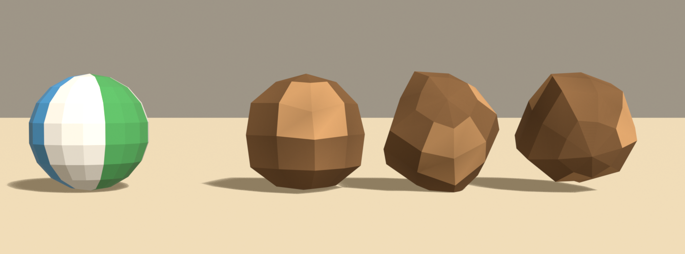

# Brief asset — Bolovan rostogolitor (`boulder_roller.glb`)

Brief auto-conținut pentru un agent Blender (ex. Blender MCP). Nu presupune
acces la restul repo-ului — tot contractul e aici. Sursele din care e derivat:
[style_bible.md](../style_bible.md) (estetică) + [blender_export.md](../blender_export.md)
(pipeline) + [scripts/palette.gd](../../scripts/palette.gd) (indici de sloturi).

Referință vizuală: `assets/dunele_inspiration/sheet_wave1_props.png`, panoul
**BOULDERS & ROCKS** — folosește silueta bolovanilor mari din rândul de sus.
Cote: `sheet_scale_rocks_cactus_barrels.png`, rândul **LARGE (6-10m)**, dar la
scara cerută mai jos.

> **Prompt de dat agentului** — de la linia orizontală de mai jos în jos e
> paste-ready. Restul paginii sunt note pentru noi.

---

Construiește un bolovan care se rostogolește peste șosea ca obstacol mobil,
low-poly, stilizat, pentru un joc de curse cu mașinuțe de jucărie în stil
diorámă de deșert (ton *Art of Rally* — machetă de masă, NU foto-realist).
Rezultat: un `.glb` care intră într-o lume cu un singur material partajat.

## ⚠️ Originea e în CENTRU, nu la bază

Ăsta e **singurul asset din tot proiectul** cu originea în centrul geometriei.
E intenționat: motorul îl rotește pe loc în timp ce îl translatează, iar o
origine la bază l-ar face să sară în loc să se rostogolească.

Bbox pe Y de la **−2.5 la +2.5**. Nu-l așeza pe sol.

**Formă și dimensiuni** (unitate: 1 = 1 m; mașina de referință = 4.2 m):
- **Diametru ~5.0 m** pe toate axele (motorul îl scalează ulterior la 2.6 m în
  joc). Abaterile între axe: maximum ±5%, altfel rostogolirea pare că se
  poticnește.
- Un singur obiect, numit **`Boulder`**.
- Formă de bolovan, **nu sferă**: fațete mari și neregulate, 8–10 laturi pe
  orizontală, 5–6 inele pe verticală.
- **Fără concavități.** Nicio adâncitură, nicio scobitură. O suprafață convexă e
  ce face rostogolirea lizibilă.
- **2–3 fețe plane mai mari**, ca la un bolovan proaspăt desprins dintr-un
  perete de stâncă. Astea sunt tot ce trebuie ca să pară rupt, nu erodat.
- Câteva pietricele NU se adaugă — obiectul se mișcă, orice satelit ar pluti.

NU: crăpături modelate, mușchi, stratificare fină, forme de fasole cu talie.

**Culoare — FĂRĂ texturi proprii. UV → sloturi dintr-un atlas de paletă** (32
sloturi orizontale). Fiecare față își colapsează toate UV-urile pe **un singur
punct**, centrul slotului:
- Corp de stâncă (majoritatea fețelor): **u = 0.140625, v = 0.5**
- Fețele proaspăt sparte (cele 2–3 plane): **u = 0.109375, v = 0.5**
- Nu e nevoie să încarci vreo imagine în Blender; contează doar coordonata UV.
  Materialul se înlocuiește ulterior.

Contrastul dintre cele două spune „s-a desprins acum din perete", ceea ce leagă
obstacolul de falezele de deasupra drumului.

**Vertex colors = ambient occlusion copt (grayscale), se înmulțește peste
culoare în engine:**
- **Gradient RADIAL, nu vertical.** Obiectul se rotește, deci un gradient
  vertical s-ar învârti cu el și ar arăta greșit. Întunecă spre interiorul
  concavităților dintre fațete, lasă crestele spre 1.0.
- 1.0 = neatins, ~0.5 = adânc/umbrit. Fără el iese plat — e obligatoriu.

**Scară, origine, orientare:**
- Originea (pivotul) **în centrul geometriei**, nu la bază. Vezi avertismentul
  de sus.
- Fără orientare preferată — obiectul se rotește continuu.
- Bevel **0.10 m** — generos, ca fațetele să se citească rotunjite.
- Buget: **≤ 220 triunghiuri.** O singură instanță pe pistă, deci e larg.

**Export:**
- glTF Binary **(.glb)**, un fișier, nume `boulder_roller.glb`, un obiect
  `Boulder`.
- Include: Mesh, **UVs**, **Vertex Colors**, Normals. Fără camere, lumini sau
  materiale complexe.
- **Apply Modifiers: ON** (bevel-ul să fie în geometrie). Y-up: implicit.

---

## Note pentru noi (nu fac parte din prompt)

- **Ce înlocuiește:** `beach_ball.glb` — o minge de plajă care se rostogolește
  peste șosea în canionul de deșert. Rămășiță din tema abandonată „jucării în
  ladă de nisip"; comentariul din `scenes/tracks/track.gd:896` o spune pe față.
- **Verificatorul cere `--origin=center`.** Nota inițială spunea că
  `verify_glb.py` *va da eroare și e corect*, fiindcă testează „baza la Y=0".
  Asta ar fi lăsat singurul asset cu excepție declarată cu verdict roșu
  permanent — adică fără gardă, fiindcă data viitoare când pică din alt motiv
  nu se mai uită nimeni. Steagul `--origin=center` mută aserțiunea pe ce chiar
  trebuie verificat: **bbox-ul centrat pe Y**. Un export făcut din greșeală cu
  originea la bază pică în continuare, cu motivul scris. Referința rămâne
  `scenes/hazards/sliding_hazard.gd:106-107`
  (`_pivot.position = Vector3.UP * roll_radius`).

  ```
  python tools/blender/verify_glb.py assets/models/rocks/boulder_roller.glb 220 --origin=center
  ```
- **Nu-l face să semene cu `Cluster_L1`** din `rock_cluster.glb` — ăla e
  bolovanul static din decor (și, până în august 2026, cel care cădea în
  `RockfallHazard`; de atunci și rockfall-ul folosește `boulder_roller`, la
  scara 0.5, fiindcă o movilă cu baza plată nu se rostogolește). Ăsta trebuie
  să se distingă în mișcare.
- **Diametrul e contract.** Godot are `model_scale = 0.52` și `roll_radius = 1.3`
  derivate din cei 5.0 m (`track.gd:902-903`). Alt diametru → două numere de
  schimbat în cod.
- **Sloturi folosite:** `rock_dark` = 4 (u = 0.140625), `rock_light` = 3
  (u = 0.109375).
- **Fișier nou. NU se atinge `beach_ball.glb`.**
- **Checklist la primire:** un nod `Boulder`; ≤ 220 tris; UV pe centre de slot;
  bbox Y de la −2.5 la +2.5; `COLOR_0` prezent.

## Livrat (#B2)



În stânga, mingea de plajă pe care o înlocuiește; în dreapta, bolovanul rotit cu
0°, 55° și 110°, toate la scara din joc (2.6 m). Cele trei rotații sunt acolo ca
să se vadă că nu există unghi din care să apară o față plată cât obiectul.

### Cote reale, pentru colizor

| | valoare |
|---|---|
| triunghiuri | **90** (buget 220) |
| bbox X / Y / Z | **5.000 × 5.000 × 5.000 m**, centrul la (0, 0, 0) |
| rază pe orizontală | **2.500 m** → la `model_scale = 0.52`: **1.300 m** |
| AO (`COLOR_0`) | 0.58 .. 1.00 |
| sloturi | `rock_dark` (4) dominant, `rock_light` (3) pe fețele sparte |

`roll_radius` iese **exact 1.300**, adică fix numărul hardcodat azi în
`track.gd:940`. `sliding_hazard.gd:103-110` îl măsoară oricum din model, deci
integrarea e o singură linie schimbată — calea — și zero numere.

### Convexitatea, măsurată

Brieful cere „fără concavități" pentru că o adâncitură face rostogolirea să pară
că se poticnește. Era o afirmație verificată din ochi, pe un render, dintr-un
unghi. Acum e un număr tipărit la fiecare build (`max_concavity`, testul de
manual: niciun vârf nu trece dincolo de planul vreunei fețe):

| | concavitate max, ca fracțiune din rază |
|---|---|
| `boulder()` singur, deviație 0.00 → 0.26 | **0.0000** — strict convex prin construcție |
| după cele trei tăieturi plane | **0.041** = 10 cm pe modelul de 5 m, **5.2 cm în joc** |

Toată concavitatea vine din tăieturi: proiectarea vârfurilor pe planul de tăiere
lasă o creastă minusculă la margine. Baleiajul pe deviație (0.10 → 0.26, două
seed-uri) arată pragul constant la ~0.040 până la 0.22 și un salt la 0.067 la
0.26 — de aceea valoarea aleasă e **0.18**, care dă 27% variație de rază.

### Abateri de la brief

- **Bevel 0, nu 0.10.** E aritmetică, nu gust. Planșa de probă a ajutoarelor a
  măsurat multiplicatorul bevel-ului la ~3.7×, constant. Cele 90 de triunghiuri
  brute ar fi devenit ~333 — peste bugetul de 220 — și singura reparație ar fi
  fost coborârea la 3 benzi de latitudine, adică un zar de 5 m. `style_bible` §3
  cere stânci rotunjite (70%) **sau fațetate (30%)**, iar un bolovan proaspăt
  spart din perete e chiar cazul fațetat: muchiile dure sunt argument aici, nu
  economie.
- **AO sferic, nu radial.** Brieful cerea „gradient RADIAL, nu vertical", și
  raționamentul era corect — obiectul se rotește — dar `bake_ao(gradient=
  "radial")` măsoară distanța față de **axa Z**, care e la fel de dependentă de
  orientare ca cea verticală când rostogolirea se face în jurul unei axe
  orizontale. `gradient="none"` e corect și inutil: pe un corp convex ocluzia
  geometrică e nulă, iar prima rulare a ieșit exact așa, **AO 1.00..1.00** —
  bolovanul ar fi fost singurul obiect din cadru fără nicio variație tonală.
  Singurul gradient invariant la o rotație oarecare e distanța față de **centru**
  (`gradient="spherical"`, adăugat în `dio_lib`).
- **Primitivă nouă: `Builder.boulder()`.** `rock()` construiește inele de la bază
  în sus și închide cu două capace plate — o movilă, perfectă pentru orice stă pe
  sol și exact greșită pentru ceva care se rotește, fiindcă acel capac de la bază
  devine o fațetă cât tot obiectul. `boulder()` construiește în jurul centrului,
  între doi poli.
- **Fără satelit și fără pietricele** — brieful le interzicea deja; le confirm
  aici doar ca să nu revină la o citire ulterioară.
