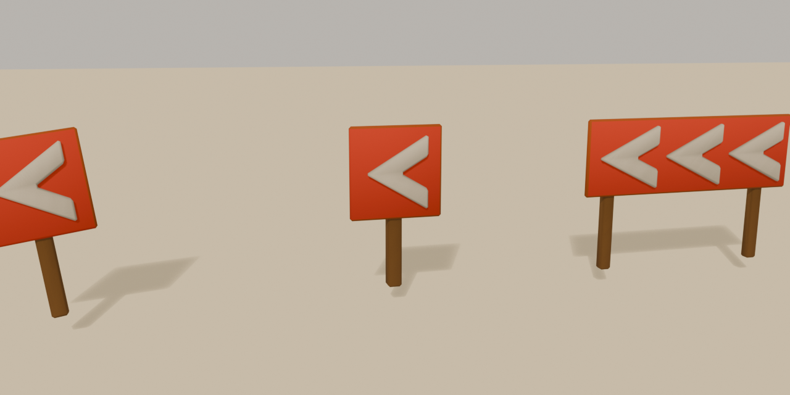
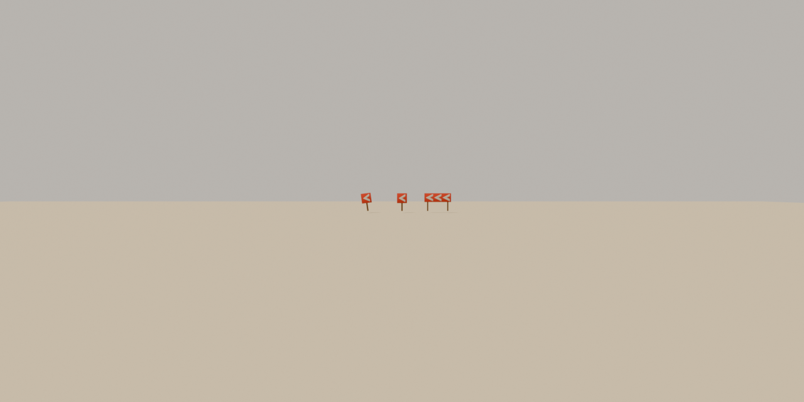

# Brief asset — Semn chevron de viraj (`chevron_sign.glb`)

Brief auto-conținut pentru un agent Blender (ex. Blender MCP). Nu presupune
acces la restul repo-ului — tot contractul e aici. Sursele din care e derivat:
[style_bible.md](../style_bible.md) (estetică) + [blender_export.md](../blender_export.md)
(pipeline) + [scripts/palette.gd](../../scripts/palette.gd) (indici de sloturi).

Sursa reproductibilă: [tools/blender/build_chevron_sign.py](../../tools/blender/build_chevron_sign.py).

Referință vizuală: conceptul „Canyon Circuit" (ChatGPT) — semnele galbene cu
săgeți de dinaintea virajelor. Ia din el **rolul și amplasarea**, nu culoarea:
paleta noastră n-are galben, folosim roșu/alb ca la kerbs (vezi §5).

> **Prompt de dat agentului** — de la linia orizontală de mai jos în jos e
> paste-ready. Restul paginii sunt note pentru noi.

---

## 1. Ce construiești

Construiește **trei variante** de semn chevron de viraj (panou cu săgeți care
indică direcția curbei), low-poly și stilizat, pentru un joc de curse cu
mașinuțe de jucărie în stil diorámă de deșert (ton *Art of Rally* — machetă de
masă, NU foto-realist). Rezultat: un `.glb` cu trei obiecte, care intră într-o
lume cu un singur material partajat.

## 2. Rolul lui în cadru

Semnul e **comunicare de gameplay, nu decor**: de la 60–80 m, din chase cam, la
viteză, jucătorul trebuie să citească *direcția* virajului înainte să vadă
virajul. Testul care spune că a reușit: la 70 m, pe un ecran de telefon, distingi
un chevron spre stânga de unul spre dreapta **doar din siluetă și pata de
culoare** — fără să încetinești. De aceea formele sunt mari și puține: un
chevron care nu se citește la 70 m e doar zgomot (style_bible §3).

## 3. Formă și dimensiuni

Unitate: 1 = 1 m; mașina de referință = 4.2 m.

Trei obiecte în același fișier, cu numele **exacte** `Chevron_A`, `Chevron_B`,
`Chevron_C`. **Toate arată spre stânga** — dreapta se obține în engine cu
scale.x = -1, nu din variante separate.

- **`Chevron_A` — triplu, lat.** Panou dreptunghiular **2.4 × 0.8 m**, gros
  0.06 m, montat pe **doi** stâlpi prismatici cu 4 laturi (secțiune
  0.12 × 0.12 m). Marginea de jos a panoului la **0.8 m** de sol; total
  **1.6 m** înălțime — sub linia ochilor camerei, peste botul mașinii. Pe față:
  **trei benzi chevron** (unghiuri „>" întoarse spre stânga), fiecare bandă lată
  ~0.28 m, cu vârful îndoiturii pe axa orizontală a panoului.
- **`Chevron_B` — simplu, pătrat.** Panou **0.9 × 0.9 m** pe **un** stâlp,
  aceeași înălțime totală ~1.6 m. Pe față: **un singur chevron** mare, lat
  ~0.34 m.
- **`Chevron_C` — lovit.** Geometria lui `Chevron_B`, dar înclinat ~10° pe două
  axe (ca `Marker_B` din marker_post: o singură axă pare dreaptă din jumătate
  din unghiuri) și rotit ~8° în jurul stâlpului, ca după un impact. Fără
  geometrie zdrențuită.

**Chevronele NU sunt obiecte separate și NU sunt geometrie extrudată.** Sunt
fețe **decupate în planul feței panoului** (inset/knife în aceeași suprafață),
care primesc alt slot de UV. O bandă chevron = două paralelograme unite la vârf,
~8–10 triunghiuri. Relieful l-ar pierde oricum la 60 km/h; tăietura costă
triunghiuri, nu adâncime.

NU: șuruburi, ramă perimetrală ca obiect separat, text, cabluri, stâlpi
cilindrici cu multe laturi.

## 4. Orientare

Fața cu chevronele privește spre **-Z în Godot**, adică spre **+Y în Blender** —
exportatorul glTF face `(x, y, z) -> (x, z, -y)`, deci **Blender +Y devine
Godot -Z**.

## 5. Culoare — FĂRĂ texturi proprii

UV → sloturi dintr-un atlas de paletă (32 sloturi orizontale). Fiecare față își
colapsează toate UV-urile pe **un singur punct**, centrul slotului:
`u = (slot + 0.5) / 32`, `v = 0.5`.

- Fundalul feței panoului: **u = 0.234375, v = 0.5** (roșu de kerb)
- Benzile chevron (fețele decupate): **u = 0.265625, v = 0.5** (alb-beton —
  singurul deschis neutru din paletă, se decupează și pe nisip, și pe cer)
- Spatele și muchiile panoului: **u = 0.328125, v = 0.5** (tablă ruginită)
- Stâlpii: **u = 0.296875, v = 0.5** (lemn decolorat)

Referința ChatGPT are semne galbene cu negru; paleta noastră n-are galben
(sloturile 14–16 sunt rezervate mașinilor, 17–31 ies magenta și pică
`verify_glb.py`). Roșu/alb e limbajul deja stabilit al pistei — kerbs, gard,
marker posts — deci semnul se citește ca „infrastructură de circuit", exact ce
trebuie.

Nu e nevoie să încarci vreo imagine în Blender; contează doar coordonata UV.
Materialul e înlocuit oricum la runtime de `Palette.apply_world_material()`.

## 6. Vertex colors = AO copt

Grayscale, se înmulțește peste culoare în engine. 1.0 = neatins, ~0.5 = adânc.
**Fără el prop-ul e o pată de culoare plată** — nu e opțional.

- Gradient vertical pe stâlpi: 0.55 la bază → 1.0 sus.
- Panoul: aproape neatins (0.9–1.0) — e o tablă subțire în aer liber, n-are ce
  să se ocluzeze; întunecă doar unde stâlpii ating panoul.
- La `Chevron_C`, întunecă ușor latura dinspre sol a înclinării.
- Eșantioane: 32 ajung — piesele sunt mici.

## 7. Scară, origine, bevel

- Origine la **baza obiectului, centrată în XZ** (`finish(origin="base")`),
  fiecare variantă la (0,0,0) — dacă le-ai decalat în viewport pentru
  lizibilitate, adu-le la zero înainte de export.
- Bevel **0.02 m** (prop mic; 0.04 ar mânca muchia panoului de 0.06 m).

## 8. Buget de triunghiuri

**≤ 300 pentru `Chevron_A`, ≤ 170 pentru `Chevron_B`/`C`**, măsurat după bevel.
(Brieful inițial cerea 240 pentru toate — vezi §11 pentru ce a arătat
măsurătoarea.)

> Bevel-ul la 0.05/30° multiplică cu ~3.7x, dar aici doar stâlpii și conturul
> panoului iau bevel — fețele decupate ale chevronelor sunt în plan, nu se
> multiplică. Planul de piese: panou ~12 brute + chevrone 3×10 = 30 brute (fără
> bevel) + doi stâlpi ~20 brute (cu bevel ~3.7x → ~150). `Chevron_A` e cea mai
> scumpă variantă și trebuie să încapă; B și C ies natural pe la ~150.

Se instanțiază de ~8–14 ori pe pistă (doar la virajele strânse), deci nu e în
regimul marker_post-ului de 110 instanțe — dar fiecare triunghi tot se plătește
de 14 ori.

## 9. Export

- glTF Binary **(.glb)**, un fișier, nume `chevron_sign.glb`, cu **trei**
  obiecte: `Chevron_A`, `Chevron_B`, `Chevron_C`, ca **copii direcți ai
  rădăcinii**, exportate la origine — vezi §"GLB-uri cu variante" din
  [blender_export.md](../blender_export.md).
- Include: Mesh, **UVs**, **Vertex Colors**, Normals. Fără camere, lumini sau
  texturi incorporate.
- **Apply Modifiers: ON** (bevel-ul să fie în geometrie). Y-up: implicit.

---

## 10. Note pentru noi (nu fac parte din prompt)

**Măsurat:** `Chevron_A` **276** / `Chevron_B` **136** / `Chevron_C` **136**
de triunghiuri (total 548). Verdict `verify_glb.py`: **OK**.
bbox: A 2.40 × 1.60, B 0.90 × 1.60, C 1.01 × 1.65 m (X × înălțime).

```
python tools/blender/verify_glb.py assets/models/chevron_sign.glb 240
```

- **Sloturi folosite:** `kerb_red` = 7 (u = 0.234375), `concrete` = 8
  (u = 0.265625), `wood_weathered` = 9 (u = 0.296875), `rust_metal` = 10
  (u = 0.328125). Dacă se schimbă ordinea în
  [palette.gd](../../scripts/palette.gd), se recalculează u.
- **De raportat în PR:** înălțimea și jumătatea de lățime reale per variantă,
  pentru colizor — probabil `col: "none"` ca route66_sign (semnul e
  comunicare, nu obstacol; un colizor pe stâlp la 70 km/h e frustrare), dar
  decizia se ia la integrare.
- **Checklist la primire** (`res://assets/models/chevron_sign.glb`):
  1. trei noduri cu numele exacte, copii direcți ai rădăcinii
  2. fiecare ≤ 240 triunghiuri
  3. UV-urile nimeresc centrele sloturilor (fără 14–31!)
  4. origine la bază, centrată XZ, fiecare la (0,0,0)
  5. există strat de vertex color (AO)
  6. toate trei arată spre STÂNGA (oglindirea e treaba engine-ului)

## 11. Abateri de la brieful original și de ce

- **Chevronele sunt prisme subțiri pe jumătate îngropate în panou, nu fețe
  decupate în planul tablei.** `dio_lib` n-are tăiere într-o față existentă;
  prisma iese ~3 cm din panou, invizibil la distanța de joc, și dă gratis o
  umbră de contur care ajută citirea (style_bible §3: silueta înaintea
  detaliului). Capacele din spate, îngropate în tablă, sunt șterse — ~30 de
  triunghiuri economisite per chevron.
- **Banda e mai subțire decât cerea brieful: 0.20 m vertical (~0.17
  perpendicular), nu 0.28–0.34.** Măsurat pe randare: la 0.34, golul dintre
  brațe dispărea și chevronul se citea ca un triunghi plin (buton de play).
  Direcția virajului e tot rostul obiectului (§2), deci golul câștigă.
- **Bugetul a urcat de la 240 la 300 pentru `Chevron_A`.** 240 fusese estimat
  cu o aritmetică greșită a bevel-ului (multiplicatorul e topologic, nu ține
  de lățime). Măsurat după ștergerea capacelor ascunse: 276. La ~10 instanțe
  pe pistă vorbim de ~3k triunghiuri — zgomot față de pragul de 300k; garda
  reală rămâne numărul de materiale, iar semnul aduce zero (atlas + retag).

## Livrat



De la stânga: `Chevron_C` (lovit), `Chevron_B` (simplu), `Chevron_A` (triplu).
Toate arată spre stânga; dreapta = `scale.x = -1` în engine.



Testul din §2 la 70 m, obiectiv 35 mm: tripla se citește fără echivoc; simpla
se citește de la ~40 m, adică exact regimul virajelor medii pentru care există.

### Cote reale, pentru colizor (dacă se decide colizor)

| variantă | tris | înălțime | jumătate de lățime (X) |
|---|---|---|---|
| `Chevron_A` | **276** | 1.600 m | 1.200 m |
| `Chevron_B` | **136** | 1.600 m | 0.450 m |
| `Chevron_C` | **136** | 1.648 m | 0.505 m |

Modelele sunt la scara lumii, origine la bază — fără `model_scale`.
Recomandarea rămâne `col: "none"` (§10).

## 12. Dependențe și compoziție

- Ajutoare din `dio_lib` folosite: <de completat de agent>.
- Cu ce se leagă în lume: **amplasarea e procedurală, nu manuală** — track.gd
  poate calcula curbura din punctele traseului și pune `Chevron_A` pe
  **exteriorul** virajelor strânse, cu 25–35 m înainte de apex, orientat
  perpendicular pe direcția de sosire; `Chevron_B`/`C` pe virajele medii.
  Pattern-ul de plasare/variație e cel din `_build_markers()` +
  `_MARKER_PICKS` (track.gd). Niciodată pe interiorul virajului și niciodată
  în apex (style_bible §7).
