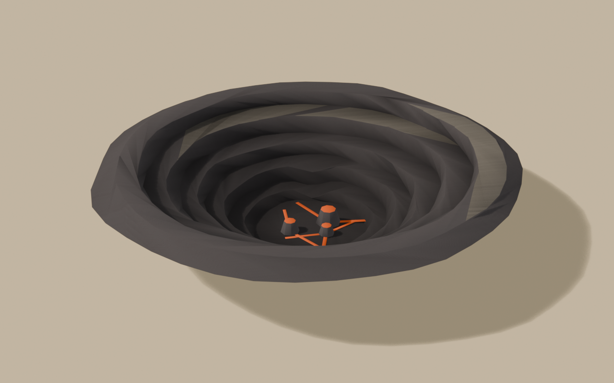

# Brief asset — Craterul (`crater_bowl.glb`)

Brief auto-conținut pentru un agent Blender (ex. Blender MCP). Nu presupune
acces la restul repo-ului — tot contractul e aici. Sursele:
[style_bible.md](../style_bible.md) + [blender_export.md](../blender_export.md) +
[scripts/palette.gd](../../scripts/palette.gd).

Referință vizuală: `docs/track_briefs/img/stromboli_assets_a.png`, panoul 1
(CRATER BOWL — front / side cutaway / top / ¾), plus secțiunea lungă prin
crater din foaia B, panoul 1.

**De ce e primul asset al pistei:** camera de urmărire vede 63° în JOS.
Buza craterului e carosabil (Track11, frac 0.47–0.52), iar interiorul ăsta e
CE VEDE jucătorul când trece pe ea. E piesa de rezistență vizuală a pistei.

> **Prompt de dat agentului** — de la linia orizontală în jos e paste-ready.

---

Construiește interiorul unui crater vulcanic activ, văzut de sus, pentru un joc
de curse cu mașinuțe de jucărie în stil dioramă (ton *Art of Rally* — machetă
de masă, NU foto-realist). Low-poly, fațetat. Rezultat: un `.glb` cu două
obiecte, într-o lume cu un singur material partajat.

**Contextul de amplasare:** craterul se așază într-o gaură deja săpată în
teren; drumul jocului trece chiar pe buza lui. Jucătorul îl vede aproape
exclusiv DE SUS și DIN LATERAL-SUS, de la 10–20 m — fundul și pereții
contează, exteriorul aproape deloc.

**Formă și dimensiuni** (unitate: 1 = 1 m; mașina de referință = 4.2 m):

### `Crater_Bowl` — cuva, ≤ 2400 triunghiuri

- **Inel exterior**: diametru **58 m** la coronament, cu o fustă scurtă de 3 m
  în afară, teșită în jos, ca să se îngroape în teren fără muchie vizibilă.
- **Interiorul coboară în trepte** până la **−13 m**: 4–5 terase inelare
  neregulate de scorie, fiecare cu fața verticală de 1.5–3 m și podestul
  înclinat spre centru. Terasele NU sunt cercuri concentrice curate — rupe-le
  în arce decalate, cu surpări locale (2–3 pene de grohotiș care taie peste
  două terase).
- **Fundul**: un platou neregulat de ~18 m diametru la −13 m.
- Silueta generală: cuvă, nu pâlnie — pereții abrupți sus, fundul lat.
- Fațete mari, low-poly; muchiile teraselor ușor neregulate în plan.

### `Crater_Vents` — gurile active, ≤ 700 triunghiuri

- **Trei conuri mici** pe fundul cuvei, descentrate (nu în mijloc): Ø 4 m /
  3 m / 2.5 m, înalte 1.5–2.5 m, cu gura teșită.
- **Buzele gurilor și 3–4 crăpături radiale** care pleacă din ele pe fund:
  fâșii de geometrie plată, late 0.3–0.6 m, ușor scufundate — astea primesc
  culoarea incandescentă (vezi mai jos) și, în engine, emisiv.
- Crăpăturile sunt geometrie separată pe fund, NU textură.

NU: lavă lichidă modelată, stalactite, fum modelat (fumul vine din particule
în engine), text, schele sau obiecte umane.

**Culoare — FĂRĂ texturi proprii. UV → sloturi dintr-un atlas de paletă** (32
sloturi orizontale). Fiecare față își colapsează toate UV-urile pe **un singur
punct**, centrul slotului:

- Terase, pereți, fustă exterioară (scorie închisă): **u = 0.640625, v = 0.5**
- Fețele verticale din umbră ale teraselor, alternativ: **u = 0.140625, v = 0.5**
- Podestele prăfuite de cenușă, coronamentul: **u = 0.921875, v = 0.5**
- Conurile gurilor: **u = 0.640625, v = 0.5**
- **Buzele gurilor + crăpăturile radiale (incandescent): u = 0.953125, v = 0.5**
- Nu încărca nicio imagine; contează doar coordonata UV.

**Vertex colors = ambient occlusion copt (grayscale):**
- Gradient general cu adâncimea: coronament ~1.0 → fund ~0.45.
- Întunecă tare sub fețele verticale ale teraselor (~0.4).
- **Crăpăturile și buzele incandescente rămân la 1.0** — orice AO peste ele
  omoară semnalul; ele trebuie să iasă în evidență, nu să se îngroape.

**Scară, origine, orientare:**
- Originea la **nivelul coronamentului, centrată în XZ** — cuva coboară în
  −Y de la origine. (Se așază la cota drumului de pe buză.)
- Export la (0,0,0). Fără direcție „înainte" — obiectul e radial.
- Bevel 0.15 m pe muchiile teraselor.
- Buget total: **≤ 3100 triunghiuri**.

**Export:** glTF Binary `.glb`, nume `crater_bowl.glb`, două obiecte:
`Crater_Bowl`, `Crater_Vents`, copii direcți ai rădăcinii. Include Mesh,
UVs, Vertex Colors, Normals. Apply Modifiers ON. Fără camere/lumini.

---

## Note pentru noi (nu fac parte din prompt)

- **Sloturi:** `VOLCANIC_BLACK` 20 (scorie), `ROCK_DARK` 4 (fețe umbrite),
  `MARBLE_GREY` 29 (cenușă), `LAVA_ORANGE` 30 (incandescent — slot adăugat în
  același PR cu brief-ul ăsta).
- **La integrare:** `Crater_Vents` primește materialul de clasă emisiv al
  lavei (partajat cu `lava_flow` și `volcanic_bomb` — UN material, garda
  numără). Fumul din guri = particule din cod, pe `EruptionCycle`.
- **Destinație:** `assets/models/stromboli/structures/crater_bowl.glb`;
  se plantează la centrul craterului din Track11 (godot −109.2, y buza, 268.3),
  în gaura săpată de `custom_ravines[0]`.
- **De raportat în PR:** captură DE SUS + de pe buză de la ~10 m (unghiul
  camerei de joc: 28.7° în jos). Testul: terasele se citesc ca adâncime?
  crăpăturile portocalii se văd de pe buză?
- **Checklist la primire:** 2 noduri cu numele exacte; ≤ 3100 tris; origine la
  coronament; UV pe centre; `COLOR_0` prezent; crăpăturile la AO 1.0.

---

## Livrat

Captura cerută de brief: **de pe buză, la unghiul camerei de joc (28.7° în
jos)**. Vederea de sus e în `img/crater_bowl_top.png`, trei-sferturile în
`img/crater_bowl_34.png`.

Testele din brief, răspunse pe capturi:
- *terasele se citesc ca adâncime?* — da, după ce profilul a fost refăcut
  (vezi „Pâlnia" mai jos). Cele cinci trepte se numără din ambele unghiuri.
- *crăpăturile portocalii se văd de pe buză?* — da, și rămân singurul accent
  saturat din cadru. Sunt vizibile și de sus, de la 78°.

### Cote

| nod | tris | dimensiuni măsurate |
|---|---|---|
| `Crater_Bowl` | **2002** / 2400 | 64.00 × 13.00 × 63.45 m |
| `Crater_Vents` | **584** / 700 | 13.44 × 2.59 × 14.68 m |
| **total** | **2586** / 3100 | |

- coronament la **Y = 0.000**, fundul la **Y = −13.000** — cotele din brief,
  la milimetru: profilul e scalat aritmetic pe ținte, nu desenat din ochi
- diametru la coronament **58 m** + fusta de 3 m → 64 m gabarit total
- platoul de fund: rază **9.0 m** (Ø 18 m, cerut „~18 m")
- 5 terase: podeste la **6.5–6.8°**, pereți la **68.5–71.4°**, căderi de
  **1.73–2.62 m** (brief: fețe verticale de 1.5–3 m)
- gurile: Ø **4.0 / 3.0 / 2.5 m**, înalte **2.4 / 1.9 / 1.5 m**, descentrate
- `verify_glb.py ... 3100 --origin=rim` → **VERDICT: OK**

### Pâlnia: profilul, nu shading-ul

Prima randare a ieșit o **pâlnie netedă**, exact ce interzice brief-ul („cuvă,
nu pâlnie"). Suspectul evident era `apply_smooth`, care rotunjește muchiile sub
55°. Era greșit: măsurate, „pereții" mei cădeau 2.6 m pe 3.3 m de rază, adică
**38°**, iar podestele stăteau la **19–24°**. O diferență de 16° între „perete"
și „podest" nu se citește ca treaptă *indiferent* de shading — geometria era
pâlnie de la bun început.

Cauza din spate era o eroare de indexare în tabel: coloana a treia ținea
„înălțimea peretelui de SUB podest", dar bucla o citea ca tipul benzii curente,
așa că toate cele opt benzi ieșeau verticale și niciun podest nu primea cenușă.
Acum tipul e **scris** („podest" / „perete"), nu dedus dintr-un prag pe pantă,
iar cele cinci terase sunt scalate ca profilul să cadă fix pe (r=9, z=−13).

Lecția care merită dusă mai departe: **când o siluetă iese greșit, măsoară
unghiurile înainte să bănuiești materialul sau shading-ul.**

### Abateri de la brief

**1. Cenușa e `ASPHALT_EDGE` (6), nu `MARBLE_GREY` (29).** Brief-ul cere
marmura pentru „podestele prăfuite de cenușă". Măsurat pe luminanță, pe fundal
de scorie (`#55535A`, L=0.329): marmura vine la **2.15×**, adică **mai
luminoasă decât lava însăși** (`#E8622D`, 1.46×). În randarea de control
cenușa devenea suprafața cu cel mai mare contrast din cadru și trăgea ochiul
*de pe guri* — adică exact de pe semnalul pentru care pista a primit un slot
portocaliu. `ASPHALT_EDGE` (`#696765`) stă la **1.23×**: se citește ca praf pe
rocă și rămâne sub lavă în ierarhia de contrast. Nu consumă slot nou. Dacă la
integrare craterul pare prea monocrom de sus, pârghia e `coverage` din `_ash`,
nu slotul.

**2. Cenușa e în petice, nu pe inel întreg** — și doar pe primele două podeste,
la ~30% acoperire. Pusă pe toate podestele de sus, cum sugera citirea directă a
brief-ului, ieșeau **inele albe concentrice**, adică o țintă de tir.

**3. `ROCK_DARK` (4) nu se folosește.** Brief-ul îl cerea pentru „fețele
verticale din umbră ale teraselor, alternativ". E maroul de deșert al
canionului (`#67421F`) și lângă negru vulcanic a ieșit **noroi ruginiu**.
Umbra pereților o face AO-ul — au 70° pantă, deci se auto-ocluzează tare — nu
un al doilea slot de culoare. Rezultatul: cuva folosește **două** sloturi în
loc de trei.

**4. Buzele incandescente sunt capacul de sus al conului, re-etichetat**, nu un
inel de geometrie proprie. Un cilindru subțire în jurul fiecărei guri costa
**348 de triunghiuri după bevel** (măsurat) pentru un contur pe care capacul îl
desenează oricum; `retag` costă zero. Fără asta `Crater_Vents` ieșea la 1004
tris, față de bugetul de 700.

### Note pentru integrare

- se plantează la centrul craterului din Track11 (godot **−109.2, y_buză,
  268.3**), în gaura săpată de `custom_ravines[0]`; originea e la coronament,
  deci `y` e chiar cota drumului de pe buză
- `Crater_Vents` primește materialul de clasă **emisiv** al lavei, partajat cu
  `lava_flow` și `volcanic_bomb` — un singur material în plus pe pistă
- fumul din guri = particule din cod, pe `EruptionCycle`
- craterul **nu e carosabil**; crăpăturile stau la 4 cm peste podeaua cuvei ca
  să nu facă z-fighting cu ea

### Unelte atinse în același PR

- `tools/blender/dio_lib.py`: `LAVA_ORANGE = 30` (lipsea; `palette.gd` îl avea)
- `tools/blender/verify_glb.py`: sloturile 24–29 (Baikal) și 30 lipseau din
  `SLOT_NAMES`/`LEGAL_SLOTS`, deci **orice** asset Stromboli ar fi picat cu
  „slot ilegal"; plus modul nou **`--origin=rim`**, pentru obiectele ancorate
  de muchia de sus (geometria atârnă sub Y=0). Fără el craterul raporta veșnic
  „baza nu e la Y=0" — un fals pozitiv pe exact contractul cerut de brief.
