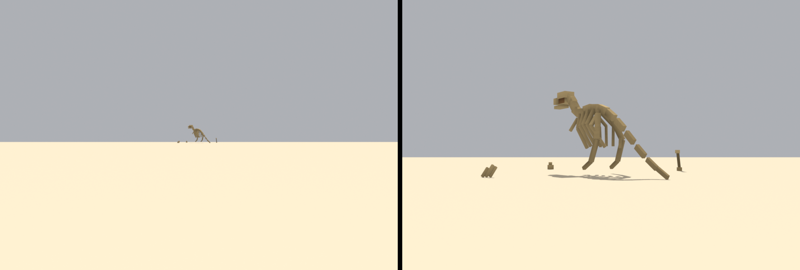

# Brief asset — Schelet de dinozaur (`dino_bones.glb`)

Brief auto-conținut pentru un agent Blender (ex. Blender MCP). Nu presupune
acces la restul repo-ului — tot contractul e aici. Sursele din care e derivat:
[style_bible.md](../style_bible.md) (estetică) + [blender_export.md](../blender_export.md)
(pipeline) + [scripts/palette.gd](../../scripts/palette.gd) (indici de sloturi).

Referință vizuală: `assets/dunele_inspiration/sheet_wave1_props.png`, panoul
**DINOSAUR SKELETON** (dreapta sus). Foaia arată și un rând de **oase izolate**
sub schelet — alea sunt variantele mici cerute mai jos.

> **Prompt de dat agentului** — de la linia orizontală de mai jos în jos e
> paste-ready. Restul paginii sunt note pentru noi.

---

Construiește un schelet de dinozaur fosilizat, parțial dezgropat din nisip,
low-poly, stilizat, pentru un joc de curse cu mașinuțe de jucărie în stil
diorámă de deșert (ton *Art of Rally* — machetă de masă, NU foto-realist).
Rezultat: un `.glb` cu patru obiecte, care intră într-o lume cu un singur
material partajat.

**Formă și dimensiuni** (unitate: 1 = 1 m; mașina de referință = 4.2 m):

Patru obiecte în același fișier, cu numele **exacte**:

### `Dino_Skeleton` — piesa principală, ≤ 600 triunghiuri

Lungime totală ~9 m (cu coadă), înălțime ~4.5 m la șold, lățime ~2.5 m.
Silueta de terapod din foaie: cap ridicat, coadă lungă întinsă, sprijinit pe
picioarele din spate.

- **Coloană vertebrală**: un șir de ~14 vertebre care descresc spre coadă.
  Fiecare vertebră = o cutie cu 6 fețe, 0.28 m la trunchi → 0.10 m la vârful
  cozii. Nu modela procese spinoase separate; fă vertebra mai înaltă decât lată
  și se citește la fel.
- **Cutie toracică**: **8 coaste**, câte 4 pe parte, arcuite. Fiecare coastă =
  un prismatic cu 4 laturi, grosime minimă **0.12 m**. Sub asta dispar la viteză.
- **Craniu**: o masă alungită, ~1.5 m, cu o falcă sugerată printr-o tăietură
  orizontală. **Orbitele nu se scobesc** (nu avem operații booleene) — se
  marchează cu un slot închis pe două fețe.
- **Membre**: două picioare din spate masive (femur + tibie + labă, câte o formă
  fiecare) și două brațe scurte în față. Fără degete individuale.
- **Parțial îngropat**: jumătatea din spate a cozii și labele intră în nisip.
  Modelează doar ce se vede. Asta e ce-l face să pară un sit de săpături, nu o
  statuie — și taie jumătate din triunghiuri.

### `Bone_A`, `Bone_B`, `Bone_C` — oase izolate, ≤ 40 triunghiuri fiecare

Din rândul de oase al foii. Se împrăștie separat prin decor.
- `Bone_A` — femur, ~1.4 m, prismatic cu 6 laturi și capetele îngroșate.
- `Bone_B` — grup de 3 coaste curbate, ~0.9 m, întrepătrunse.
- `Bone_C` — vertebră izolată, ~0.5 m.

NU: dinți individuali, textură de os, crăpături modelate, unelte de săpătură,
prelate, țăruși.

**Culoare — FĂRĂ texturi proprii. UV → sloturi dintr-un atlas de paletă** (32
sloturi orizontale). Fiecare față își colapsează toate UV-urile pe **un singur
punct**, centrul slotului:
- Os (majoritatea fețelor): **u = 0.015625, v = 0.5**
- Orbite, interiorul cutiei toracice, fețele orientate în jos: **u = 0.078125, v = 0.5**
- Nisip/pământ la baza scheletului, dacă modelezi o movilă: **u = 0.046875, v = 0.5**
- Nu e nevoie să încarci vreo imagine în Blender; contează doar coordonata UV.
  Materialul se înlocuiește ulterior.

Osul e **mai deschis decât nisipul din jur** — ăsta e contrastul care face
silueta lizibilă de la 80 m. Nu folosi alb; nu există în paletă.

**Vertex colors = ambient occlusion copt (grayscale), se înmulțește peste
culoare în engine:**
- Gradient vertical: jos mai închis (~0.55), sus spre 1.0.
- Întunecă: între coaste, sub craniu, unde oasele intră în nisip, în orbite.
- 1.0 = neatins, ~0.5 = adânc/umbrit. Fără el iese plat — e obligatoriu.

**Scară, origine, orientare:**
- Originea (pivotul) la **baza obiectului, centrată în XZ**, pentru fiecare din
  cele patru.
- Toate patru se **exportă la origine** (0,0,0), nu decalate.
- Botul scheletului se orientează spre **+Y în Blender**.
- Bevel **0.04 m**.
- Buget: **`Dino_Skeleton` ≤ 600**, oasele izolate **≤ 40** fiecare.

**Export:**
- glTF Binary **(.glb)**, un fișier, nume `dino_bones.glb`, cu **patru** obiecte:
  `Dino_Skeleton`, `Bone_A`, `Bone_B`, `Bone_C`, ca **copii direcți ai rădăcinii**.
- Include: Mesh, **UVs**, **Vertex Colors**, Normals. Fără camere, lumini sau
  materiale complexe.
- **Apply Modifiers: ON** (bevel-ul să fie în geometrie). Y-up: implicit.

---

## Note pentru noi (nu fac parte din prompt)

- **Ce înlocuiește:** `toy_dino.glb` — un dinozaur de plastic din tema abandonată
  „ladă de nisip". Codul care îl plasează (`track.gd:1325-1350`, `_dino_spots()`)
  e viu, doar că nicio pistă nu-l cere momentan.
- **De ce merită înlocuit și nu șters.** Un dinozaur *de plastic* în canion e
  absurd; un **schelet fosilizat** e unul dintre cele mai puternice clișee
  vizuale ale deșertului american, se leagă de falezele stratificate pe care le
  avem deja, și dă turului un moment „ce-a fost aia?". Asta e literalmente ce
  înseamnă cererea de „mai memorabil".
- **Cele 3 oase izolate sunt un bonus peste issue-ul original** (#52 cerea doar
  scheletul). Sunt aproape gratis — 40 de triunghiuri fiecare — și transformă un
  landmark unic într-un **sit** care se poate întinde pe 40 m de drum. Instanța
  de gameplay decide dacă le împrăștie.
- **Sloturi folosite:** `sand_light` = 0 (u = 0.015625), `sand_shadow` = 2
  (u = 0.078125), `sand_mid` = 1 (u = 0.046875).
- **Fișier nou. NU se atinge `toy_dino.glb`.**
- **Testul real** e o captură de la ~80 m, de la nivelul solului: se citește ca
  schelet? Dacă nu, îngroașă oasele și scoate detalii — nu invers.
- **Checklist la primire:** patru noduri cu numele exacte, copii direcți ai
  rădăcinii; bugetele respectate per nod; UV pe centre; `COLOR_0`; origini la
  bază, toate la (0,0,0).

## Livrat (#B4)

Stânga e **testul de acceptanță din issue**: 80 m, de la nivelul solului,
obiectiv 26 mm. Silueta se citește — cap ridicat, spinare arcuită, coadă care
coboară în nisip — dar e mică, și e cinstit spus așa: la 80 m scheletul ocupă
vreo 40 de pixeli pe verticală. Dreapta e același sit de la 21 m, cu cele trei
oase izolate împrăștiate.

### Cote

| nod | tris | buget | dimensiuni (Godot X × Y × Z) |
|---|---|---|---|
| `Dino_Skeleton` | **552** | 600 | 2.25 × 5.15 × 10.39 m |
| `Bone_A` (femur) | **36** | 40 | 0.28 × 1.39 × 0.37 m |
| `Bone_B` (3 coaste) | **36** | 40 | 0.75 × 0.63 × 0.50 m |
| `Bone_C` (vertebră) | **24** | 40 | 0.30 × 0.52 × 0.34 m |

Toate patru sunt copii direcți ai rădăcinii, la (0,0,0), cu baza la Y=0.
`toy_dino.glb` măsoară 3.05 × 5.95 × 9.11 — același ordin de mărime.

### Abateri de la brief

- **Bevel 0, nu 0.04.** Multiplicatorul e 3.67× și **nu depinde de lățimea
  bevel-ului** — `segments=1` adaugă mereu aceeași topologie. Cu bevel, bugetul
  brut util ar fi fost 600 / 3.67 = **163 de triunghiuri**, adică 13 cutii;
  brieful cere peste 30 de piese, deci coloana singură ar fi depășit tot bugetul.
  Fără bevel încape tot brieful, cu coaste în două segmente, și mai rămân 48 de
  triunghiuri. Schimbul nu e același ca la poarta de start: acolo bevel-ul
  rotunjea grinzi văzute de la 30 m, aici testul din issue e o captură de la
  80–100 m, unde o teșitură de 4 cm e sub-pixel. Un os fosilizat citește bine
  fațetat.
- **Cinci perechi de coaste, nu patru.** Bugetul permitea, iar cu patru cușca
  rămânea rară. 48 de triunghiuri, cea mai ieftină îmbunătățire de siluetă din
  tot fișierul.
- **Fără movilă de nisip la bază.** Ar fi însemnat o pată de `sand_mid` peste un
  teren procedural a cărui culoare variază — adică un contur vizibil. Contactul
  cu solul îl dă AO-ul copt.

### Două lucruri pe care le-au arătat capturile, nu calculul

**Coastele arcuiau doar în plan lateral.** Din profil — singurul unghi din care
se citește orice terapod — un arc în planul X–Z se proiectează într-o linie
dreaptă: ieșeau patru stâlpi verticali sub coloană, ca picioarele unei mese.
Coastele reale cad **și spre spate**; înclinarea spre −Y le desface în evantai
exact pe silueta pe care o vezi din mașină.

**Coada ieșea linie punctată.** Vertebrele la 0.30 din pasul de 0.8 m lăsau goluri
cât osul. La 0.38 rămân distincte, dar golul scade sub jumătate și se citește șir
de oase, nu urmă.

Și, a treia oară în lotul ăsta după stâlpii porții: **grosimea nu costă niciun
triunghi.** La primul test de 80 m silueta era la limită, iar issue-ul spune
explicit ce se face atunci — „îngroașă oasele și scoate detalii, nu invers".
Vertebre 0.28 → 0.34, coaste 0.14 → 0.18, craniu cu ~12% mai mare. Zero cost.
