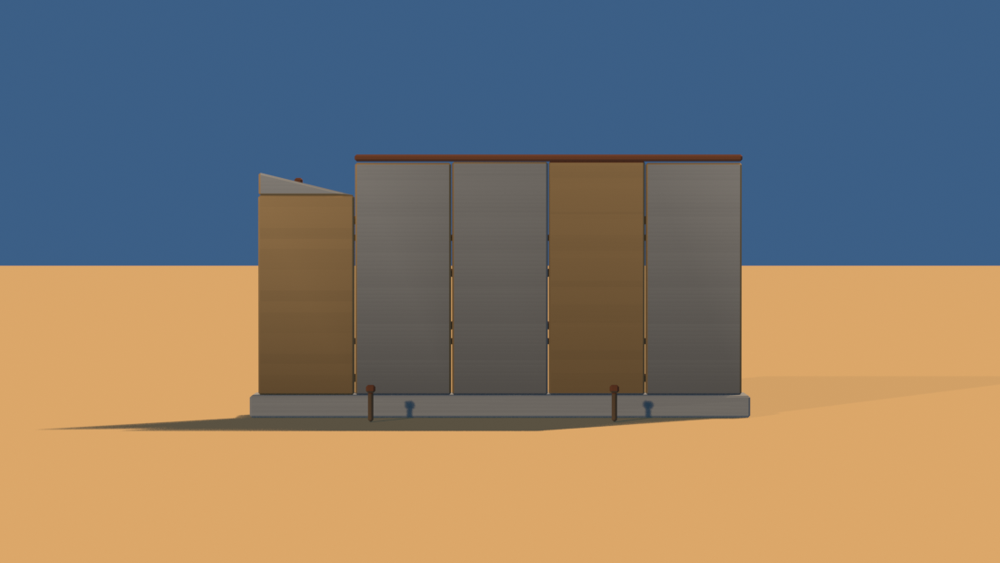
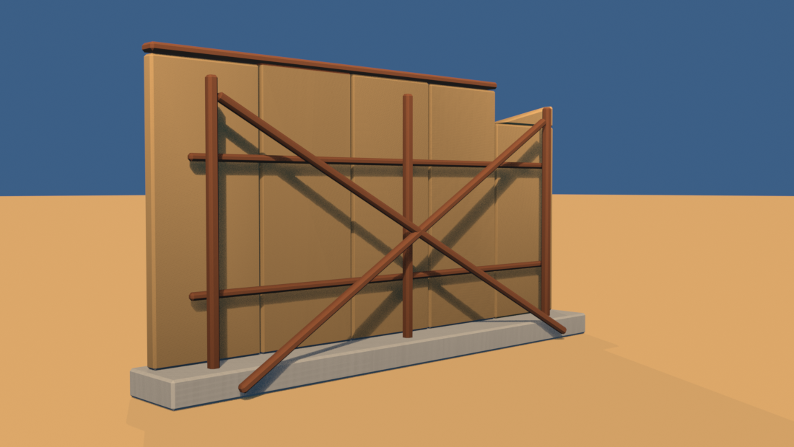

# Brief asset — Ecran de drive-in (`drive_in_screen.glb`)

Brief auto-conținut pentru un agent Blender (ex. Blender MCP). Nu presupune
acces la restul repo-ului — tot contractul e aici. Sursele din care e derivat:
[style_bible.md](../style_bible.md) (estetică) + [blender_export.md](../blender_export.md)
(pipeline) + [scripts/palette.gd](../../scripts/palette.gd) (indici de sloturi).

Sursa reproductibilă: [tools/blender/build_drive_in_screen.py](../../tools/blender/build_drive_in_screen.py).

> **Prompt de dat agentului** — de la linia orizontală de mai jos în jos e
> paste-ready. Restul paginii sunt note pentru noi.

---

Construiește un ecran de cinema în aer liber, abandonat, low-poly și stilizat,
pentru un joc de curse cu mașinuțe de jucărie în stil diorámă de deșert (ton
*Art of Rally* — machetă de masă, NU foto-realist). Rezultat: un `.glb` care
intră într-o lume cu un singur material partajat.

**Rolul lui în cadru:** e o siluetă imensă și plată pe cer. Ocupă o bucată mare
din imagine pentru câteva sute de triunghiuri — ăsta e tot rostul obiectului.
Testul nu e cum arată din față, ci dacă rămâne interesant **din trei sferturi**,
când se vede scheletul din spate.

**Formă și dimensiuni** (unitate: 1 = 1 m; mașina de referință = 4.2 m):
- **Ecran** 20 m lățime × 9.6 m înălțime, grosime **0.5 m** — trebuie să aibă
  corp când îl vezi din unghi, nu să fie o foaie.
- **Fundație de beton** 20.6 × 2.6 × 0.9 m, sub tot ecranul. Vârful ansamblului
  ajunge la **10.84 m**.
- Ecranul e împărțit în **5 panouri verticale** cu înălțimi ușor diferite
  (±8 cm) — marginea de sus nu e o linie perfectă. Ultimul panou e retezat cu
  1.35 m: **colțul din dreapta-sus lipsește**, cu un ciob triunghiular sub
  ruptură ca să arate a metal smuls, nu a tăietură de ferăstrău.
- **Lisă de ramă** pe muchia de sus (0.28 m), care se oprește înainte de panoul
  retezat — de acolo a plecat bucata lipsă.
- **Schelet de sprijin în spate**, ca la un panou publicitar real:
  3 montanți verticali (0.34 m), 2 traverse orizontale (0.26 m) și **două
  diagonale groase de 0.30 m** care coboară până în nisip. Un singur X pe toată
  lățimea — NU fermă fină.
- **2 stâlpi de difuzor** în față, 1.2 m înălțime, 0.22 m grosime, cu o cutie
  de difuzor deasupra. Nu sunt decor: doi stâlpi de 1.2 m în fața unui perete de
  10.8 m sunt singurul lucru care spune cât de mare e peretele.

**Orientare:** fața ecranului privește spre **−Z în Godot**, adică spre **+Y în
Blender** (exportatorul glTF face `(x, y, z) → (x, z, −y)`).

**Culoare — FĂRĂ texturi proprii. UV → sloturi dintr-un atlas de paletă** (32
sloturi orizontale). Fiecare față își colapsează toate UV-urile pe **un singur
punct**, centrul slotului (`u = (slot + 0.5) / 32`, `v = 0.5`):
- **Fața ecranului**: `concrete` = 8 (u = 0.265625) — cel mai deschis **neutru**
  din paletă
- **Două panouri decolorate** (al doilea și cel retezat), tot pe față:
  `sand_mid` = 1 (u = 0.046875)
- **Laterale și spate** ale panourilor: `sand_mid` = 1
- **Schelet, lisă, cutii de difuzor**: `rust_metal` = 10 (u = 0.328125)
- **Fundație**: `concrete` = 8
- **Stâlpi de difuzor**: `wood_weathered` = 9 (u = 0.296875)
- Sloturile legale sunt **doar 0–13**. 14–16 sunt accente de mașină, 17–31 se
  randează magenta în joc.

**Vertex colors = ambient occlusion copt** (grayscale), se înmulțește peste
culoare în engine:
- Gradient vertical **slab**: 0.72 jos → 1.0 sus. Un perete plat n-are ce să-și
  ocluzeze la bază, iar cu gradient tare fața încetează să mai fie cea mai
  deschisă suprafață din cadru.
- Întunecă unde se ocluză: sub traverse, la contactul diagonalelor cu peretele,
  între montanți și ecran.
- 64 de eșantioane de raycast: peretele are ~190 m² de suprafață continuă, iar
  la 32 zgomotul se vede ca stropi sub traverse.

**Scară, origine, orientare:**
- Originea (pivotul) la **baza obiectului, centrată în XZ**.
- Bevel **consistent 0.08 m** (clasa „clădiri" din style_bible §3).
- Buget: **≤ 900 triunghiuri**. Fără șuruburi, fără fermă fină, fără cercevele —
  se pierd la 60 km/h și transformă silueta în zgomot.

**Export:**
- glTF Binary **(.glb)**, un fișier, nume `drive_in_screen.glb`, un singur nod
  `DriveInScreen`.
- Include: Mesh, **UVs**, **Vertex Colors**, Normals. Fără camere, lumini,
  texturi încorporate.
- **Apply Modifiers: ON** (bevel-ul să fie în geometrie). Y-up: implicit.

---

## Note pentru noi (nu fac parte din prompt)

**Măsurat:** 824 triunghiuri din 900. Verdict `verify_glb.py`: **OK**.
bbox 20.60 × 5.89 × 10.84 m.

### Abateri de la brieful original (#C3) și de ce

- **Fața pe `CONCRETE` (8), nu pe `SAND_LIGHT` (0).** Briefu-l lăsa la alegere.
  La randare, `SAND_LIGHT` e din aceeași familie cu terenul, deci fața ecranului
  se topea în nisipul de sub ea. `CONCRETE` e singurul deschis **neutru** din
  paletă și se decupează și pe cerul albastru, și pe nisip. E și adevărul
  obiectului: un ecran de drive-in e vopsit alb, nu culoarea deșertului.
- **Vârf la 10.84 m, nu mai sus.** Stâlpul cu stea din #C4 măsoară 13.2 m și
  trebuie să rămână cel mai înalt lucru construit de pe pistă — e singurul
  accent vertical din lot.
- **Stâlpii de difuzor au rămas**, deși brieful îi dădea opționali („se pierd,
  sunt aproape de sol"). Fără ei ecranul poate fi orice mărime; cu ei, scara e
  citibilă instantaneu. Costă 88 de triunghiuri din 900.
- **Panouri, nu o placă.** Cinci cutii în loc de una costă 176 de triunghiuri în
  plus, dar dau îmbinări verticale reale (așa se construiește un ecran de
  drive-in), lasă fiecare panou ca țintă separată pentru `retag()` și permit
  tăierea colțului rupt fără boolean.

### Dependențe de `dio_lib`

Scriptul folosește două ajutoare adăugate odată cu el (parte din #A1):
`Builder.pickets()` pentru montanții din spate și `Builder.retag()` pentru
decolorarea per panou. `retag` costă **zero** triunghiuri — e diferența dintre
un perete de 190 m² care citește ca plastic și unul care citește ca tablă
decolorată neuniform (style_bible §4).
