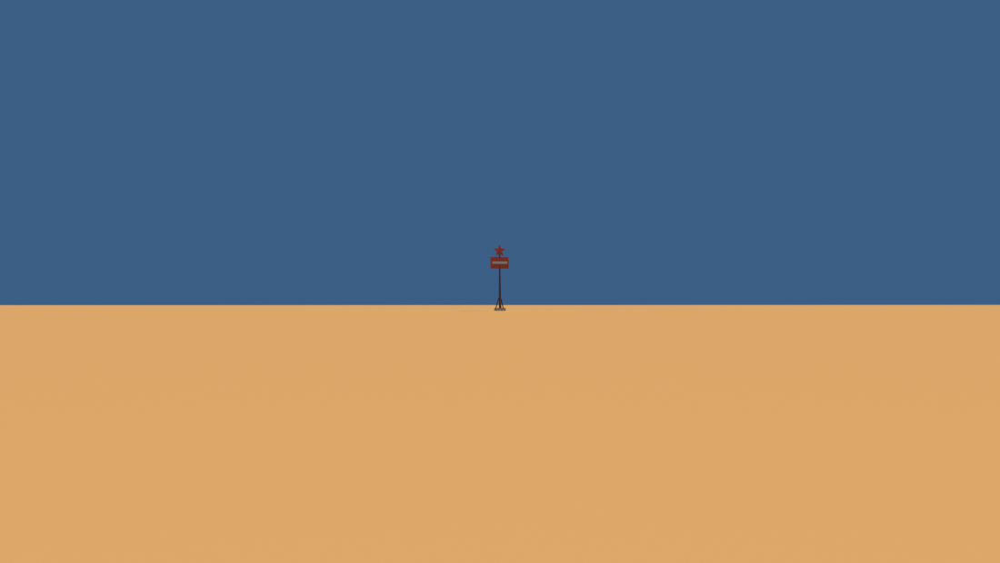
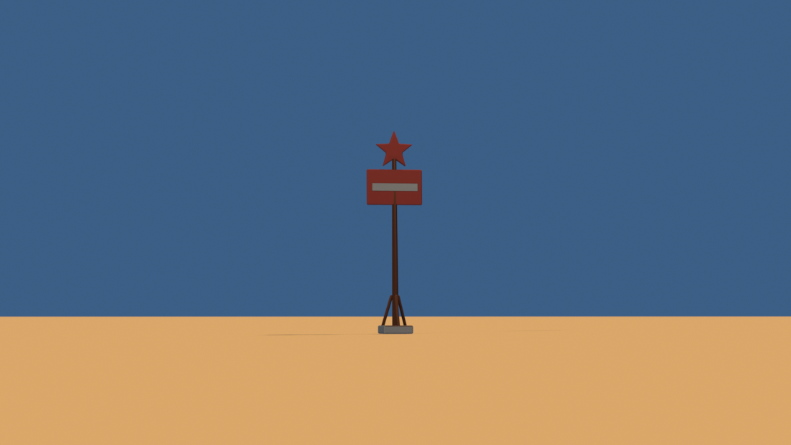
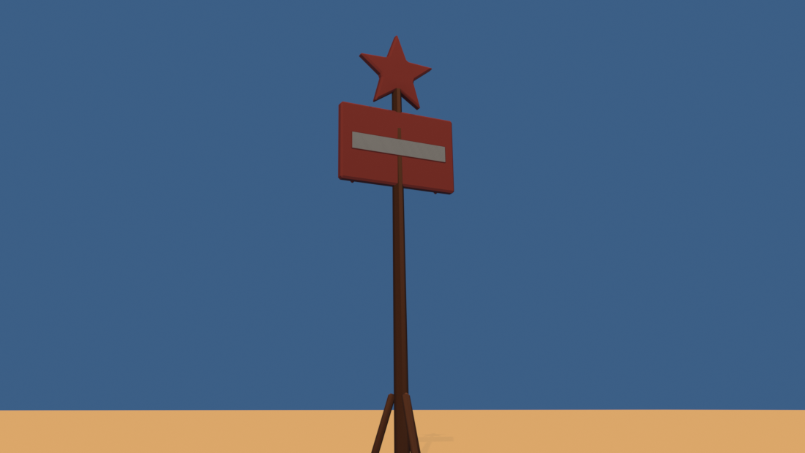

# Brief asset — Stâlp cu stea de benzinărie (`gas_pole_sign.glb`)

Brief auto-conținut pentru un agent Blender (ex. Blender MCP). Nu presupune
acces la restul repo-ului — tot contractul e aici. Sursele din care e derivat:
[style_bible.md](../style_bible.md) (estetică) + [blender_export.md](../blender_export.md)
(pipeline) + [scripts/palette.gd](../../scripts/palette.gd) (indici de sloturi).

Sursa reproductibilă: [tools/blender/build_gas_pole_sign.py](../../tools/blender/build_gas_pole_sign.py).

> **Prompt de dat agentului** — de la linia orizontală de mai jos în jos e
> paste-ready. Restul paginii sunt note pentru noi.

---

Construiește un stâlp înalt cu panou și stea, în stil benzinărie americană anii
'50, low-poly și stilizat, pentru un joc de curse cu mașinuțe de jucărie în stil
diorámă de deșert (ton *Art of Rally* — machetă de masă, NU foto-realist).
Rezultat: un `.glb` care intră într-o lume cu un singur material partajat.

**Rolul lui în cadru** — și de aici vin toate deciziile: e un landmark **înalt și
subțire**, care se citește de la 200 m ca un semn de exclamare pe orizont. Toate
celelalte landmark-uri de pe pistă (benzinărie, moară, turn de apă) sunt mase
joase și late. Ăsta rupe silueta orizontului pe verticală. Dacă la 200 m nu se
citește, obiectul și-a ratat singurul rost.

**Formă și dimensiuni** (unitate: 1 = 1 m; mașina de referință = 4.2 m):
- **Înălțime totală 13.75 m.** Mai înalt decât moara (10.1 m) și decât turnul de
  apă (9.5 m) — trebuie să fie cel mai înalt lucru construit de pe pistă.
- **Fundație de beton** 2.0 × 2.0 × 0.55 m.
- **Stâlp conic**, de la 0.30 la 12.25 m, rază 0.24 → 0.16 m (diametru 0.48 →
  0.32 m), 8 laturi. Conic, nu cilindric: un stâlp care se subțiază spre vârf
  capătă direcție — citește ca „arată în sus".
- **Trei contrafise** de ancorare la bază, la 120°, grinzi de 0.20 m, de la
  raza 0.92 m până la stâlp la 2.60 m înălțime.
- **Panou** 3.8 × 2.4 m, grosime 0.30 m, centrat pe axa stâlpului, între 8.70 și
  11.10 m — treimea de sus. Nu are nevoie de brațe: stâlpul trece prin spatele
  lui.
- **Bandă de contrast** 3.25 × 0.62 m peste mijlocul panoului, ieșind 3 cm de
  fiecare parte. **Nu modela litere** — dispar la viteză și style_bible §3 le
  interzice. Banda citește ca text de la 200 m și costă 12 triunghiuri.
- **Trei coaste de rigidizare** pe spatele panoului, aliniate perfect.
- **Stea** cu rază 1.35 m, grosime 0.28 m, centrată la 12.40 m, **cu vârful în
  sus**. Vârful superior ajunge la 13.75 m. Steaua stă **deasupra** panoului,
  cu ~0.2 m de cer între ele și o bucată de stâlp vizibilă.
- **Stâlpul e înclinat 2°** spre spate. Se rotește tot ce e deasupra fundației
  în jurul bazei stâlpului; fundația rămâne plană pe sol — betonul nu se
  înclină, pământul de sub stâlp cedează.

**Orientare:** fața panoului privește spre **−Z în Godot**, adică spre **+Y în
Blender** (exportatorul glTF face `(x, y, z) → (x, z, −y)`).

**Culoare — FĂRĂ texturi proprii. UV → sloturi dintr-un atlas de paletă** (32
sloturi orizontale). Fiecare față își colapsează toate UV-urile pe **un singur
punct**, centrul slotului (`u = (slot + 0.5) / 32`, `v = 0.5`):
- **Panou și stea**: `kerb_red` = 7 (u = 0.234375). **NU galben** — sloturile
  14–16 sunt rezervate mașinilor.
- **Bandă de contrast**: `concrete` = 8 (u = 0.265625)
- **Stâlp, contrafise, coaste**: `rust_metal` = 10 (u = 0.328125). Nu
  `painted_metal` — albastrul lui se citește rece pe nisip.
- **Fundație**: `concrete` = 8
- Sloturile legale sunt **doar 0–13**.

**Vertex colors = ambient occlusion copt** (grayscale), gradient vertical
0.62 → 1.0, 48 de eșantioane.

**Scară, origine, orientare:**
- Originea **pe axa stâlpului**, la bază — NU pe centrul bounding box-ului. Cu
  stâlpul înclinat, centrarea pe bbox mută fundația cu ~23 cm față de punctul în
  care o așază Godot.
- Bevel **0.06 m** (între prop 0.04 și clădire 0.08).
- Buget: **≤ 700 triunghiuri**. E un obiect subțire; nu are nevoie de mai mult.

**Export:**
- glTF Binary **(.glb)**, un fișier, nume `gas_pole_sign.glb`, un singur nod
  `GasPoleSign`.
- Include: Mesh, **UVs**, **Vertex Colors**, Normals. Fără camere, lumini,
  texturi încorporate. **Apply Modifiers: ON.** Y-up: implicit.

---

## Note pentru noi (nu fac parte din prompt)

**Măsurat:** 624 triunghiuri din 700. Verdict `verify_glb.py`: **OK**.
bbox 3.80 × 2.00 × **13.69 m** (13.75 pe hârtie; bevel-ul rotunjește vârful
stelei cu 6 cm).

Testul cerut de #C4 — de la 200 m, de la nivelul solului, la FOV de joc (35 mm):

Aceeași poziție, teleobiectiv, ca să se vadă ce citește de fapt ochiul:

De aproape, de la 25 m:

### Abateri de la brieful original (#C4) și de ce

- **13.75 m, nu 12–14 „cât iese".** Am urcat steaua peste panou în loc s-o
  lipesc de el. Lipite, panoul și steaua citesc ca o singură pată roșie la
  200 m; cu 0.2 m de cer între ele și o bucată de stâlp vizibilă, silueta are
  trei etaje și se recunoaște. A costat 0.55 m de înălțime și zero triunghiuri.
- **`star_outline(rotation=90)`.** Funcția moștenită de la benzinărie are
  implicit un **vârf în jos** — potrivit pentru accentul mic de acolo, greșit
  aici: cu vârful în jos, silueta de pe orizont are o **vale** în vârf, adică
  exact opusul semnului de exclamare pe care îl vrem. Cu vârful în sus,
  îmbinarea cu stâlpul se rezolvă singură: steaua are atunci o vale în partea de
  jos, în care intră capătul stâlpului, flancat de cele două vârfuri inferioare.
- **Fără brațe de susținere pentru panou.** Panoul e centrat pe axa stâlpului,
  deci stâlpul trece prin spatele lui — brațele ar fi fost 88 de triunghiuri
  pentru o îmbinare pe care n-o vede nimeni.
- **Contrafise groase, nu cabluri de tensionare.** Un cablu real e detaliu de
  frecvență înaltă (style_bible §3 — „NU balustrade subțiri"). Trei grinzi de
  0.20 m se văd și de la 60 km/h.

### Dependențe de `dio_lib`

Scriptul folosește trei lucruri adăugate odată cu lotul (parte din #A1):
`Builder.frustum()` pentru stâlpul conic (`cylinder` are rază constantă,
`revolve` lasă vârful deschis), `Builder.pickets()` pentru coastele de pe
spatele panoului, și `star_outline()` mutat din `build_gas_station.py` în
`dio_lib` — nota 32 din auditul de pipeline.

### Compoziție

Se leagă de benzinăria existentă: un stâlp GAS anunță o benzinărie pe care o
vezi 3 secunde mai târziu (style_bible §7 — un landmark dominant la fiecare 4–6
secunde). Cu ecranul de drive-in din #C3 (10.84 m) formează o pereche: unul lat
și scund, unul înalt și subțire.