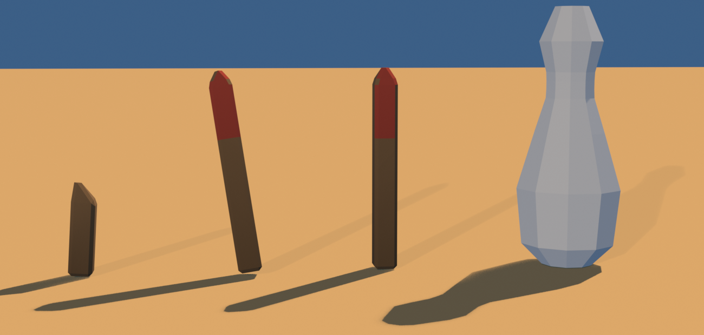

# Brief asset — Stâlp de marcaj (`marker_post.glb`)

Brief auto-conținut pentru un agent Blender (ex. Blender MCP). Nu presupune
acces la restul repo-ului — tot contractul e aici. Sursele din care e derivat:
[style_bible.md](../style_bible.md) (estetică) + [blender_export.md](../blender_export.md)
(pipeline) + [scripts/palette.gd](../../scripts/palette.gd) (indici de sloturi).

Sursa reproductibilă: [tools/blender/build_marker_post.py](../../tools/blender/build_marker_post.py).

Referință vizuală: `assets/dunele_inspiration/sheet_wave1_props.png`, panoul
**ROAD MARKER POSTS** (stânga sus). Ia din el **silueta și inventarul de
variante**, nu finisajul.

> **Prompt de dat agentului** — de la linia orizontală de mai jos în jos e
> paste-ready. Restul paginii sunt note pentru noi.

---

Construiește **trei variante** de stâlp de marcaj pentru marginea drumului,
low-poly, stilizate, pentru un joc de curse cu mașinuțe de jucărie în stil
diorámă de deșert (ton *Art of Rally* — machetă de masă, NU foto-realist).
Rezultat: un `.glb` cu trei obiecte, care intră într-o lume cu un singur
material partajat.

**Bugetul e cel mai strâmt din tot proiectul: ≤ 90 de triunghiuri per variantă.**
Motivul: obiectul ăsta se instanțiază de **110 ori pe pistă**, deci fiecare
triunghi în plus costă 110. Citește §Formă cu asta în minte — dacă un detaliu nu
încape în 90, nu încape deloc.

**Formă și dimensiuni** (unitate: 1 = 1 m; mașina de referință = 4.2 m):

Trei obiecte în același fișier, cu numele **exacte** `Marker_A`, `Marker_B`,
`Marker_C`:

- **`Marker_A` — drept.** Stâlp prismatic cu **4 laturi** (nu cilindru), secțiune
  0.14×0.14 m, înălțime **1.20 m**. Vârf teșit. Bază: o pastilă de beton
  0.30×0.30×0.12 m, îngropată pe jumătate.
- **`Marker_B` — înclinat.** Identic ca formă, dar rotit ~12° pe o axă și cu baza
  ușor ridicată pe o parte, ca lovit de o mașină. Înălțime efectivă ~1.15 m.
- **`Marker_C` — rupt.** Doar **0.55 m** din stâlp, cu vârful frânt (o față
  oblică, nu geometrie zdrențuită). Fără pastilă de beton — iese direct din nisip.

**Banda reflectorizantă** pe toate trei: NU e geometrie separată. E pur și simplu
**fața dinspre drum a stâlpului, pe treimea de sus**, cu alt slot de culoare.
Asta înseamnă că stâlpul are o tăietură orizontală în plus la ~0.80 m, ca să
existe fața aia. Costă 2 triunghiuri, nu 20.

Fața cu banda se orientează spre **+Y în Blender**.

NU: șuruburi, plăcuțe cu text, cabluri, reflectorizante ca obiecte separate,
cilindri cu multe laturi.

**Culoare — FĂRĂ texturi proprii. UV → sloturi dintr-un atlas de paletă** (32
sloturi orizontale). Fiecare față își colapsează toate UV-urile pe **un singur
punct**, centrul slotului:
- Corp de lemn decolorat: **u = 0.296875, v = 0.5**
- Bandă (fața dinspre drum, treimea de sus): **u = 0.234375, v = 0.5**
- Pastilă de beton la bază: **u = 0.265625, v = 0.5**
- Nu e nevoie să încarci vreo imagine în Blender; contează doar coordonata UV.
  Materialul se înlocuiește ulterior.

Fă `Marker_C` (cel rupt) integral pe lemn, fără bandă — și-a pierdut vârful.

**Vertex colors = ambient occlusion copt (grayscale), se înmulțește peste
culoare în engine:**
- Gradient vertical: jos mai închis (~0.55), sus spre 1.0.
- Întunecă la contactul cu pastila de beton și pe fața frântă a lui `Marker_C`.
- 1.0 = neatins, ~0.5 = adânc/umbrit. Fără el iese plat — e obligatoriu.

**Scară, origine, orientare:**
- Originea (pivotul) la **baza obiectului, centrată în XZ**, pentru fiecare din
  cele trei, ca să stea direct pe sol la poziție.
- Cele trei variante se **exportă la origine** (0,0,0), nu decalate una lângă
  alta. Dacă le-ai decalat în viewport pentru lizibilitate, pune-le la zero
  înainte de export.
- Bevel **0.02 m** — mic, fiindcă obiectul e mic și bevel-ul consumă triunghiuri.
- Buget: **≤ 90 triunghiuri per variantă.**

**Export:**
- glTF Binary **(.glb)**, un fișier, nume `marker_post.glb`, cu **trei** obiecte:
  `Marker_A`, `Marker_B`, `Marker_C`, ca **copii direcți ai rădăcinii**.
- Include: Mesh, **UVs**, **Vertex Colors**, Normals. Fără camere, lumini sau
  materiale complexe.
- **Apply Modifiers: ON** (bevel-ul să fie în geometrie). Y-up: implicit.

---

## Note pentru noi (nu fac parte din prompt)

- **De ce ăsta e primul din lot.** Înlocuiește `bowling_pin.glb` (196 tris ×
  110 instanțe = **21.560**, adică 31% din triunghiurile pistei Dunele). La 90
  de triunghiuri economisim **~11.660** — care finanțează cele patru
  landmark-uri noi și toată îmbogățirea hero-urilor.
- **Sloturi folosite:** `wood_weathered` = 9 (u = 0.296875), `kerb_red` = 7
  (u = 0.234375), `concrete` = 8 (u = 0.265625). Dacă se schimbă ordinea în
  [palette.gd](../../scripts/palette.gd), se recalculează u.
- **Referința are 5 variante; cerem 3.** A patra și a cincea din foaie (dungi
  diagonale galben-negru, dungi roșu-alb) ar cere fâșii alternante, adică multe
  tăieturi orizontale — nu încap în 90 de triunghiuri. Banda simplă pe o singură
  față dă 80% din efect la 10% din cost.
- **Fișier nou. NU se atinge `bowling_pin.glb`.** Întoarcerea căii în
  `scenes/tracks/track.gd:1434` o face instanța de gameplay, după verificare.
- **De raportat în PR:** înălțimea și jumătatea de lățime reale ale fiecărei
  variante — colizorul din `scenes/props/bowling_pin.gd:20-23` (cilindru
  `radius 0.3, height 1.55`) se redimensionează după ele.
- **Checklist la primire** (`res://assets/models/marker_post.glb`):
  1. trei noduri cu numele exacte, copii direcți ai rădăcinii
  2. fiecare ≤ 90 triunghiuri (`verify_glb.py assets/models/marker_post.glb 90`)
  3. UV-urile nimeresc centrele sloturilor
  4. origine la bază, centrată XZ, fiecare la (0,0,0)
  5. există strat de vertex color (AO)

## Livrat (#B1)

De la stânga: `Marker_C` (rupt), `Marker_B` (înclinat), `Marker_A` (drept),
și popicul de bowling pe care îl înlocuiesc. Popicul e randat cu material neutru
— el nu respectă contractul (fără UV pe slot, fără `COLOR_0`), deci cu materialul
comun ar ieși negru.

### Cote reale, pentru colizor

| variantă | tris | înălțime | jumătate de lățime |
|---|---|---|---|
| `Marker_A` | **76** | 1.222 m | 0.070 m |
| `Marker_B` | **76** | 1.204 m | **0.183 m** (amprenta înclinată) |
| `Marker_C` | **52** | 0.558 m | 0.084 m |

Modelele sunt construite **la scara lumii**: nu au nevoie de `model_scale`, spre
deosebire de popic (0.53).

### Economia

110 × 196 = 21.560 → 110 × 76 = 8.360. **−13.200 de triunghiuri**, cu ~1.500 mai
mult decât estimarea din issue, fiindcă am ajuns la 76 în loc de 90. Plus un
draw call, fiindcă popicul își aducea propriul material.

### Abateri de la brief

- **Fără pastilă de beton la bază.** Măsurat: pastila costă 44 de triunghiuri
  după bevel — jumătate din bugetul de 90 — pentru un obiect de 0.30 m îngropat
  pe jumătate, adică 6 cm deasupra nisipului. La 110 instanțe ar fi însemnat
  **4.840 de triunghiuri** pentru ceva ce nu se vede de la nicio distanță de
  joc. Cu pastilă, stâlpul întreg ieșea 132 — peste buget. Contactul cu solul îl
  dă AO-ul copt, care întunecă baza.
- **Stâlpul e un singur solid din `revolve` cu 4 laturi, nu cutii stivuite.**
  Două cutii suprapuse costau 88, solidul costă 76 și n-are fețe interne.
  `revolve` cu 4 laturi pune vârfurile pe axe, deci geometria se rotește cu 45°
  ca banda să privească drept spre drum.
- **`Marker_B` e înclinat pe două axe**, nu pe una. Cu o singură axă, jumătate
  din unghiurile de cameră îl prind exact din direcția înclinării și stâlpul
  pare drept — la 110 instanțe varietatea dispare tocmai când ai nevoie de ea.
- **Vârful e piramidal, nu teșit.** Apexul lui `revolve` închide vârful cu 4
  triunghiuri; un vârf teșit ar fi cerut încă un inel plus un capac, adică ~30
  de triunghiuri pentru o diferență de 8 cm.
