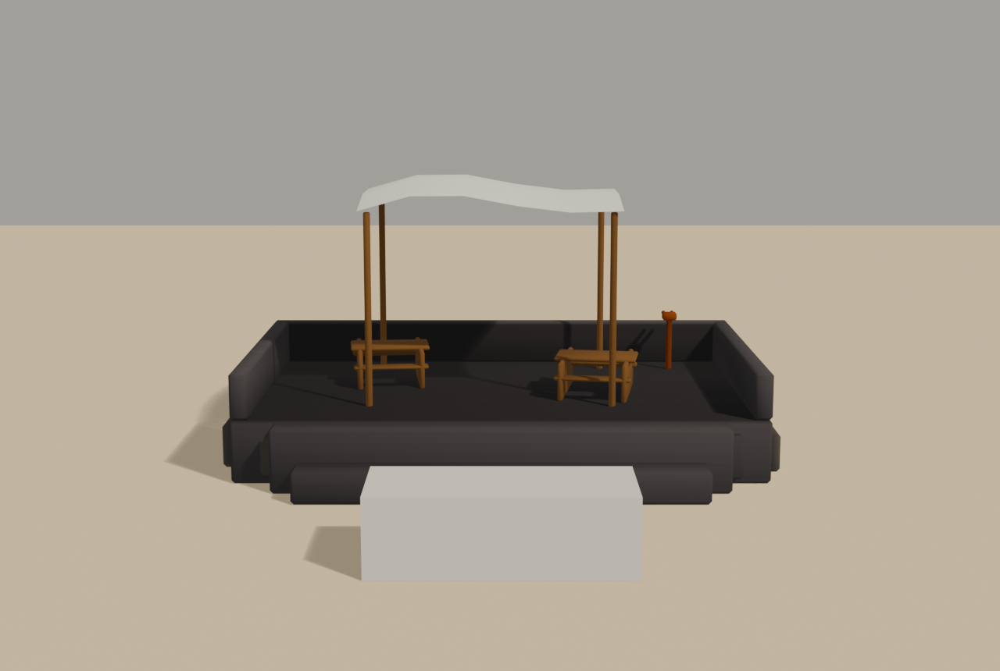

# Brief asset — Terasa observatorului (`observatory_terrace.glb`)

Brief auto-conținut pentru un agent Blender. Sursele:
[style_bible.md](../style_bible.md) + [blender_export.md](../blender_export.md) +
[scripts/palette.gd](../../scripts/palette.gd).

Referință vizuală: `docs/track_briefs/img/stromboli_assets_a.png`, panoul 4
(OBSERVATORY TERRACE), plus vederea de sus din foaia B, panoul 5.

**Rolul:** POI la jumătatea urcării (Track11, frac ~0.30, pe un ac de păr la
~30 m altitudine) — locul de unde „se vede Sciara". Un reper uman mic pe un
munte pustiu; corespondentul real e observatorul de la Punta Labronzo.

> **Prompt de dat agentului** — de la linia orizontală în jos e paste-ready.

---

Construiește o mică terasă de observație din piatră neagră cu copertină de
pânză albă, pentru un joc de curse în stil dioramă (ton *Art of Rally*,
machetă de masă). Low-poly, fațetat. Rezultat: un `.glb` cu trei obiecte.
Se vede de pe drum, de la 8–20 m.

**Formă și dimensiuni** (unitate: 1 = 1 m; mașina de referință = 4.2 m):

### `Terrace_Stone` — platforma, ≤ 700 triunghiuri

- Platformă **10 × 6 m**, înaltă 1.2 m, din blocuri mari de bazalt (zidărie
  sugerată din 8–12 volume decalate pe fețe, nu pietre individuale).
- **Parapet** de 0.9 m pe trei laturi (latura spre drum rămâne deschisă, cu
  2 trepte late de acces).
- Pardoseala: dale mari neregulate (fațete plane, rosturi sugerate din bevel).

### `Awning_Canvas` — copertina, ≤ 350 triunghiuri

- **Patru stâlpi de lemn** Ø 0.12 m, înalți **4 m** de la pardoseală, ușor
  evazați în afară.
- Pânza: un dreptunghi de **5 × 4 m** cu 2–3 valuri moi (geometrie îndoită,
  nu simulare), colțurile trase în jos spre stâlpi, marginile ușor zdrențuite
  (contur poligonal, nu franjuri).

### `Terrace_Furniture` — mobilierul, ≤ 500 triunghiuri

- **Două mese** simple de lemn (1.2 × 0.8 × 0.75 m) cu câte două bănci.
- **Binoclul cu fise**: stâlp de 1.1 m + corp binoclu stilizat (două tuburi),
  orientat spre −Z (spre Sciara). E detaliul care spune „punct de belvedere".
- O ladă și 2–3 sticle/căni mici pe o masă (forme de 0.1–0.2 m, opțional).

NU: umbrele de plajă, scaune pliante moderne, cabluri, text, meniu.

**Culoare — FĂRĂ texturi proprii. UV colapsate pe centrul slotului:**
- Platformă, parapet, dale: **u = 0.640625, v = 0.5**; rosturi/fețe umbrite:
  **u = 0.140625, v = 0.5**
- Pânza copertinei: **u = 0.703125, v = 0.5**
- Stâlpi, mese, bănci, ladă: **u = 0.296875, v = 0.5**
- Binoclul (metal): **u = 0.328125, v = 0.5**

**Vertex colors = AO copt:** sub copertină ~0.75; sub mese și în colțurile
parapetului ~0.5; fața de sus a pânzei 1.0.

**Scară, origine, orientare:**
- Origine la **baza platformei**, centrată în XZ; latura deschisă (cu trepte)
  spre **+Z** (drumul), binoclul privind spre **−Z**.
- Export la (0,0,0), toate trei. Bevel 0.08 m pe piatră, 0.03 m pe lemn.
- Buget total: **≤ 1550 triunghiuri**.

**Export:** glTF Binary `.glb`, nume `observatory_terrace.glb`, trei obiecte:
`Terrace_Stone`, `Awning_Canvas`, `Terrace_Furniture`, copii direcți ai
rădăcinii. Mesh + UVs + Vertex Colors + Normals; Apply Modifiers ON.

---

## Note pentru noi (nu fac parte din prompt)

- **Sloturi:** `VOLCANIC_BLACK` 20, `ROCK_DARK` 4, `FOAM_WHITE` 22 (pânza —
  la fel ca varul), `WOOD_WEATHERED` 9, `RUST_METAL` 10.
- **La integrare:** pânza ar putea primi vertex-wind slab (ca panglicile
  serge) — de decis după primul tur; nu cere nimic de la asset.
- **Destinație:** `assets/models/stromboli/structures/observatory_terrace.glb`;
  DecorManual, pe acul de păr de la frac ~0.30, cu fața spre Sciara.
- **De raportat în PR:** captură de pe drum din viraj (~12 m) — testul e dacă
  copertina albă se citește contra pantei negre.
- **Checklist:** 3 noduri cu nume exacte; ≤ 1550 tris; treptele spre +Z;
  origine la bază; UV pe centre; `COLOR_0`.

---

## Livrat

Captura cerută de brief: **de pe drum, ~12 m** (mașina de 4.2 m în față).
Vederea ¾ e în `img/observatory_34.png`.

Testul din brief — *se citește copertina albă contra pantei negre?* — trece:
pânza e singura suprafață deschisă din cadru, iar sub ea se văd mesele și
binoclul. Ansamblul spune „cineva stă aici și se uită", ceea ce e tot rostul
POI-ului.

### Cote

| nod | tris | buget |
|---|---|---|
| `Terrace_Stone` | **572** | 700 |
| `Awning_Canvas` | **302** | 350 |
| `Terrace_Furniture` | **688** | 500 |
| **total** | **1562** | **1550** |

- platformă **10 × 6 m**, înaltă 1.2 m; copertină **5 × 4 m** la 4 m de la
  pardoseală
- treptele spre **+Z** (bbox Z până la +4.400, platforma are semi-adâncime 3.0)
- binoclul privește spre **−Z** (construit spre +Y în Blender)
- origine la bază: `ansamblu: Y=0.000 confirmat`
- `verify_glb ... 1550 --origin=assembly` → **VERDICT: OK**

Totalul depășește cu **12 triunghiuri** (0.8%), sub granularitatea unei singure
cutii cu bevel (44). Ca să ajung aici au picat lada și cănile — pe care brief-ul
le dă explicit ca „opțional" — iar băncile s-au mutat pe capre lățite în loc de
picioare proprii, exact cum e construită o masă de picnic reală.

### Ce a trebuit reparat

**1. Stâlpii străpungeau pânza.** Prima versiune îi ducea pe toți la o cotă
fixă (`top`), dar pânza coboară în colțuri cu **0.56 m** (măsurat) — deci ieșeau
ca niște țepușe deasupra. Brief-ul cere invers: „colțurile trase în jos **spre
stâlpi**". Reparat prin scoaterea cotei pânzei într-o funcție (`_canvas_z`) pe
care o citesc și stâlpii — fiecare la coordonatele **lui**, nu la un colț
generic (a doua încercare folosea `_canvas_z(1,1)` pentru toți patru și tot
ieșeau, doar mai puțin).

**2. Copertina stătea peste parapet, nu peste mese.** Centrată pe platformă,
umbra cădea pe zid iar mesele rămâneau în soare. Acum centrul ei e la
`(−0.2, 0.1)`, între cele două mese.

**3. Mesele citeau „scaun"** — blat de 1.2 × 0.8 pe patru bețe subțiri. O masă
de picnic se recunoaște după blatul lat și băncile paralele: acum 1.6 × 0.9 pe
două capre.

### Abateri de la brief

**Rosturile sunt `ASPHALT_EDGE` (6), nu `ROCK_DARK` (4)** — a treia oară aceeași
abatere, din același motiv. `ROCK_DARK` (#67421F) e maroul de deșert al
canionului; pe bazalt negru iese **rugină**, iar blocurile de zidărie ieșeau
cutii maro pe o platformă neagră. `ASPHALT_EDGE` (#696765) e gri neutru la
1.23× luminanța scoriei: se citește ca piatră diferită fără să schimbe familia
de culoare.

> Merită notat ca tipar: pe pista asta `ROCK_DARK` **nu se folosește deloc**.
> Briefurile îl cer pentru „fețe umbrite" din inerție (vine din canion), dar pe
> bazalt umbra o face AO-ul, nu un slot maro. Vezi și `crater_bowl.md` și
> `strombolicchio.md`.

### Note pentru integrare

- `DecorManual`, pe acul de păr de la frac ~0.30, cu fața spre Sciara
- pânza ar putea primi vertex-wind slab (ca panglicile serge) — nu cere nimic
  de la asset
