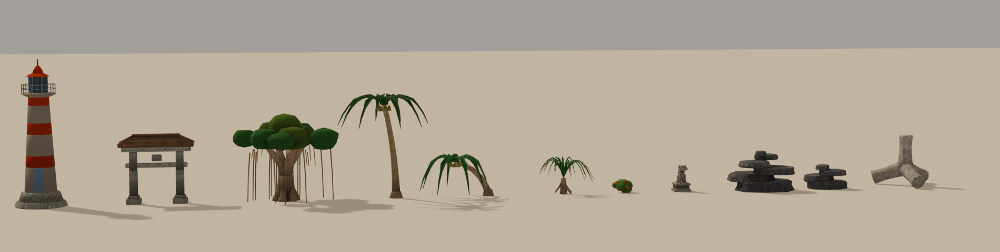

# Kit Okinawa — assets din foaia de referinta (issue #101, #102, #104, #105)

Sursa formelor: `assets/okinawa_inspiration/ChatGPT Image Aug 2, 2026, 07_38_24 PM.png`
(foaia cu TETRAPODS / SHISA GUARDIANS / PALMS AND TREES / CORAL ROCKS / ROADSIDE).

Spre deosebire de briefurile de alaturi, asta **nu e o comanda pentru un agent
Blender extern**: modelele exista deja, construite din `tools/blender/build_*.py`.
Documentul e CONTRACTUL de integrare — ce nume de noduri cauta Godot si ce clasa
de material primeste fiecare. Fara el, integrarea porneste tacut pe fallback
(fiecare punct de incarcare e pazit de `ResourceLoader.exists()`, deci un nume
gresit nu crapa nimic — se vede abia la urmatorul screenshot).



## Ce contine

Nouasprezece fisiere, acoperind issue-urile #101 (wave-0), #102 (wave-1 hero),
#104 (wave-2 vegetatie) si #105 (wave-3). Cotele sunt MASURATE pe GLB, nu
declarate.

| fisier | noduri | cota | tris | issue |
|---|---|---|---|---|
| `tetrapod.glb` | `Tetrapod_01`, `Tetrapod_04`, `Tetrapod_Stack_01` | 1.77 / 3.45 / 3.29 m | 5104 | #101 |
| `coral_rock.glb` | `Coral_Rock_01..08` | 0.40 – 3.77 m | 4174 | #101 |
| `island_scatter.glb` | `Beach_Grass`, `Driftwood`, `Coral_Pebbles`, `Hibiscus` | 0.14 – 0.54 m | 930 | #101 |
| `sea_wall_segment.glb` | `Sea_Wall_A/B/C` | 1.20 / 1.62 m | 700 | #101 |
| `coconut_palm.glb` | `Palm_Bark`, `Palm_Fronds` | 6.70 m | 1742 | #104 |
| `beach_palm_bent.glb` | `BentPalm_*` | 2.80 m | 1406 | #104 |
| `pandanus.glb` | `Pandanus_*` | 2.40 m | 2068 | #104 |
| `banyan.glb` | `Banyan_*` | 5.56 m | 4852 | #104 |
| `hibiscus_bush.glb` | `Hibiscus` | 0.86 m | 788 | #104 |
| `sugar_cane_clump.glb` | `Cane_Clump_A/B/C` | 2.80 – 3.58 m | 8870 | #104 |
| `stone_gate_torii.glb` | `Torii_Stone`, `Torii_Roof` | 4.39 m | 942 | #102 |
| `lighthouse.glb` | `Lighthouse_Stone/White/Red/Metal` | 9.11 m | 2654 | #102 |
| `shisa_statue.glb` | `Shisa_Base/Stone/Detail` | 1.80 m | 4640 | #102 |
| `shisa_statue_closed.glb` | `Shisa_Base/Stone/Detail` | 1.66 m | 4552 | #102 |
| `gusuku_wall.glb` | `Gusuku_Wall_A/B/C` | 2.77 – 4.48 m | 6952 | #102 |
| `sabani_boat.glb` | `Sabani_Hull`, `Sabani_Trim` | 5.00 m lungime | 1300 | #105 |
| `beach_clutter.glb` | `Fishing_Crate`, `Net_Floats`, `Awamori_Pot`, `Bamboo_Rack`, `Driftwood_Log` | 0.19 – 1.37 m | 3594 | #105 |
| `horizon_island.glb` | `Island_Low`, `Island_Peak`, `Island_Ridge` | 6.6 – 26.0 m | 750 | #105 |
| `wave_surge.glb` | `Wave`, `Wave_Foam`, `Wave_Spray` | 3.00 m / 30 m lungime | 2806 | #105, #106 |
| `sea_turtle.glb` | `Sea_Turtle` | 3.60 m lungime / 3.63 m latime | 1090 | — |

> Testoasa e `hazard_model` pe Okinawa manual, in locul barcii sabani: bariera
> mobila de la fractia 0.256 sta la 90 m de apa, unde o barca „targ ita peste
> causeway" nu mai avea nicio explicatie. E singura piesa din lot cu un
> „inainte", deci pista o si roteste pe directia de maturare
> (`hazard_face_travel`) — vezi antetul lui `scenes/tracks/track08.gd`.

> Valul a fost RECONSTRUIT in august 2026, dupa playtest: era o bucata de 6 m pe
> care pista o repeta de cinci ori ca sa acopere drumul, si din masina se vedeau
> exact cinci valuri identice cu cusaturi intre ele. Acum e o singura piesa de
> 30 m, cu varfuri inegale, o portiune deja sparta si un rulou de spuma pe buza.
> Piesa noua `Wave_Spray` e a treia care se anima singura (`wave_surge.gd`).

Total lot: **57.610 de triunghiuri** pentru cate o instanta din TOATE variantele
— dar nicio pista nu le pune pe toate deodata. Ce conteaza e costul per
instanta: scatter-ul sub 400 tris, stancile 300-870, hero-urile 900-4900.

> ⚠️ **NUMELE NODURILOR SUNT CONTRACT, si se verifica in GDScript, nu din
> memorie.** Prima versiune a acestui lot exporta `CoralRock_04`; Godot cauta
> `Coral_Rock_%02d` (`track_decor.gd:359`), nu gasea nimic si cadea tacut pe
> cutii colorate — cu testele verzi. Trei liste de nume sunt hardcodate azi:
> `_add_island_scatter` (Beach_Grass/Driftwood/Coral_Pebbles/Hibiscus),
> `_add_coral_rock` (Coral_Rock_01..08) si `HORIZON_RINGS["picks"]`.

## Mapare de materiale (asta se scrie in Godot)

| nod | clasa | proiectie |
|---|---|---|
| `Tetrapod_*` | `concrete` | UV cubic |
| `Coral_Rock_*` | `coral_rock` | **triplanar de lume**, scara 0.85 |
| `Sea_Wall_*` | `concrete` | UV cubic 1.5 m |
| `Palm_Bark`, `BentPalm_Bark`, `Pandanus_Bark`, `Banyan_Bark` | `bark` | UV cubic 1.3 m |
| `Torii_Stone`, `Lighthouse_Stone`, `Shisa_Base`, `Gusuku_Wall_*` | `stone_wall` | UV cubic 1.4–1.6 m |
| `Torii_Roof` | `roof_tiles` | UV cubic 1.0 m |
| `Lighthouse_White` | `plaster` | UV cubic 1.6 m |
| `Shisa_Stone` | `concrete` | UV cubic 1.0 m |
| `Sabani_Hull` | `wood` | UV cubic 1.2 m |

Tot restul ramane pe materialul lumii (atlasul de paleta): frunzisul
(`*_Fronds`, `*_Leaves`, `Banyan_Canopy`, `Cane_Clump_*`, `Hibiscus`),
scatter-ul, `beach_clutter`, `horizon_island`, `wave_surge`, si accentele
(`Lighthouse_Red/Metal`, `Shisa_Detail`, `Sabani_Trim`). Au UV-uri colapsate pe
sloturi si sunt corecte asa.

**Doua clase noi**, generate de `tools/process_class_textures.gd` din surse
PolyHaven CC0 (`assets/textures/classes/src/`):

- **`coral_rock`** ← `coral_fort_wall_03`, ancora `VOLCANIC_BLACK`, triplanar la
  0.85 (o repetitie la 1.18 m). Chiar zidaria de calcar coraligen a castelelor
  din Okinawa.
- **`bark`** ← `palm_tree_bark`, ancora `WOOD_WEATHERED`, UV cubic 1.3 m = scara
  reala a scanarii, deci inelele de cicatrici cad cat trebuie.

Ambele au fost alese prin `tools/measure_texture_src.gd`, nu din miniatura —
tabelele cu candidatii si motivele respingerilor sunt in comentariile din
`process_class_textures.gd`. Restul claselor folosite (`concrete`, `plaster`,
`stone_wall`, `roof_tiles`) existau deja, deci kitul adauga **doua** materiale
la bugetul pistei, nu unsprezece.

## Ce NU are textura, si de ce

Tot frunzisul (frunze de palmier, sabii de pandanus, coroana de banyan, tufa de
hibiscus) ramane pe atlasul de paleta. Nu e o scurtatura: am masurat patru
candidate de frunzis din PolyHaven fata de ancora `TROPICAL_GREEN` si niciuna nu
e frunzis tropical — `forest_leaves_02/03` sunt litiera de padure (maro,
toamna), `leafy_grass` si `sparse_grass` sunt gazon cu frunze uscate. Gradate cu
45% spre verde ies noroi masliniu. Volumul il dau cuta in V a frunzei si AO-ul
copt, care sunt gratis.

## Verificare

```
python tools/blender/verify_glb.py assets/models/tetrapod.glb 900 --class-parts=Tetrapod_04
python tools/blender/verify_glb.py assets/models/coral_rock.glb 1800
python tools/blender/verify_glb.py assets/models/coconut_palm.glb 2000 \
    --class-parts=Palm_Bark --origin=assembly
python tools/blender/verify_glb.py assets/models/beach_palm_bent.glb 1600 \
    --class-parts=BentPalm_Bark --origin=assembly
python tools/blender/verify_glb.py assets/models/pandanus.glb 2400 \
    --class-parts=Pandanus_Bark --origin=assembly
python tools/blender/verify_glb.py assets/models/banyan.glb 5000 \
    --class-parts=Banyan_Bark --origin=assembly
python tools/blender/verify_glb.py assets/models/hibiscus_bush.glb 900
python tools/blender/verify_glb.py assets/models/stone_gate_torii.glb 1200 \
    --class-parts=Torii_Stone,Torii_Roof --origin=assembly
python tools/blender/verify_glb.py assets/models/lighthouse.glb 3000 \
    --class-parts=Lighthouse_Stone,Lighthouse_White --origin=assembly
python tools/blender/verify_glb.py assets/models/shisa.glb 5000 \
    --class-parts=Shisa_Base,Shisa_Stone --origin=assembly
```

Toate zece dau `VERDICT: OK`.

## Regenerare

Blender deschis cu addon-ul MCP pornit, apoi:

```python
P = r"d:/GameDev/ignition-spike/tools/blender"
g = {"__name__": "__main__", "__file__": P + "/dio_lib.py"}
exec(open(P + "/dio_lib.py").read(), g)
for f in ("build_tetrapod.py", "build_coral_rock.py", "build_island_scatter.py",
          "build_sea_wall.py", "build_palms.py", "build_pandanus.py",
          "build_banyan.py", "build_hibiscus.py", "build_sugar_cane.py",
          "build_torii.py", "build_lighthouse.py", "build_shisa.py",
          "build_gusuku_wall.py", "build_sabani.py", "build_beach_clutter.py",
          "build_horizon_island.py", "build_wave_surge.py",
          "build_sea_turtle.py"):
    exec(open(P + "/" + f).read(), g)
```

Pentru previzualizari (`tools/blender/preview.py`, randare EEVEE cu lumina din
style_bible §5, nu screenshot de viewport):

```python
exec(open(P + "/preview.py").read(), g)
apply_class(bpy.data.objects["Shisa_Stone"], "concrete")   # textura reala, nu atlasul
shot([bpy.data.objects["Shisa_Stone"]], "d:/tmp/shisa.png", azimuth=90.0)
```

## Lucruri invatate aici (ca sa nu se reinvete)

1. **`Builder.rock` face CONURI daca il folosesti pentru frunzis.** Construieste
   inele de la baza in sus si inchide cu capac plat — corect pentru ce sta pe
   sol, gresit pentru o masa suspendata. Coroana banyanului a iesit prima data
   noua corturi de circ. `Builder.boulder` (elipsoid inchis) e primitiva
   corecta.
2. **Primul inel al unui `taper_sweep` e perpendicular pe TANGENTA.** Pe un
   trunchi inclinat asta il baga sub sol cu raza x sin(unghi) — 6.5 cm la
   palmierul de plaja, 10 cm la contrafortii banyanului. Reparatia e un stub
   vertical de 15 cm la baza (doua puncte cu acelasi xy), nu o coborare a
   modelului.
3. **`verify_glb --origin=assembly` nu masura nimic** cand toate piesele aveau
   pivot propriu — adica exact tiparul `finish(origin="base_axis")` +
   `obj.location.z = min_z` folosit de la casa de sat incoace. Raporta „niciun
   nod cu mesh" in loc sa verifice. Reparat in acelasi PR; ambele cote de mai
   sus au fost gasite abia dupa.
