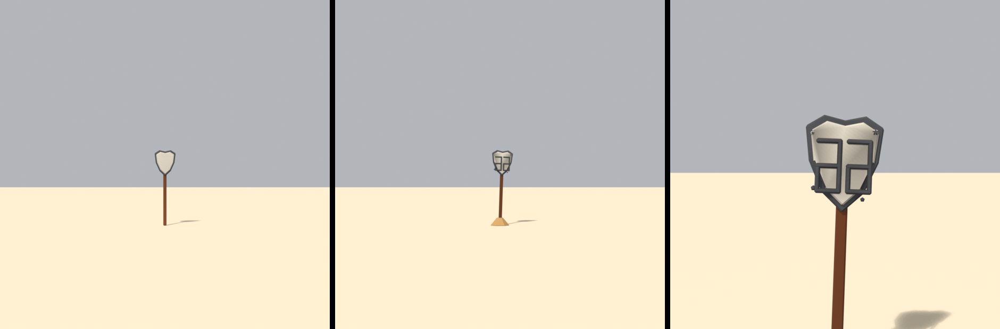

# Brief asset — Semn Route 66 ("route66 sign", `route66_sign.glb`)

Brief auto-conținut pentru un agent Blender (Blender MCP). Nu presupune acces la
restul repo-ului — tot contractul e aici. Surse din care e derivat:
[style_bible.md](../style_bible.md) (estetică) + [blender_export.md](../blender_export.md)
(pipeline) + [scripts/palette.gd](../../scripts/palette.gd) (indici de sloturi).

> **Prompt de dat agentului** — de la linia orizontală în jos e paste-ready.
> Restul paginii sunt note pentru noi.

---

Construiește un semn rutier "Route 66" (US highway shield pe stâlp), low-poly și
stilizat, pentru un joc de curse cu mașinuțe de jucărie în stil **diorámă de
deșert** (ton *Art of Rally* — machetă de masă, NU foto-realist). Rezultat: un
`.glb` mic care intră într-o lume cu **un singur material partajat**. E un prop
de accent — mic, dar cu siluetă recognoscibilă (scut de highway pe par).

**Formă și dimensiuni** (unitate: 1 = 1 m; mașina de referință = 4 m):
- **Stâlp**: vertical, de la 0 la ~**2.8 m**, secțiune pătrată sau octogonală
  ~0.12 m. Opțional o traversă scurtă groasă sub scut. Chunky, nu subțire.
- **Scut (shield)**: silueta clasică de US route shield (blazon cu umeri rotunjiți
  și bază ușor ascuțită), placă plată cu muchie beveled, ~**0.9 lățime × 1.0 m
  înălțime × 0.08 m grosime**, montat sus pe stâlp (centru la ~2.4 m).
  - Construcție în **2 straturi** ca să dea contrastul fără textură:
    1. **placă-fundal** (rama întunecată): scutul plin, ușor mai mare.
    2. **placă-față** (câmpul deschis): scut inset ~0.06 m spre interior, ceva
       mai mic, în relief ușor peste fundal.
  - Cifrele "66" și "US" **NU se modelează** (fără text 3D) — se citește prin
    siluetă + contrast de culoare. (Vezi nota despre decal ulterior.)
- Bevel **consistent 0.04 m** (prop) pe toate muchiile.

**Culoare — FĂRĂ texturi proprii. UV → sloturi dintr-un atlas de paletă** (32
sloturi orizontale). Fiecare față își colapsează UV-urile pe **un singur punct**,
centrul slotului (v = 0.5 mereu):
- **Beton / câmp deschis** (placa-față a scutului) → u = **0.265625**
- **Asfalt / întunecat** (placa-fundal = rama scutului) → u = **0.171875**
- **Metal vopsit** (stâlp, traversă) → u = **0.359375**
  - Alternativ **metal ruginit** pentru stâlp (u = **0.328125**) dacă vrei un ton
    mai cald, de deșert.
- Nu încărca nicio imagine în Blender; contează doar coordonata UV.

**Regulă de citire:** rama de asfalt (slot întunecat) e cea mai închisă parte a
propului — corect, asfaltul rămâne cea mai închisă suprafață din lume.

**Vertex colors = ambient occlusion copt (grayscale), se înmulțește peste
culoare:**
- Gradient vertical ușor pe stâlp: jos ~0.6, sus spre 1.0.
- Întunecă unde scutul se prinde de stâlp și pe muchia interioară dintre placa-față
  și placa-fundal (dă adâncime la relief).
- 1.0 = neatins, ~0.5 = adânc. Obligatoriu.

**Scară, origine, orientare:**
- Originea (pivotul) la **baza stâlpului, centrată în XZ**, ca să stea pe sol la Y=0.
- Fața scutului spre **-Z** (spre stradă/camere).
- Buget: **≤ 250 triunghiuri**. Prop mic — siluetă curată, zero detaliu fin.

**Export:**
- glTF Binary **(.glb)**, un fișier, nume `route66_sign.glb`.
- Include: Mesh, **UVs**, **Vertex Colors**, Normals. Fără camere/lumini/materiale
  complexe.
- **Apply Modifiers: ON** (bevel în geometrie). Y-up: implicit.

---

## Note pentru noi (nu fac parte din prompt)

- **Cifrele "66":** fără textură nu le putem picta. Placa-față beton + rama de
  asfalt dau deja o siluetă de "route shield" lizibilă la viteză. Dacă vrem "66"
  vizibil, opțiuni ulterioare: (a) un slot de decal dedicat în atlas, (b) o placă
  subțire cu literele extrudate — decizie separată, NU în acest brief.
- **Sloturi folosite:** concrete=8 (u=0.265625), asphalt=5 (0.171875),
  painted_metal=11 (0.359375), rust_metal=10 (0.328125). u = (slot+0.5)/32.
- **Commit sursa `.blend` + `.glb`** — nu doar exportul.
- **Checklist la primire** (`res://assets/models/route66_sign.glb`):
  1. triunghiuri ≤ 250
  2. UV-uri pe centrele sloturilor (câmp = beton, ramă = asfalt)
  3. origine la baza stâlpului, XZ centrat; stă pe sol la Y=0
  4. există un strat de vertex color (AO)
  5. instanțiere cu `Palette.apply_world_material(glb)` → un singur material
- Din aceeași bază se derivă ușor și **semnul "GAS" cu stea** din referință
  (schimbi silueta plăcii + sloturile kerb_red/beton) dacă îl vrem ca prop distinct.

## Livrat (#D4)

De la stânga: înainte (scut gol), după — ambele de la **30 m, de la nivelul
drumului**, cum cere issue-ul — și un prim-plan pentru verificarea formei.
Ambele randate cu același material comun.

| | înainte | după |
|---|---|---|
| triunghiuri | 220 | **932** |
| înălțime | 2.90 m | 2.91 m |

### Răspunsul cinstit la testul din issue

Issue-ul întreabă: *„se citește «66»?"* La 30 m, **nu** — se citesc două semne
întunecate cu structură, nu două cifre. Ce s-a rezolvat e problema reală
descrisă în issue: scutul nu mai e **gol**. De la ~10 m cifrele se citesc.

Nu cred că se poate mai bine fără să crească scutul: la 30 m cifra ocupă vreo 6
pixeli pe verticală, iar acolo nicio formă nu mai e o cifră.

### Cum e făcută cifra

Cinci bare, în tiparul afișajului cu 7 segmente, **nu** după forma tipografică —
`style_bible` §3 și issue-ul cer exact asta. Bara de sus, muchia stângă pe toată
înălțimea, traversa din mijloc, bara de jos și muchia dreaptă **doar pe jumătatea
de jos**: ultima e cea care distinge un 6 de un 5.

Prima versiune avea bara la 0.075 pe o cifră de 0.30 — un sfert din lățime — și
golurile rămase ieșeau două dreptunghiuri egale: cifra se citea a domino. La
0.052 pe 0.27 se citește.

### Abateri de la brief

- **Urmele de gloanțe nu pot fi `retag`.** Brieful le cere la zero triunghiuri,
  dar placa-față e un `prism`: fața ei din față e **un singur ngon**, deci n-are
  ce să fie re-etichetat pe bucăți. Sunt discuri cu 5 laturi, 15 triunghiuri
  fiecare. Și sunt discuri, nu cutii, dintr-un motiv concret: prima versiune
  folosea cutii, iar una a căzut chiar deasupra cifrelor și se citea ca un „+".
- **Buget ignorat, la cerere.** Issue-ul ținea ~260; au ieșit 932. Cel mai scump
  post sunt cele zece bare de cifră (~600 după bevel).
- Abaterea documentată la `:36-38` (stâlpul e `RUST`, nu `PAINTED`) e păstrată.
