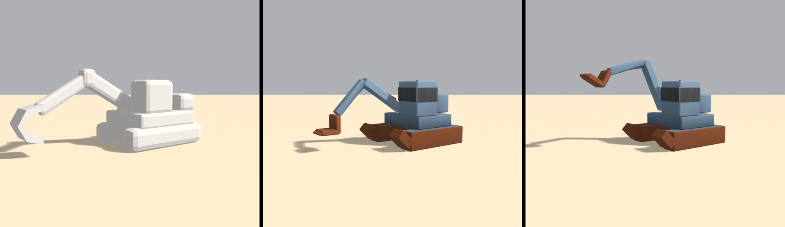

# Brief asset — Excavator ruginit (`rusted_digger.glb`)

Brief auto-conținut pentru un agent Blender (ex. Blender MCP). Nu presupune
acces la restul repo-ului — tot contractul e aici. Sursele din care e derivat:
[style_bible.md](../style_bible.md) (estetică) + [blender_export.md](../blender_export.md)
(pipeline) + [scripts/palette.gd](../../scripts/palette.gd) (indici de sloturi).

Referință vizuală: `assets/dunele_inspiration/sheet_wave1_props.png`, panoul
**RUSTY EXCAVATOR** (mijloc). Silueta din foaie e exact ce vrem.

> **Prompt de dat agentului** — de la linia orizontală de mai jos în jos e
> paste-ready. Restul paginii sunt note pentru noi.

---

Construiește un excavator ruginit low-poly, stilizat, pentru un joc de curse cu
mașinuțe de jucărie în stil diorámă de deșert (ton *Art of Rally* — machetă de
masă, NU foto-realist). Rezultat: un `.glb` cu două obiecte, care intră într-o
lume cu un singur material partajat.

## ⚠️ Al doilea obiect e brațul, și numele lui e contract

> ### Un obiect trebuie să se numească exact **`arm`** (litere mici).

Motorul îl caută după nume și îi animează rotația pe X — brațul coboară peste o
bandă de drum ca obstacol. Fără nodul `arm`, brațul rămâne nemișcat **dar
coliziunea tot comută**: o barieră invizibilă în mijlocul șoselei.

**Pivotul lui `arm`** trebuie să fie la articulația cu corpul, nu la baza
geometriei. Setează originea obiectului acolo.

**Formă și dimensiuni** (unitate: 1 = 1 m; mașina de referință = 4.2 m):

### `body` — șasiu, șenile și cabină

- **Șenile**: două blocuri alungite, 4.8 m lungime × 0.9 m lățime × 1.0 m
  înălțime, la ±1.5 m pe lateral. Roțile de capăt: câte un prismatic cu **8
  laturi** la fiecare capăt, rază 0.5 m. NU modela zalele individual — o tăietură
  de 6–8 caneluri longitudinale pe fața exterioară sugerează șenila și costă
  nimic.
- **Platformă rotativă** peste șenile: cutie 3.2×2.6×0.7 m, de la 1.0 la 1.7 m.
- **Cabină**: cutie 1.6×1.5×1.9 m, de la 1.7 la 3.6 m, decalată pe o parte.
  Ferestre: goluri sugerate cu slot închis, cu ramă groasă de 0.10 m dacă ai
  ajutorul `window()`; altfel plăci întunecate retrase cu 0.06 m.
- **Motor / contragreutate** în spatele platformei: cutie 1.4×2.2×1.1 m, cu un
  tub de eșapament vertical (prismatic 6 laturi, rază 0.10 m, înălțime 0.9 m).
- Înălțime totală ~3.6 m, lungime ~5.3 m.

### `arm` — brațul articulat, pivotat la articulație

- **Braț principal**: grindă 3.4 m lungime, secțiune 0.55×0.45 m, plecând de la
  articulația de pe platformă.
- **Antebraț**: grindă 2.2 m, secțiune 0.42×0.38 m, la ~40° față de primul.
- **Cupă**: o formă în „C" din 3 cutii, deschidere ~1.1 m, cu **4 dinți** —
  cutii mici de 0.15 m, nu conuri.
- **Doi cilindri hidraulici**: prismatice cu 6 laturi, rază 0.11 m. Doi, nu patru.
- **Originea obiectului la articulația cu platforma**, aproximativ (0.0, 0.6, 1.9)
  în coordonate Blender relative la baza excavatorului.

NU: furtunuri, cabluri, scări, oglinzi, plăcuțe, șuruburi, zale de șenilă
individuale.

**Culoare — FĂRĂ texturi proprii. UV → sloturi dintr-un atlas de paletă** (32
sloturi orizontale). Fiecare față își colapsează toate UV-urile pe **un singur
punct**, centrul slotului:
- Caroserie vopsită decolorată (platformă, cabină, brațe): **u = 0.359375, v = 0.5**
- Metal ruginit (șenile, cupă, hidraulice, eșapament): **u = 0.328125, v = 0.5**
- Ferestre și goluri: **u = 0.078125, v = 0.5**
- Nu e nevoie să încarci vreo imagine în Blender; contează doar coordonata UV.
  Materialul se înlocuiește ulterior.

Aici `PAINTED` (albastrul) **e permis și dorit** — pe o mașinărie e exact ce
trebuie, spre deosebire de structurile din peisaj unde s-a citit rece.

**Vertex colors = ambient occlusion copt (grayscale), se înmulțește peste
culoare în engine:**
- Gradient vertical: jos mai închis (~0.55), sus spre 1.0.
- Întunecă: sub platformă, între șenile, în interiorul cupei, la articulații.
- Pe `arm` folosește un gradient **slab** — obiectul se rotește, deci un gradient
  vertical puternic ar arăta greșit când brațul e coborât.
- 1.0 = neatins, ~0.5 = adânc/umbrit. Fără el iese plat — e obligatoriu.

**Scară, origine, orientare:**
- `body`: origine la **bază, centrată în XZ**.
- `arm`: origine **la articulație** (vezi mai sus). Va avea deci o translație de
  nod în GLB — e corect și așteptat.
- Excavatorul privește spre **+Y în Blender**.
- Bevel **0.05 m**.
- Buget: **≤ 900 triunghiuri în total** pe ambele obiecte.

**Export:**
- glTF Binary **(.glb)**, un fișier, nume `rusted_digger.glb`, cu **două**
  obiecte: `body` și `arm`, ca **copii direcți ai rădăcinii**.
- Include: Mesh, **UVs**, **Vertex Colors**, Normals. Fără camere, lumini sau
  materiale complexe.
- **Apply Modifiers: ON** (bevel-ul să fie în geometrie). Y-up: implicit.

---

## Note pentru noi (nu fac parte din prompt)

- **Ce înlocuiește:** `toy_excavator.glb` — excavator de plastic din tema
  abandonată „ladă de nisip". Noduri actuale: `bucket`, `arm`, `body`. Noi cerem
  doar `body` + `arm`; cupa intră în `arm`, fiindcă oricum se rotește cu el.
- **Rigul actual, ca referință de proporție:** corp 5.10 × 4.90 × 7.10 m, pivotul
  brațului la `(0.8, 3.0, −1.4)`, brațul ajunge la Z −7.3.
  `scenes/hazards/excavator_hazard.gd:31-41` are colizoare potrivite manual pe
  rigul ăsta (`model_scale = 0.75`, corp `3.4³` la `(0,1.7,1.0)`, braț
  `1.6 × 2.0 × 4.6` la `(0,1.1,−2.9)`, `raise_angle = 0.55`).
  **Cerem un excavator vizibil mai mic** (5.3 m lungime în loc de 7.1) fiindcă
  cel actual e supradimensionat față de mașina de 4.2 m. De raportat cotele reale
  în PR ca să se recalibreze colizoarele.
- **Sloturi folosite:** `painted` = 11 (u = 0.359375), `rust_metal` = 10
  (u = 0.328125), `sand_shadow` = 2 (u = 0.078125).
- **Fișier nou. NU se atinge `toy_excavator.glb`.**
- **Checklist la primire:** două noduri, `body` la rădăcină și **`arm` copil al
  lui `body`** (vezi corectura de mai jos); **`arm` scris cu litere mici**;
  ≤ 900 tris total; pivotul lui `arm` la articulație; UV pe centre; `COLOR_0`.

## Livrat (#B5, partea a doua)



De la stânga: `toy_excavator.glb` la `model_scale = 0.75`, cum arată azi; apoi
modelul nou cu brațul **coborât** (poziția care blochează banda) și **ridicat**
la cele 0.55 rad pe care le animă hazardul. Excavatorul vechi e randat cu
material neutru — n-are UV pe sloturi.

### Corectura de ierarhie — `arm` NU e copil al rădăcinii

Versiunea inițială a acestui brief cerea două noduri „copii direcți ai
rădăcinii". E greșit, și greșit exact în direcția periculoasă. Codul spune
altceva:

```gdscript
_arm = model.find_child("arm", true, false)              # excavator_hazard.gd:30
var body_node := model.find_child("body", true, false)   # :34
body_aabb = model.transform * Track.model_aabb(body_node, _arm)   # :39
```

Al doilea argument al lui `model_aabb` e un nod de **sărit**, iar comentariul de
la `:36-38` spune de ce: *„`arm` e COPIL al lui `body` în GLB, deci fără skip
iese o cutie de 10 m pe adâncime care ar bloca șoseaua permanent"*. Deci ierarhia
e contract, nu preferință. Structura livrată, citită din containerul glTF:

```
rădăcina scenei: ['body']
  nod body   copii=['arm']   translation=None
  nod arm    copii=-         translation=[0.550, 1.950, -0.419]   rotation=None
```

`rotation` lipsește intenționat: `_arm_base_rot` se citește din nod (`:31`), iar
brațul e modelat direct în poziția coborâtă.

### Cote, pentru colizoare

| | valoare |
|---|---|
| `body` | **420** tris, 3.90 × 3.73 × 4.93 m (Godot X × Y × Z), bază la 0 |
| `arm` | **440** tris |
| total | **860** / 900 |
| pivot `arm` (Godot) | **(0.550, 1.950, −0.419)** |
| braț coborât, cutie strânsă | size **(0.92, 2.84, 5.38)** la position **(0.55, 2.34, −3.01)** |

`toy_excavator.glb` are șasiul de 5.10 × 4.90 × 7.10 m și se încarcă la
`model_scale = 0.75`, deci ocupă 3.83 × 3.68 × 5.33. Modelul nou e construit la
scara lumii și măsoară 3.90 × 3.73 × 4.93 — practic aceeași masă în cadru — deci
**`model_scale` devine 1.0**.

Cutia brațului din `excavator_hazard.gd:60-62` e potrivită de mână pe rigul vechi
(`size (1.6, 2.0, 4.6) * k`, `position (0, 1.1, −2.9) * k`) și **trebuie
re-potrivită**: brațul nou e mai îngust (0.92 față de 1.6), stă mai sus (centru
la 2.34 față de 1.1) și e ceva mai lung. Cotele de mai sus sunt măsurate pe
geometria efectivă, în poziția coborâtă, și scriptul le tipărește la fiecare
build.

### Abateri de la brief

- **Fără roți de capăt la șenile.** Brieful cere câte un prismatic cu 8 laturi la
  fiecare capăt: 4 × 28 = **112 triunghiuri brute**, aproape jumătate din bugetul
  brut de 245. O rampă înclinată în față dă aceeași siluetă cu 12 — profilul
  trapezoidal e ce recunoști de la 40 m, nu roțile.
- **Bandă continuă de geam, nu `window()`.** Ajutorul costă 60 de triunghiuri
  brute pentru **o** fereastră, adică un sfert din tot bugetul brut pentru trei.
  Banda continuă e și mai aproape de adevăr: excavatoarele au cabina vitrată pe
  tot conturul.
- **Geamul e `asphalt` (5), nu `sand_shadow` (2).** La prima captură banda ieșea
  bej — `sand_shadow` e `#A97A4A`, un maro mediu — și se citea ca o dungă de
  vopsea, nu ca geam. Argumentul e chiar cel din docstring-ul lui `window()`:
  *„slotul cel mai închis din lume citește ca gol, nu ca sticlă"*. Cel mai închis
  slot legal e `asphalt`, `#4B4B4D`.
- **Cupa din două cutii, nu trei.** Al treilea perete n-ar fi adăugat siluetă —
  cupa se vede din lateral, unde conturul în „L" e tot.
- **Cilindrii hidraulici sunt `beam`, nu prismatice cu 6 laturi.** 12 triunghiuri
  în loc de 18 fiecare, iar la 40 m nimeni nu vede că pistonul e pătrat.
- **AO cu gradient slab pe `arm`** (`low = 0.86` față de 0.52 pe șasiu), cum cere
  brieful: obiectul se rotește. Același raționament ca la bolovanul din #B2, doar
  că aici rotația e limitată la 0.55 rad, deci gradientul se reduce, nu se
  elimină.
