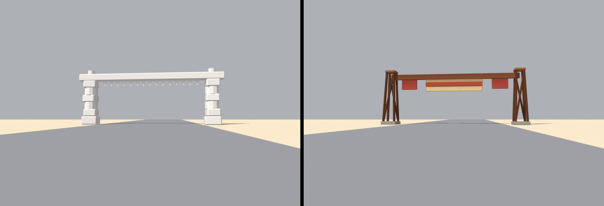

# Brief asset — Poartă de start (`start_gate.glb`)

Brief auto-conținut pentru un agent Blender (ex. Blender MCP). Nu presupune
acces la restul repo-ului — tot contractul e aici. Sursele din care e derivat:
[style_bible.md](../style_bible.md) (estetică) + [blender_export.md](../blender_export.md)
(pipeline) + [scripts/palette.gd](../../scripts/palette.gd) (indici de sloturi).

Referință vizuală: `assets/dunele_inspiration/sheet_wave1_props.png`, panoul
**START / FINISH ARCH**. Silueta din foaie e exact ce vrem — turnuri zăbrelite,
panou central, tablă de șah pe lateral.

> **Prompt de dat agentului** — de la linia orizontală de mai jos în jos e
> paste-ready. Restul paginii sunt note pentru noi.

---

Construiește o poartă de start/sosire low-poly, stilizată, pentru un joc de
curse cu mașinuțe de jucărie în stil diorámă de deșert (ton *Art of Rally* —
machetă de masă, NU foto-realist). Rezultat: un `.glb` care intră într-o lume cu
un singur material partajat.

## ⚠️ Dimensiuni exacte, nu aproximative

> ### Lățime totală **22.800 m**. Înălțime totală **8.700 m**.

Motorul are patru numere derivate din bbox-ul modelului, hardcodate. Un model de
altă mărime se scalează greșit și își pierde coliziunea, fără să dea eroare.
Verifică bbox-ul înainte de export.

**Formă și dimensiuni** (unitate: 1 = 1 m; mașina de referință = 4.2 m):
- **Doi piloni** cu centrele la **x = ±10.5 m**, astfel încât marginile exterioare
  să atingă exact ±11.400 m.
  - Fiecare pilon: turn zăbrelit **evazat** — amprentă la sol ~1.8×1.8 m, sus
    ~1.1×1.1 m, de la 0 la **7.20 m**.
  - Patru montanți de colț de ~0.20 m grosime, **două inele orizontale** (la
    2.4 m și 4.8 m) și **o singură diagonală groasă per față**.
    NU fermă fină, NU zăbrele subțiri — se pierd la viteză.
  - Bază: pastilă de beton 2.4×2.4×0.5 m sub fiecare pilon.
- **Traversă** de la 7.20 la 8.05 m, întinsă între cei doi piloni, grindă
  ~0.45 m grosime.
- **Panou central** suspendat sub traversă: lățime **9.0 m**, înălțime **2.2 m**,
  grosime 0.25 m, cu partea de jos la **5.30 m**.
  - Degajarea sub panou e deci 5.30 m. **Asta e minimul absolut** — mașinile trec
    pe sub poartă după o rampă și au nevoie de aer.
  - Pe panou: o **bandă orizontală** de culoare contrastantă în mijloc, înaltă
    ~0.7 m. Aici ar scrie START/FINISH. **NU modela litere** — dispar la 60 km/h.
- **Două panouri de șah**, câte unul între fiecare pilon și panoul central,
  ~2.5×1.6 m. Șahul se face din **maximum 4×3 pătrate** alternând două sloturi de
  culoare — adică 12 quad-uri coplanare, nu geometrie separată.
- **Vârfuri de pilon**: un mic finial peste fiecare turn, până la **8.70 m**. Astea
  dau înălțimea totală.
- Opțional dacă rămâne buget: 2–3 butoaie și un teanc de cauciucuri la baza
  pilonilor (ca în foaie). Butoiul = un prismatic cu 8 laturi, 0.9 m înălțime.

NU: pânză care flutură, steaguri subțiri, cabluri, becuri individuale, text.

**Culoare — FĂRĂ texturi proprii. UV → sloturi dintr-un atlas de paletă** (32
sloturi orizontale). Fiecare față își colapsează toate UV-urile pe **un singur
punct**, centrul slotului:
- Structură metalică (piloni, traversă, rame): **u = 0.328125, v = 0.5**
- Fața panoului central și pătratele deschise de șah: **u = 0.015625, v = 0.5**
- Banda de pe panou și pătratele închise de șah: **u = 0.234375, v = 0.5**
- Beton (pastile, butoaie de beton): **u = 0.265625, v = 0.5**
- Lemn, dacă folosești grinzi de lemn undeva: **u = 0.296875, v = 0.5**
- Nu e nevoie să încarci vreo imagine în Blender; contează doar coordonata UV.
  Materialul se înlocuiește ulterior.

**Vertex colors = ambient occlusion copt (grayscale), se înmulțește peste
culoare în engine:**
- Gradient vertical: jos mai închis (~0.55), sus spre 1.0.
- Întunecă: în interiorul turnurilor zăbrelite, sub traversă, în spatele
  panoului, la contactul pilonilor cu pastilele de beton.
- 1.0 = neatins, ~0.5 = adânc/umbrit. Fără el iese plat — e obligatoriu.

**Scară, origine, orientare:**
- Originea (pivotul) la **baza obiectului, centrată în XZ** — mijlocul dintre
  cei doi piloni, la nivelul solului.
- Fața panoului (cea pe care ar scrie START) se orientează spre **+Y în Blender**.
- Bevel **consistent 0.05 m** pe toate muchiile.
- Buget: **≤ 950 triunghiuri.** O singură instanță pe pistă.

**Export:**
- glTF Binary **(.glb)**, un fișier, nume `start_gate.glb`, un singur obiect
  numit `StartGate`.
- Include: Mesh, **UVs**, **Vertex Colors**, Normals. Fără camere, lumini sau
  materiale complexe.
- **Apply Modifiers: ON** (bevel-ul să fie în geometrie). Y-up: implicit.

---

## Note pentru noi (nu fac parte din prompt)

- **Ce înlocuiește:** `start_arch.glb` — arcadă de jucărie din tema abandonată
  „ladă de nisip". Apare pe **toate** pistele, fără verificare de temă, și e
  primul lucru pe care îl vezi la countdown. N-are UV pe sloturi, n-are
  `COLOR_0`, deci își aduce propriul material.
- **De unde vin cele patru numere magice** (`scenes/tracks/track.gd`):
  ```gdscript
  var s := target_width / 22.8          # :1499 — "latimea masurata a modelului"
  box.size = Vector3(1.4, 8.7 * s, 1.6) # :1509
  box.position.y = 8.7 * s * 0.5        # :1511
  # inset stalpi: target_width * 0.5 - 0.9
  ```
  Zero citiri de AABB. De aceea cotele sunt contract. Instanța de gameplay are pe
  listă să le înlocuiască cu o citire de AABB — până atunci, 22.800 × 8.700.
- **Sloturi folosite:** `rust_metal` = 10, `sand_light` = 0, `kerb_red` = 7,
  `concrete` = 8, `wood_weathered` = 9.
- **De ce roșu și nu galben** pentru bandă: sloturile 14–16 sunt rezervate
  accentelor de mașină și sunt interzise în decor. Aceeași decizie e documentată
  în `tools/blender/build_gas_station.py:93`.
- **De ce nu `PAINTED` (albastru)** pentru structură: `build_route66.py:36-38`
  notează că albastrul rece s-a citit ca un corp străin peste nisip, verificat în
  viewport.
- **Fișier nou. NU se atinge `start_arch.glb`.**
- **De raportat în PR:** bbox-ul printat, ca dovadă că e 22.800 × 8.700, plus o
  captură **din unghi de șofer**, nu de sus — poarta se vede aproape exclusiv de
  la nivelul mașinii.
- **Checklist la primire:** un nod `StartGate`; ≤ 950 tris; bbox exact; degajare
  ≥ 5.3 m sub panou; UV pe centre; `COLOR_0` prezent; origine la bază centrată XZ.

## Livrat (#B3)



Ambele din **unghi de șofer** — ochiul la 1.20 m, pe banda din dreapta, la 34 m
de poartă, obiectiv 26 mm. Arcada veche e randată cu material neutru: n-are UV pe
sloturi, deci cu materialul comun ar ieși neagră. Asta e chiar problema.

### Cote

| | valoare |
|---|---|
| triunghiuri | **924** (buget 950) |
| bbox X | −11.4000 .. **+11.4000** → lățime **22.8000 m** |
| bbox Y (Godot, sus) | 0.000 .. **8.7000 m** |
| bbox Z (Godot, adâncime) | −1.200 .. +1.200 |
| degajare sub panou | 5.300 m (minimul din brief) |
| degajare sub traversă | 7.200 m |
| AO | 0.30 .. 1.00 |
| sloturi | `rust_metal`, `sand_light`, `kerb_red`, `concrete` |

`start_arch.glb` măsoară **exact 22.800 × 8.700** — confirmat prin import, nu
presupus. Cele patru numere hardcodate din `track.gd:1499-1511` rămân valabile
cuvânt cu cuvânt.

### Cotele sunt exacte prin construcție, nu prin constantă ajustată

Bevel-ul cu `miter_outer = MITER_ARC` umflă vârfurile cu câțiva milimetri peste
fața plană: construcția la 8.700 iese **8.7177**. Turnul de apă rezolvă asta cu
două constante ajustate de mână (`FINIAL_TOP = 9.486`), și e fragil — epsilonul
depinde de lățimea bevel-ului, de unghi și de geometria din jur, deci se strică
tăcut la prima retușare.

Aici cotele sunt contract, deci se **măsoară și se corectează**: `snap_bbox()`
scalează pe X și Z pe cotele exacte după bevel. Corecția reală a fost X ×1.00000
(nimic) și Z ×0.99797 — 0.2%, sub grosimea unui bevel.

### Nota de buget: brieful e cu 90% peste

Măsurat, la bevel 0.05, cu multiplicatorul **3.67× constant**:

| variantă de pilon | brut | după bevel |
|---|---|---|
| brief integral: 4 stâlpi + 2 inele + 4 diagonale | 492 | **1804** |
| 2 inele, 2 diagonale | 444 | 1628 |
| 1 inel, 2 diagonale | 348 | 1276 |
| 1 inel, 0 diagonale | 300 | **1100** |
| 0 inele, 0 diagonale | 204 | 748 |

**Nici măcar un singur inel nu încape.** Bugetul brut util e 950 / 3.67 = 258 de
triunghiuri, adică vreo 21 de cutii pentru toată poarta. Repartiția finală (252
brut):

```
2 piloni × (4 montanți + 2 diagonale + pastilă + capac)   192
traversă                                                   12
panou central + bandă                                      24
2 panouri laterale                                         24
```

Multiplicatorul 3.67 nu e o coincidență: un cub de 12 triunghiuri beveluit pe
toate muchiile dă 6 fețe (12) + 12 quad-uri de muchie (24) + 8 triunghiuri de
colț = **44**.

### Abateri de la brief

- **Fără inele orizontale.** Vezi tabelul. Ce s-a păstrat din zăbrele: montanții
  de colț și **două diagonale per pilon**, pe fețele dinspre ±Y. Diagonalele au
  fost preferate inelelor pentru că inelele sunt orizontale, deci paralele cu
  traversa și cu panoul — nu adaugă nicio direcție nouă în siluetă. Diagonala e
  singura linie înclinată din tot obiectul.
- **Capac peste fiecare turn, în locul finialului.** Prima captură din unghi de
  șofer a arătat problema pe care tăierea inelelor o crease: fără nimic care să-i
  lege, cei patru montanți se citeau ca **patru bețe separate**, iar vârfurile
  rămâneau cioturi peste traversă. Capacul rezolvă cu o singură cutie ce un inel
  (96 de triunghiuri brute) n-ar fi încăput să facă. Plata: panourile laterale au
  coborât de la două casete la una.
- **Montanți de 0.32 m, nu 0.20.** Tot din prima captură: la 34 m ieșeau tije, iar
  turnul citea a schelă, nu a structură care ține o traversă de 20 m. Grosimea nu
  costă **niciun** triunghi — o cutie are 12 fețe indiferent cât e de groasă.
- **Fără tablă de șah 4×3.** 24 de casete = 288 brut = 1057 după bevel, adică mai
  mult decât toată poarta. `corrugate` părea ieșirea ieftină și nu e: un panou
  costă 52 brut, fiindcă cele două ngon-uri de capac costă cât toată suprafața
  utilă (nota de buget din `dio_lib` scria greșit `~6*ribs+2`; e `16*ribs+4`, și
  am corectat-o). Rămâne ritmul de culoare pe tot ansamblul: **roșu |
  deschis-cu-bandă-roșie | roșu**. Un șah de 4×3 pe 2.5 m înseamnă oricum pătrate
  de 0.6 m, exact detaliul de frecvență înaltă interzis de `style_bible` §3.
- **Bandă din geometrie, nu din `retag`.** Un `retag` ar fi costat zero, dar fața
  din față a panoului e **un singur quad** — n-are ce să fie re-etichetat pe
  jumătate. Ieșirea de 8 cm își plătește triunghiurile: face umbră proprie, deci
  banda se citește și când soarele bate din spatele porții.
