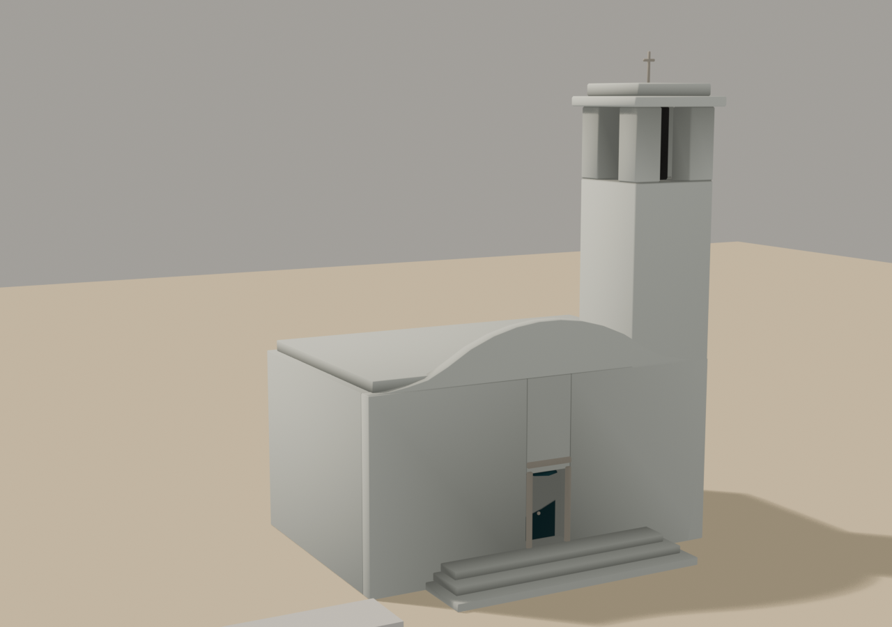

# Brief asset — Biserica din sat (`stromboli_church.glb`)

Brief auto-conținut pentru un agent Blender. Sursele:
[style_bible.md](../style_bible.md) + [blender_export.md](../blender_export.md) +
[scripts/palette.gd](../../scripts/palette.gd).

Referință vizuală: `docs/track_briefs/img/stromboli_assets_a.png`, panoul 2
(STROMBOLI CHURCH), plus vederea de sus din foaia B, panoul 2. **Simplifică
față de planșe**: au ieșit cu prea mult detaliu de zidărie — noi vrem volume
curate de var, în familia bisericii din Khuzhir (Baikal), nu o machetă de
catedrală.

> **Prompt de dat agentului** — de la linia orizontală în jos e paste-ready.

---

Construiește o biserică eoliană albă, mică, pentru un joc de curse cu mașinuțe
de jucărie în stil dioramă (ton *Art of Rally*, machetă de masă, NU
foto-realist). Low-poly, fațetat, volume simple văruite. Rezultat: un `.glb`
cu trei obiecte. E POI-ul liniei de start — mașinile trec pe lângă ea la
fiecare tur, la 10–15 m.

**Formă și dimensiuni** (unitate: 1 = 1 m; mașina de referință = 4.2 m):

### `Church_Body` — corpul, ≤ 1100 triunghiuri

- Volum principal **12 × 8 m**, înalt **6 m**, cu **fronton curb** pe fațadă
  (silueta baroc-mediteraneană: două volute laterale + segment de arc sus).
  Fațada e fața −Z.
- Acoperiș plat sau foarte ușor înclinat în spatele frontonului — NU șarpantă.
- **Trepte late** pe toată fațada: 3 trepte × 0.25 m.
- Colțuri și muchii **ușor rotunjite** (bevel generos — varul eolian nu are
  muchii vii).
- O ușă dreptunghiulară cu arc sus, **2.2 × 1.2 m**, ca panou plat retras
  0.3 m (fără gol tăiat), pe slotul albastru.
- Două ferestre mici arcuite pe fiecare latură lungă, panouri plate retrase.

### `Church_Tower` — campanilul, ≤ 900 triunghiuri

- Turn **3 × 3 m**, înalt **14 m**, lipit de colțul din dreapta-fațadă.
- **Trei goluri de clopot** pe registrul de sus (două pe fațadă, unul lateral),
  arcuite, cu panou întunecat retras; un clopot simplu (bipiramidă, ≤ 40 tris)
  în golul principal.
- Coronament în trepte + **cruce simplă** de 1 m în vârf.

### `Church_Trim` — accente, ≤ 300 triunghiuri

- Ancadramentele ușii și golurilor de clopot: rame plate de 0.15 m.
- Crucea, clopotul, mânerul ușii.
- Separat ca nod ca să poată primi alt slot decât corpul.

NU: olane detaliate, statui, vitralii, text, interior.

**Culoare — FĂRĂ texturi proprii. UV colapsate pe centrul slotului:**
- Corp, turn, trepte (var alb): **u = 0.703125, v = 0.5**
- Ușa și panourile ferestrelor (albastru-gri): **u = 0.359375, v = 0.5**
- Golurile de clopot (panouri retrase, întuneric): **u = 0.171875, v = 0.5**
- Ancadramente, cruce, clopot: **u = 0.921875, v = 0.5**

**Vertex colors = AO copt (grayscale):** gradient jos ~0.7 → sus 1.0; întunecă
sub fronton, în golurile de clopot (~0.35), sub trepte, pe retragerile ușii
și ferestrelor. Fără AO, varul iese carton.

**Scară, origine, orientare:**
- Origine la **baza**, centrată în XZ; fațada (frontonul + treptele) spre
  **−Z**. Export la (0,0,0), toate trei nodurile.
- Bevel 0.10 m pe var (rotunjimea e identitatea), 0.03 m pe accente.
- Buget total: **≤ 2300 triunghiuri**.

**Export:** glTF Binary `.glb`, nume `stromboli_church.glb`, trei obiecte:
`Church_Body`, `Church_Tower`, `Church_Trim`, copii direcți ai rădăcinii.
Mesh + UVs + Vertex Colors + Normals; Apply Modifiers ON.

---

## Note pentru noi (nu fac parte din prompt)

- **Sloturi:** `FOAM_WHITE` 22 (var — aceeași decizie ca zăpada Baikal: albul
  există deja, nu se duplică), `PAINTED_METAL` 11 (albastru-gri eolian pentru
  uși/obloane — #7692A8, exact rolul), `ASPHALT` 5 (goluri), `MARBLE_GREY` 29.
- **La integrare:** corpul poate primi clasa `plaster` (există de la farul
  Okinawa) cu UV cubic — de decis la primire, pe captură; dacă varul plat
  citește bine, rămâne pe atlas.
- **Destinație:** `assets/models/stromboli/buildings/stromboli_church.glb`;
  POI A (piața de start), DecorManual.
- **De raportat în PR:** captură de la nivelul drumului, ~25 m, cu o mașină
  pentru scară — testul e silueta frontonului + turnului contra cerului.
- **Checklist:** 3 noduri cu nume exacte; ≤ 2300 tris; fațada spre −Z;
  origine la bază; UV pe centre; `COLOR_0`.

---

## Livrat

Captura cerută de brief: **de la nivelul drumului, ~25 m, cu o mașină de 4.2 m
pentru scară** (cutia din stânga-jos). Vederea frontală e în
`img/church_front.png`.

Testul din brief — *silueta frontonului + turnului contra cerului* — trece:
frontonul curb și campanilul se citesc amândouă din profil, iar ușa albastră
ancorează fațada la nivelul ochiului.

### Cote

| nod | tris | buget |
|---|---|---|
| `Church_Body` | **1562** | 1100 |
| `Church_Tower` | **352** | 900 |
| `Church_Trim` | **382** | 300 |
| **total** | **2296** | **2300** |

- corp **12 × 8 m**, înălțime **6 m**; turn **3 × 3 m**, **14.72 m** cu tot cu
  coronament și cruce
- fațada verifică **−Z** pe `Church_Body` și `Church_Trim`
- origine la bază (`ansamblu: Y=0.000 confirmat`), piesele își păstrează
  pozițiile relative

Bugetele per nod s-au redistribuit față de brief — corpul depășește, turnul și
trim-ul rămân mult sub — dar **totalul e respectat**. Motivul e în secțiunea
următoare: fațada a trebuit spartă în fâșii, ceea ce mută triunghiuri din turn
în corp fără să schimbe silueta.

### Golul trebuie să fie spațiu ÎNTRE mase (a doua oară)

Lecția e scrisă deja în [mine_portal.md](mine_portal.md) și tot am reînvățat-o
pe pielea mea, cu trei runde de reparații inutile.

Turnul și nava erau **solide**, iar ușa și golurile de clopot erau panouri
întunecate „retrase". Un panou împins într-un solid nu devine gol — devine
**invizibil**: peretele din față îl acoperă. Fiecare rundă în care am
„adâncit retragerea" (0.15 → 0.30 → 0.46 m) a împins panoul mai adânc în masă,
adică fix în direcția greșită.

Ce a rupt bucla a fost o **măsurătoare, nu o părere**: am numărat pixelii
întunecați pe coloana turnului în randare — **zero sub valoarea 100**, deși
sonda de geometrie găsea fețele de gol prezente, cu slotul corect (`asphalt`),
la 0.31 m în spatele feței turnului. Geometria exista și era invizibilă; deci
problema nu era nici materialul, nici adâncimea, ci topologia.

Reparația:
- **registrul de clopote** = patru stâlpi de colț + buiandrug, cu goluri reale
  între ei, și un miez întunecat în ax care se vede prin toate patru
- **fațada navei** = trei fâșii (stânga ușii, dreapta ușii, buiandrug), cu ușa
  în golul dintre ele; cutia navei se oprește cu 0.5 m înainte de planul fațadei

Pe drum am mai eliminat două fantome pe care le luasem drept defecte, tot prin
măsurare: „fâșia lipsă" din stânga fațadei era turnul care ocluda (fâșiile se
verifică aritmetic: acoperă −6.00 → +6.00), iar „banda palidă" verticală era un
gradient de AO de **4%** (124–134 pe 8 biți), nu o piesă ieșită din plan.

### Abateri de la brief

**1. Ușa e `SEA_DEEP` (18), nu `PAINTED_METAL` (11).** Brief-ul cere albastrul
eolian `#7692A8`; pe var (`FOAM_WHITE`, L=0.941) vine la **1.69×** contrast, iar
în randare ușa ieșea `(136,137,132)` lângă un zid `(141,142,136)` — literalmente
invizibilă. Ușile din panoul 2 al foii de referință sunt un albastru profund,
măsurat **(40,81,112)**, L=0.292. `SEA_DEEP` (`#2E5F6B`) e la **distanță de
culoare 16** de referință (`PAINTED_METAL` e la 116) și dă 2.81× contrast. Nu
consumă slot nou și albastrul marin e deja în paleta pistei.

**2. Ancadramentele golurilor de clopot nu se modelează.** Erau 6 cutii ≈ 264
tris după bevel — singura cauză pentru care `Church_Trim` ieșea 646 față de 300.
Golurile stau la 12–14 m înălțime și au ~1.1 m: de la 25 m o ramă de 18 cm e sub
un pixel. Ce citește la distanța aia e **pata întunecată**, și aia rămâne.
Ancadramentul ușii se păstrează — ușa e la nivelul ochiului, lângă linia de start.

**3. Bevel 0.05 pe turn, nu 0.10.** Stâlpii registrului au 0.95 m latură, iar o
teșitură de 10 cm pe fiecare muchie îi rotunjea în **cilindri**. Bevelul e
semnătura de familie, dar pe piesele subțiri se scalează cu piesa, nu cu clădirea.

**4. Fronton mai turtit** (`rise` 1.7, nu 2.6): la 2.6 arcul se înălța peste
umeri și ieșea o **căpiță**. Frontonul baroc-mediteranean e lat și turtit —
mișcarea vine din volute, nu din înălțime.

### Note pentru integrare

- POI A (piața de start), `DecorManual`; fațada spre drum
- corpul poate primi clasa `plaster` cu UV cubic — de decis pe captură; varul
  plat citește bine acum, deci **rămâne pe atlas** până la proba contrarie
- `Church_Tower` e pătrat perfect (96.7 arie pe X = 96.7 pe Z), deci
  `verify_glb --front=-Z` nu poate deduce o față dominantă pe el și raportează
  „model rotit 90°". Nu e un defect: `Church_Body` și `Church_Trim` confirmă −Z.
