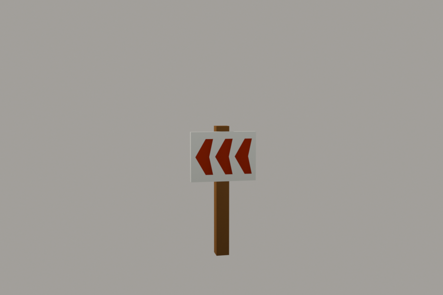
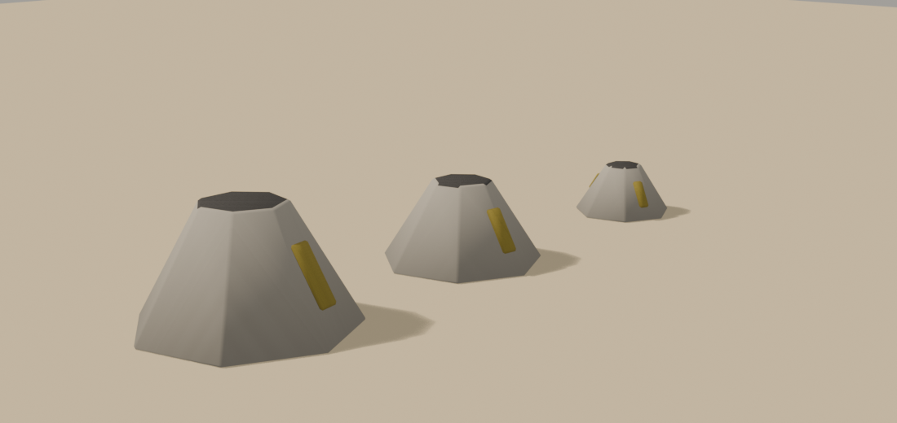
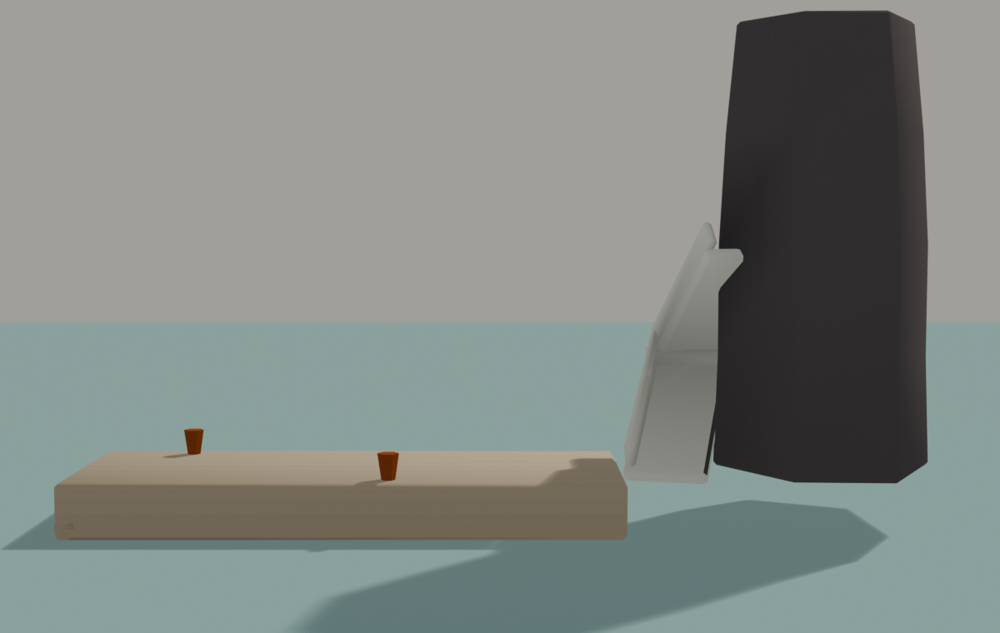

# Brief asset — Piese de margine Stromboli (`fumarole_vent.glb` + `chevron_post.glb` + `ginostra_pier.glb`)

Brief auto-conținut pentru un agent Blender. Sursele:
[style_bible.md](../style_bible.md) + [blender_export.md](../blender_export.md) +
[scripts/palette.gd](../../scripts/palette.gd).

Referință vizuală: `docs/track_briefs/img/stromboli_assets_a.png`, panourile
7 (FUMAROLE VENTS), 8 (CHEVRON POST), 9 (GINOSTRA PIER). **Corecție la
ponton:** în foaia A a ieșit movilă de stâncă; forma corectă e **dana de beton
curată** din foaia B (panoul 10, stânga-jos) + scara albă în stâncă.

> **Prompt de dat agentului** — de la linia orizontală în jos e paste-ready.
> Sunt TREI fișiere mici, descrise pe rând.

---

Construiește trei piese de margine de drum pentru un joc de curse pe o insulă
vulcanică, în stil dioramă (ton *Art of Rally*, machetă de masă). Low-poly,
fațetat, fără text nicăieri.

## Fișierul 1: `fumarole_vent.glb` — trei obiecte

### `Fumarole_A` / `Fumarole_B` / `Fumarole_C` — ≤ 220 triunghiuri fiecare
- Conuri mici de pământ crustos: diametre la bază **0.8 / 1.2 / 1.5 m**,
  înălțimi **0.4 / 0.6 / 0.8 m**, cu **gura deschisă** în vârf (Ø 0.2–0.4 m,
  panou întunecat retras înăuntru — fără gol tăiat).
- Crusta: pământ gri-albicios ars, fațete neregulate.
- **Depuneri de sulf pe buză**: un inel neregulat de geometrie plată
  galben-oliv în jurul gurii + 2–3 limbi care se scurg pe con.
- Aburul NU se modelează — vine din particule în engine.

## Fișierul 2: `chevron_post.glb` — un obiect

### `Chevron_Post` — ≤ 120 triunghiuri
- Stâlp de lemn închis **0.12 × 0.12 m**, înalt **1.2 m**.
- Placă dreptunghiulară **0.6 × 0.45 m** montată sus, perpendiculară pe
  privire (fața spre −Z), cu **modelul chevron ca GEOMETRIE**: 3 săgeți roșii
  pe fond alb, fiecare săgeată un poligon separat ușor extrudat (0.01 m) —
  dungi geometrice, NU literă, NU textură.
- Sensul săgeților: spre **+X** (dreapta privitorului); pista îl oglindește
  prin scale la plantare unde trebuie invers.

## Fișierul 3: `ginostra_pier.glb` — trei obiecte

### `Pier_Slab` — ≤ 300 triunghiuri
- **Dană de beton curată**: placă **8 × 3 m**, groasă 0.8 m, pe două picioare
  scunde de beton; muchia spre mare ușor teșită; fața de sus cu 2–3 rosturi
  sugerate din bevel.

### `Pier_Stairs` — ≤ 250 triunghiuri
- Scară **albă, văruită**, lată 1.2 m, care urcă **4 m** dintr-un capăt al
  danei pe stânca neagră: 2 rampe cu un podest, muret alb scund pe exterior
  (aceeași familie cu scările satului).
- Include sub ea o pană de stâncă neagră fațetată (2 × 3 × 4 m) pe care e
  tăiată — scara nu plutește.

### `Pier_Fittings` — ≤ 150 triunghiuri
- **Doi bolarzi** (ciuperci de 0.4 m) pe dană, un **inel de acostare** pe
  muchie, un colac de frânghie (tor turtit, opțional).

NU (toate trei): text, valuri, alge, oameni, plase (plasele sunt în kitul de
sat).

**Culoare — FĂRĂ texturi proprii. UV colapsate pe centrul slotului:**
- Fumarole — crusta: **u = 0.921875, v = 0.5**; gura (întuneric):
  **u = 0.171875, v = 0.5**; sulful: **u = 0.421875, v = 0.5**
- Chevron — stâlp: **u = 0.296875, v = 0.5**; placa fond: **u = 0.703125,
  v = 0.5**; săgețile: **u = 0.234375, v = 0.5**
- Ponton — beton: **u = 0.265625, v = 0.5**; scara + muret (var):
  **u = 0.703125, v = 0.5**; stânca: **u = 0.640625, v = 0.5**; bolarzi +
  inel + frânghie: **u = 0.328125, v = 0.5**

**Vertex colors = AO copt:** gurile fumarolelor spre 0.3; sub placa
chevronului și sub dană ~0.6; restul 0.8–1.0.

**Scară, origine, orientare:**
- Fumarole: origine la bază, centrată. Chevron: origine la baza stâlpului,
  placa spre −Z. Ponton: `Pier_Slab` cu originea la **linia apei** (fața de
  sus a danei la +0.8), dana ieșind spre **−Z** (spre mare); `Pier_Stairs` și
  `Pier_Fittings` poziționate relativ la aceeași origine, exportate împreună
  la (0,0,0).
- Bevel 0.03–0.08 m după piesă.
- Bugete: `fumarole_vent.glb` ≤ 660; `chevron_post.glb` ≤ 120;
  `ginostra_pier.glb` ≤ 700.

**Export:** trei fișiere glTF Binary cu obiectele numite exact ca mai sus,
copii direcți ai rădăcinii. Mesh + UVs + Vertex Colors + Normals; Apply
Modifiers ON.

---

## Note pentru noi (nu fac parte din prompt)

- **Sloturi:** `MARBLE_GREY` 29 (crustă fumarole), `DRY_VEGETATION` 13
  (sulful — oliv-gălbui, nu galben pur: accentele saturate rămân lava și
  mașinile), `ASPHALT` 5 (goluri), `WOOD_WEATHERED` 9, `FOAM_WHITE` 22,
  `KERB_RED` 7 (chevron — aceleași dungi ca bordurile), `CONCRETE` 8,
  `VOLCANIC_BLACK` 20, `RUST_METAL` 10.
- **Fumarolele** primesc la integrare particulele + `Area3D` de albire
  (hazard-teatru, brief pistă §3) — asset-ul e doar conul.
- **Chevronul** se plantează pe exteriorul acelor de păr și pe crestele oarbe
  ale coborârii (semnalizarea vine în același pachet cu traseul —
  world_design). Sensul se decide la plantare prin rotire/oglindire pe nod
  (memoria `multimesh-oglindire-culling`: oglindirea în MultiMesh se aruncă —
  deci chevroanele se pun ca noduri, nu în MultiMesh, dacă au nevoie de
  scale.x = −1).
- **Destinație:** `assets/models/stromboli/props/`.
- **De raportat în PR:** chevronul de la 25 m din unghiul camerei (se citește
  săgeata?); pontonul de pe apă la 30 m.
- **Checklist:** nume exacte; bugete; fumarolele cu gura întunecată; săgețile
  chevron geometrie, nu textură; dana cu origine la linia apei.

---

## Livrat

### Cote

| fișier / nod | tris | buget |
|---|---|---|
| `Fumarole_A` / `_B` / `_C` | 168 fiecare | 220 |
| **fumarole_vent.glb** | **504** | **660** |
| `Chevron_Post` | **84** | **120** |
| `Pier_Slab` | 176 | 300 |
| `Pier_Stairs` | 384 | 250 |
| `Pier_Fittings` | 52 | 150 |
| **ginostra_pier.glb** | **612** | **700** |

Toate trei: `verify_glb` → **VERDICT: OK**. Pontonul:
`linia apei: Y −1.250 .. 7.300 încalecă 0`. Chevronul: săgețile spre **+X**
(vârful conturului la x=+0.080), placa spre **−Z**.

### Bugetele au dictat forma, nu invers

Pe piesele mici bugetul nu e o limită pe care o atingi la final — e **prima
constrângere de proiectare**, fiindcă bevelul triplează orice. Trei exemple,
toate rezolvate prin măsurătoare înainte de a modela:

**Fumarolele (220/bucată).** Varianta „corectă" — două etaje de con + cilindru
de gură + tor de sulf + 3 limbi — dă **204 triunghiuri brute**, adică ~590 după
bevel. Torul singur (9×4 = 72 brut) costă cât tot bugetul. Ce a rămas: **un**
trunchi de con cu 7 laturi, gura = capacul lui re-etichetat, sulful = inelul de
fețe de sub buză, tot re-etichetat. Ambele costă **zero**. Singura geometrie în
plus sunt două limbi de sulf care se scurg pe pantă — pe alea `retag` nu le
poate face, fiindcă fețele laterale sunt inele orizontale, nu fâșii verticale.

**Chevronul (120).** Stâlp 12 + placă 12 + 3 chevroane (hexagon concav: 8 tri
pe fețe + 12 laterale = 20) = **84 brute**. Cu bevel 0.008 sar la **277** —
bevelul costă *topologic*, nu după lățime, deci 8 mm costă exact cât 10 cm.
Soluția e **bevel 0**, și e și corectă stilistic: bevelul e semnătura pieselor
de piatră și lemn, dar un semn de circulație e placă tăiată și stâlp gelui;
muchia vie e ce îl face să citească a obiect fabricat.

**Bolarzii (150).** 4 cilindri (bolarzi cu capac) + tor = 128 brut → ~460 după
bevel. Acum: bolardul e **un singur frustum** care se lățește spre vârf, inelul
de acostare e o cutie subțire în locul torului (la 30 m, distanța din brief, un
inel de 34 cm e o pată oricum), bevel 0.

### Ce a trebuit reparat

**Stânca pontonului plutea, iar scara era îngropată în ea.** Prima versiune
punea pana de stâncă *sub* scară (`center y=−1.5`, lățime 2.6 m): rampele urcau
prin interiorul ei, iar în randare scara dispăruse complet. E aceeași greșeală
ca la biserică — **geometrie îngropată într-o masă** — doar că aici masa era
stânca. Reparat prin retragerea stâncii la `y=−2.9`, cu scara urcând pe **fața**
ei dinspre dană.

A doua rundă: stânca tot plutea. `rock()` cu `taper` îngustează inelele de jos,
deci o pană așezată „exact" pe zero nu ajunge cu masă până la apă. Îngropată
deliberat (centru la 0.9 pe 6.4 m înălțime → baza la −2.3), ce iese din apă e
doar partea lată.

Pe drum am tras și **o concluzie greșită** pe care măsurătoarea a corectat-o:
la prima randare de sus am pus „plutirea" pe seama perspectivei și a podelei de
preview (care se așază la cel mai jos punct, −1.25). O vedere laterală pură a
arătat că nu — chiar plutea.

**Chevronul părea fără săgeți.** Randarea arăta placă albă goală și stâlpul în
fața ei. `verify_glb` însă raporta `kerb_red` prezent. Camera de preview privea
din **−Y**, adică spatele semnului: fața utilă e pe +Y (= −Z în Godot). Nu era
un defect al modelului, ci al unghiului din care mă uitam.

### Abateri de la brief

1. **Fumarolele:** gura și sulful de pe buză sunt **fețe re-etichetate**, nu
   cilindru retras și tor. Motivul e bugetul, detaliat mai sus.
2. **Chevronul: bevel 0** în loc de 0.03–0.08.
3. **Bolarzii:** o singură piesă per bolard, inel de acostare din cutie, fără
   colac de frânghie (brief-ul îl dă „opțional").

### Limitare cunoscută

`Pier_Stairs` depășește bugetul de nod (384 vs 250) — pana de stâncă pe care e
tăiată scara e inclusă în nodul ăsta, iar `rock()` cu 7×4 inele costă ~250
singur. Totalul fișierului rămâne sub buget (612 / 700).

Vizual, stânca citește încă mai degrabă „bloc" decât „pană fațetată". La
distanța de joc (30 m, de pe apă) e acceptabil; dacă dana ajunge vreodată în
prim-plan, stânca merită refăcută cu `mesa()` sau cu inele explicite.
