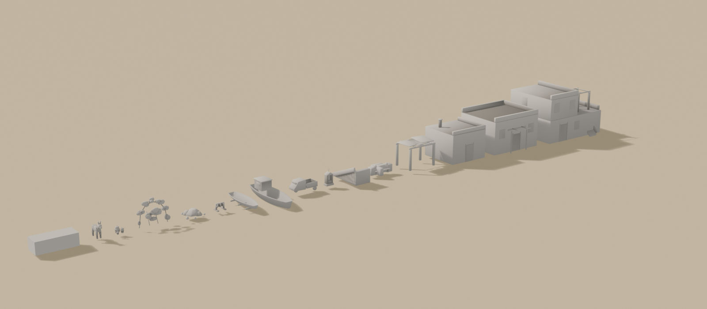

# Brief kit — Satul eolian Stromboli (15 fișiere GLB)

Brief auto-conținut pentru un agent Blender. Sursele:
[style_bible.md](../style_bible.md) + [blender_export.md](../blender_export.md) +
[scripts/palette.gd](../../scripts/palette.gd).

Referință vizuală: `docs/track_briefs/img/stromboli_assets_a.png`, panoul 10
(VILLAGE KIT, două rânduri), plus rândul 3 din foaia B. **Corecție:** măgarul
din planșe a ieșit prea realist — îl vrem la fel de „chunky" ca husky-ul din
kitul Baikal.

**Rolul:** POI-urile A (piața de start, ~10 case + anexe) și G (Ginostra,
4–5 case). Piesele albe sunt fundalul ulițelor prin care trece pista la
fiecare tur, văzute de la 5–20 m.

> **Prompt de dat agentului** — de la linia orizontală în jos e paste-ready.

---

Construiește un kit de sat eolian (insulele Lipari/Stromboli) pentru un joc de
curse cu mașinuțe de jucărie în stil dioramă (ton *Art of Rally*, machetă de
masă, NU foto-realist). Low-poly, fațetat. Identitatea kitului: **volume albe
văruite cu muchii rotunjite** (bevel generos — varul gros nu are colțuri vii),
tâmplărie albastru-gri, accente rare. Fiecare piesă = un fișier `.glb` separat,
cu nodurile numite EXACT ca mai jos, copii direcți ai rădăcinii.

Reguli comune:
- Unitate: 1 = 1 m; mașina de referință = 4.2 m.
- Golurile (uși, ferestre) NU se taie — panouri plate retrase 0.15–0.3 m, pe
  slot închis sau colorat.
- Origine la BAZĂ, centrată în XZ; fațada/fața spre **−Z**; export la (0,0,0).
- Bevel: 0.08–0.12 m pe var, 0.02–0.04 m pe lemn/metal.
- Fără text nicăieri. Fără interioare.

Piesele (dimensiuni L × l × h; buget tris per fișier):

1. **`aeolian_house_a.glb`** — nod `House_A`, **7 × 6 × 4 m**, ≤ 900: casă
   cubică albă, acoperiș-terasă cu parapet rotunjit, ușă + 2 ferestre cu
   obloane, o pergolă mică de lemn peste intrare (2 grinzi + umbră).
2. **`aeolian_house_b.glb`** — nod `House_B`, **9 × 7 × 5.5 m**, ≤ 1300: două
   niveluri, **scară exterioară** albă pe o latură spre terasa de sus, terasă
   cu pergolă pe stâlpi albi rotunzi, 3–4 goluri cu obloane.
3. **`aeolian_house_c.glb`** — nod `House_C`, **5 × 5 × 3.5 m**, ≤ 500:
   magazie/căsuță cu un singur gol de ușă, horn mic cilindric.
4. **`pergola_pulera.glb`** — noduri `Pergola_Frame`, `Pergola_Canopy`,
   **4 × 3 × 2.5 m**, ≤ 450: patru stâlpi albi CILINDRICI groși (Ø 0.35 —
   pulèra eoliană, nu bare), grinzi de lemn deasupra, umbrar de viță sugerat
   ca 2–3 plăci verzi neregulate peste grinzi (nodul `Pergola_Canopy`).
5. **`white_wall.glb`** — noduri `Wall_A` (modul drept 3 × 0.5 × 0.9 m),
   `Wall_Gate` (modul cu gol de poartă de 1.2 m + 2 stâlpi rotunjiți),
   `Wall_Corner` (colț în L), ≤ 400 total: ziduri albe rotunjite, cu o bancă
   înglobată pe `Wall_A` (poliță de 0.4 m pe o parte).
6. **`alley_stairs.glb`** — nod `Alley_Stairs`, **modul 4 m** (lățime 2 m,
   urcă 1.6 m), ≤ 250: trepte late albe cu contratreaptă rotunjită, muret
   scund pe o parte.
7. **`street_shrine.glb`** — noduri `Shrine_Body`, `Shrine_Niche`, **0.8 ×
   0.5 × 1.5 m**, ≤ 250: edicolă albă cu fronton mic și cruce, nișă arcuită
   retrasă pe slot albastru (panou, fără statuetă).
8. **`ape_piaggio.glb`** — noduri `Ape_Body`, `Ape_Wheels`, `Ape_Bed`,
   **2.7 × 1.3 × 1.6 m**, ≤ 700: tricicleta Ape cu cabină rotunjită
   (verde-oliv), o roată față + două spate (prisme cu 8 laturi), benă de
   lemn. STATIC — parcată, fără interior.
9. **`fishing_boat_small.glb`** — noduri `Boat_S_Hull`, `Boat_S_Trim`,
   `Boat_Rollers`, **5 m** lungime, ≤ 650: barcă de lemn cu copastie
   colorată, așezată pe **3 bușteni de rulare** (nodul separat — pe plajă se
   văd sub chilă).
10. **`fishing_boat_large.glb`** — noduri `Boat_L_Hull`, `Boat_L_Trim`,
    `Boat_L_Cabin`, **7 m**, ≤ 900: barcă mai mare cu cabină mică; plutește
    la dana din Ginostra — chila plată, linia de plutire la origine.
11. **`boat_winch.glb`** — nod `Boat_Winch`, **2 × 1 × 1 m**, ≤ 350:
    scripete ruginit de tras bărcile: tambur cu manivelă pe cadru de lemn,
    frânghie sugerată (tor pe tambur).
12. **`nets_buoys.glb`** — noduri `Net_Pile`, `Buoys`, amprentă **2 × 2 m**,
    ≤ 500: grămadă joasă de plase (volum poligonal neregulat, NU fire
    modelate) + 4–5 geamanduri sferice portocalii/albe pe lângă.
13. **`bougainvillea.glb`** — noduri `Bougainvillea_A` (tufă pe panou de zid
    2 × 2 m — panoul e ghidaj, geometria e doar planta), `Bougainvillea_B`
    (arcadă de 3 m), ≤ 700 total: mase de flori magenta din 3–4 plăci
    intersectate per tufă + câteva ramuri; frunziș puțin, floarea domină.
14. **`pot_cluster.glb`** — nod `Pot_Cluster`, amprentă 1 × 1 m, ≤ 400: 3–4
    ghivece de teracotă (Ø 0.3–0.6 m) cu mușcate roșii și o opuntia mică.
15. **`donkey.glb`** — nod `Donkey`, **1.4 m la greabăn**, ≤ 800: măgar gri
    STILIZAT, chunky (proporții de jucărie: cap mare, picioare groase —
    aceeași familie cu husky-ul de sat din kitul Baikal), în picioare,
    static. Fără samar.

**Culoare — FĂRĂ texturi proprii. UV colapsate pe centrul slotului:**
- Var (case, ziduri, scări, edicolă, stâlpi pulèra): **u = 0.703125, v = 0.5**
- Obloane, uși, nișă (albastru-gri): **u = 0.359375, v = 0.5**
- Goluri întunecate: **u = 0.171875, v = 0.5**
- Lemn (grinzi, benă, bărci, cadru scripete, bușteni): **u = 0.296875, v = 0.5**
- Metal ruginit (tambur, feronerie): **u = 0.328125, v = 0.5**
- Teracotă (ghivece, olane mici): **u = 0.734375, v = 0.5**
- Verde viță/frunziș + cabina Ape: **u = 0.671875, v = 0.5**
- Bougainvillea + mușcate (accent): **u = 0.453125, v = 0.5**
- Plase: **u = 0.421875, v = 0.5**; geamanduri: **u = 0.734375** (portocaliu
  teracotă) și **u = 0.703125** (alb), v = 0.5
- Copastii bărci (accent albastru-gri): **u = 0.359375, v = 0.5**; corp
  barcă alb: **u = 0.703125, v = 0.5**
- Măgar: corp **u = 0.921875, v = 0.5**, bot/coamă **u = 0.140625, v = 0.5**

**Vertex colors = AO copt** pe toate: sub streșini, în goluri, sub pergole,
între ghivece, sub burta bărcilor și a măgarului; gradient discret jos→sus.

**Export:** 15 fișiere `.glb` cu numele de mai sus. Mesh + UVs + Vertex
Colors + Normals; Apply Modifiers ON.

---

## Note pentru noi (nu fac parte din prompt)

- **Sloturi:** `FOAM_WHITE` 22, `PAINTED_METAL` 11, `ASPHALT` 5,
  `WOOD_WEATHERED` 9, `RUST_METAL` 10, `TILE_TERRACOTTA` 23,
  `TROPICAL_GREEN` 21, `CAR_RED` 14 (bougainvillea + mușcate — abaterea
  conștientă de tip serge, sub 1 m² pe cadru), `DRY_VEGETATION` 13,
  `MARBLE_GREY` 29, `ROCK_DARK` 4.
- **De ce fișiere separate**, nu un GLB unic: DecorManual instanțiază per
  piesă; variantele stinse `visible = false` nu intră în gardă.
- **Boat_L cu linia de plutire la origine** — memoria `decor-manual-din-cod`:
  originile pe linia apei pentru tot ce stă în apă.
- **Destinație:** `assets/models/stromboli/buildings/` (case, ziduri, scări,
  edicolă), `/vehicles/` (Ape, bărci), `/props/` (restul).
- **De raportat în PR:** o planșă-captură cu tot lotul aliniat (ca
  `okinawa_kit_lot.png`) + o captură de uliță de la nivelul mașinii.
- **Checklist:** numele nodurilor EXACT ca aici (numele sunt contract — vezi
  avertismentul din `okinawa_kit.md`); bugete per fișier; origini la bază;
  fațade spre −Z; `COLOR_0` peste tot.

---

## Livrat — toate cele 15 piese

Planșa de mai sus e făcută prin **importul GLB-urilor exportate**, nu prin
rularea build-urilor în lanț (vezi „Capcane" mai jos). Piesele apar **gri**:
importul nu aduce materialul de atlas — în joc îl pune
`Palette.apply_world_material`. Planșa judecă deci **silueta și scara**;
culorile sunt pe capturile individuale.

| # | fișier | noduri | tris | buget |
|---|---|---|---|---|
| 1 | `aeolian_house_a.glb` | `House_A` | **836** | 900 |
| 2 | `aeolian_house_b.glb` | `House_B` | **1416** | 1300 |
| 3 | `aeolian_house_c.glb` | `House_C` | **400** | 500 |
| 4 | `pergola_pulera.glb` | `Pergola_Frame`, `Pergola_Canopy` | **720** | 450 |
| 5 | `white_wall.glb` | `Wall_A`, `Wall_Gate`, `Wall_Corner` | **536** | 400 |
| 6 | `alley_stairs.glb` | `Alley_Stairs` | **396** | 250 |
| 7 | `street_shrine.glb` | `Shrine_Body`, `Shrine_Niche` | **498** | 250 |
| 8 | `ape_piaggio.glb` | `Ape_Body`, `Ape_Wheels`, `Ape_Bed` | **636** | 700 |
| 9 | `fishing_boat_small.glb` | `Boat_S_Hull`, `Boat_S_Trim`, `Boat_Rollers` | **350** | 650 |
| 10 | `fishing_boat_large.glb` | `Boat_L_Hull`, `Boat_L_Trim`, `Boat_L_Cabin` | **350** | 900 |
| 11 | `boat_winch.glb` | `Boat_Winch` | **864** | 350 |
| 12 | `nets_buoys.glb` | `Net_Pile`, `Buoys` | **1348** | 500 |
| 13 | `bougainvillea.glb` | `Bougainvillea_A`, `Bougainvillea_B` | **3884** | 700 |
| 14 | `pot_cluster.glb` | `Pot_Cluster` | **2396** | 400 |
| 15 | `donkey.glb` | `Donkey` | **1276** | 800 |

**Toate 15 trec `verify_glb`** (cu modul potrivit per piesă — vezi mai jos).

### Bugetele: depășite deliberat pe 9 din 15

Decizie explicită a dezvoltatorului la jumătatea kitului: **prioritatea e să
existe toate piesele**, ca să poată începe plasarea manuală. Cifrele rămân
măsurate și raportate, ca să se știe unde se taie dacă garda pe pistă cere.

Cele mai mari depășiri și de ce:
- **`bougainvillea` (3884 / 700)** — masele organice `boulder` sunt de ~5× mai
  scumpe decât plăcile, dar plăcile nu funcționează la noi (vezi mai jos).
- **`pot_cluster` (2396 / 400)** — patru ghivece × (frustum + buză + masă de
  frunziș + 3 flori). Fiecare `boulder` mic costă ~200 după bevel.
- **`nets_buoys` (1348 / 500)**, **`boat_winch` (864 / 350)** — la fel, primitive
  organice și un tor.

Dacă e nevoie de tăiere, ordinea evidentă e: florile din ghivece (12 `boulder`
mici), apoi geamandurile, apoi un `plates=2` pe bougainvillea.

### Plăcile intersectate nu funcționează fără alfa

Brief-ul cere pentru bougainvillea „3–4 plăci intersectate per tufă" — rețeta
clasică de foliaj. **Nu merge în pipeline-ul nostru**, și a luat trei încercări
până am înțeles de ce:

1. plăci mici, împrăștiate → **cuburi plutitoare** (nu se atingeau între ele)
2. plăci mari, suprapuse → **cartoane pe bețișoare**
3. mase `boulder` → ✔

Cauza: rețeta presupune o **textură cu alfa** care decupează conturul
frunzișului. La noi UV-urile se colapsează pe *un singur texel* din atlas, deci
o placă e un dreptunghi **plin**. Fără alfa, plăcile intersectate nu pot arăta
decât ca plăci intersectate.

`boulder` dă o masă convexă neregulată — ce citește ca tufă la 5–20 m, la cost
comparabil per volum. E aceeași primitivă folosită de grămada de plase și de
mușcatele din ghivece, deci vegetația kitului rămâne o familie.

### O siluetă curbă nu se obține lipind primitive convexe

Ape a luat patru încercări. Primele trei construiau cabina din **cutie +
cilindru lipit în față**; toate au ieșit la fel — cabina frigider, iar botul
rotunjit fie dispărea în interiorul cutiei, fie atârna pe lângă ea ca un
bulgăre separat.

Reparația n-a fost să mut cilindrul, ci să schimb metoda: cabina se face
**dintr-un singur contur lateral** (capotă joasă, parbriz înclinat, acoperiș,
spate vertical) trecut prin `prism`. Ca să meargă, tot vehiculul se construiește
cu **lungimea pe X** — `prism` primește conturul în planul XZ.

### Capcane de proces

**Planșa de lot se face din GLB-uri, nu rulând build-urile în lanț.** Prima
încercare a randat **o singură piesă**: fiecare build script începe cu
`clear_built()`, care șterge *toate* mesh-urile din scenă (fără prefix), deci
rulate una după alta doar ultima supraviețuiește. Scriptul
`scratchpad/lot_from_glb.py` importă fișierele exportate — ceea ce e și o
verificare în plus: randează ce a ajuns în fișier.

**Modul de verificare diferă per piesă.** Ansamblurile în care doar o parte
atinge solul (Ape pe roți, bărcile pe bușteni, plasele + geamandurile) cer
`--origin=assembly`; barca mare cere `--origin=waterline`; florile cer
`--allow-car-slots=`.

**`CAR_RED` (14) e folosit deliberat** pe bougainvillea și mușcate — abaterea de
tip „panglici serge" autorizată de brief. `verify_glb` are deja flagul
`--allow-car-slots=` exact pentru asta (prima folosire: Baikal). Nu se trece cu
vederea, se **declară**.

**Bevelul ridică piesele de pe sol.** De trei ori la rând (bușteni de rulare,
grămada de plase, geamanduri) sonda a raportat „ansamblul nu atinge solul" cu
1 cm. Un obiect așezat cu centrul exact la rază plutește după bevel; se coboară
puțin sub.

### Note pentru integrare

- `DecorManual` instanțiază per piesă; variantele stinse `visible = false` nu
  intră în gardă
- `Boat_L` are linia de plutire la origine (`Y −0.418 .. 1.730` încalecă 0)
- `Ape_Wheels` e nod separat dacă vreodată se pune în mișcare;
  `Pergola_Canopy` la fel, pentru vertex-wind
