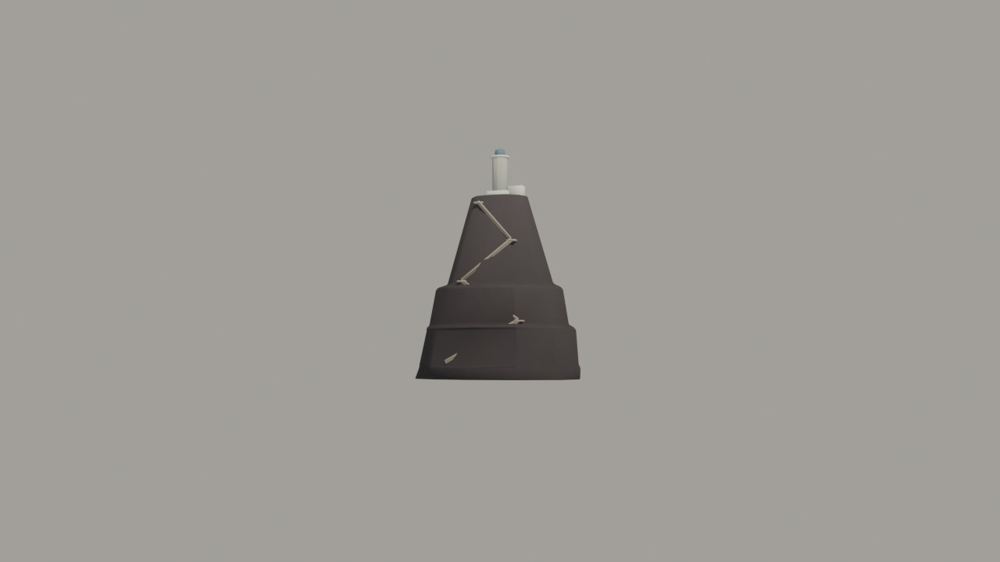

# Brief asset — Strombolicchio (`strombolicchio.glb`)

Brief auto-conținut pentru un agent Blender. Sursele:
[style_bible.md](../style_bible.md) + [blender_export.md](../blender_export.md) +
[scripts/palette.gd](../../scripts/palette.gd).

Referință vizuală: `docs/track_briefs/img/stromboli_assets_a.png`, panoul 3
(STROMBOLICCHIO — front / side / top / ¾).

**Rolul:** fundal-erou. Stă la ~200 m în larg și e silueta-semnătură a pistei —
apare la jumătatea urcării și rămâne reperul mării de pe buză. Se vede DOAR de
la 150–250 m, prin ceață caldă: siluetă și contrast, nu detaliu.

> **Prompt de dat agentului** — de la linia orizontală în jos e paste-ready.

---

Construiește un neck vulcanic negru care iese din mare, cu un far alb mic în
vârf, pentru un joc de curse în stil dioramă (ton *Art of Rally*, machetă de
masă). Low-poly, fațetat, citibil ca SILUETĂ de la 200 m. Rezultat: un `.glb`
cu patru obiecte.

**Formă și dimensiuni** (unitate: 1 = 1 m):

### `Stack_Rock` — stânca, ≤ 1400 triunghiuri

- Bază **30 × 22 m** la linia apei, înălțime **32 m**, pereți **aproape
  verticali** (silueta e un dinte zvelt, nu un con): lățimea la vârf ~14 × 10 m.
- Fațete mari verticale cu 2–3 polițe orizontale înguste — coloane de bazalt
  stilizate, nu stâncă rotundă.
- Vârful: platou ușor înclinat pentru far.
- La linia apei, un guler de 1 m ușor evazat (unde bate valul).

### `Stack_Stairs` — scara, ≤ 350 triunghiuri

- O scară îngustă (0.8 m) care urcă în **zigzag pe fața stâncii** de la un mic
  prag la linia apei până la platou: 4–5 rampe drepte cu podeste, geometrie de
  panglică (trepte sugerate prin 6–8 praguri pe rampă, nu 100 de trepte reale).
- Un parapet-muret scund (0.4 m) pe exteriorul rampelor.

### `Lighthouse_White` — farul, ≤ 500 triunghiuri

- Turn cilindric alb (prismă cu 10 laturi), **Ø 3 m, înalt 6.5 m**, pe un soclu
  pătrat de 4 × 4 × 1 m, cu o balustradă simplă sus.
- O căsuță-anexă mică (3 × 2 × 2 m) lipită de soclu.

### `Lighthouse_Lantern` — lanterna, ≤ 150 triunghiuri

- Lanterna de **1.5 m** peste turn: tambur cu 8 laturi + calotă; separată ca
  nod (la integrare poate primi un emisiv slab / sclipire).

NU: valuri modelate, pescăruși, antene, text, detaliu de zidărie.

**Culoare — FĂRĂ texturi proprii. UV colapsate pe centrul slotului:**
- Stânca: **u = 0.640625, v = 0.5**; polițele umbrite: **u = 0.140625, v = 0.5**
- Gulerul de la linia apei (spumă): **u = 0.703125, v = 0.5**
- Scara + muret: **u = 0.921875, v = 0.5**
- Far + anexă + soclu (alb): **u = 0.703125, v = 0.5**
- Lanterna: **u = 0.359375, v = 0.5**

**Vertex colors = AO copt:** stânca mai închisă jos (~0.6) spre 1.0 sus;
întunecă sub polițe și sub podestele scării; farul aproape curat (0.85–1.0).

**Scară, origine, orientare:**
- Originea la **LINIA APEI**, centrată în XZ (gulerul evazat la y=0; nimic
  relevant sub 0 — o fustă de 2 m sub linia apei e ok, se îneacă în mare).
- Fața cu scara spre **−Z**. Export la (0,0,0), toate nodurile.
- Bevel 0.2 m pe stâncă, 0.05 m pe far.
- Buget total: **≤ 2400 triunghiuri**.

**Export:** glTF Binary `.glb`, nume `strombolicchio.glb`, patru obiecte:
`Stack_Rock`, `Stack_Stairs`, `Lighthouse_White`, `Lighthouse_Lantern`,
copii direcți ai rădăcinii. Mesh + UVs + Vertex Colors + Normals; Apply
Modifiers ON.

---

## Note pentru noi (nu fac parte din prompt)

- **Sloturi:** `VOLCANIC_BLACK` 20, `ROCK_DARK` 4, `FOAM_WHITE` 22,
  `MARBLE_GREY` 29, `PAINTED_METAL` 11.
- **Cotele sunt legate** (memoria `efecte-de-fundal-cote-legate`): se plantează
  la ~200 m de coastă, sub `fog_end` 300 al temei și sub FAR_PLANE 380 —
  altfel există dar nu se vede. Poziție luată din harta Stromboli Recon
  (map ~(120, 372) → godot (−187, 0, −137)).
- **La integrare:** stânca poate primi clasa `rock` triplanară dacă silueta
  iese plată prin ceață; de decis pe captura de pe buză, nu dinainte.
- **Destinație:** `assets/models/stromboli/structures/strombolicchio.glb`.
- **De raportat în PR:** captură din joc DE PE BUZĂ (frac ~0.49) și de pe
  plajă (frac ~0.09) — testul e silueta prin ceață, nu detaliul de aproape.
- **Checklist:** 4 noduri cu nume exacte; ≤ 2400 tris; origine la linia apei
  (memoria `decor-manual-din-cod`: originile pe linia apei); scara spre −Z.

---

## Livrat

Captura de sus e **la 200 m, cu camera la 1.2 m și FOV-ul de joc** — adică fix
cadrul în care asset-ul ăsta există. Vederea de aproape (¾, cu scara pe față) e
în `img/strombolicchio_34.png`, dar ea NU e criteriul: la 200 m se judecă
silueta și ierarhia de contrast.

Testul trece: masă întunecată de bazalt, cu **farul alb ca singur semnal
luminos**. Măsurat pe randare: stâncă 60, guler 60, far **173** — farul e de
2.9× stânca și nimic nu concurează cu el.

### Cote

| nod | tris | buget |
|---|---|---|
| `Stack_Rock` | **578** | 1400 |
| `Stack_Stairs` | **528** | 350 |
| `Lighthouse_White` | **320** | 500 |
| `Lighthouse_Lantern` | **138** | 150 |
| **total** | **1564** | **2400** |

- bază **30 × 22 m** la linia apei, înălțime **32 m** — cotele din brief
- `linia apei: confirmata (Y −2.500 .. 41.380 incaleca 0)` — `--origin=waterline`
- scara pe **−Z** (bbox Z −10.383 .. −3.278), cum cere brief-ul
- `verify_glb ... 2400 --origin=waterline` → **VERDICT: OK**

`Stack_Stairs` depășește bugetul de nod (528 vs 350), dar totalul e la 65% din
buget. Scara e singurul element care descrie *scara umană* a stâncii, deci
prefer să plătesc acolo decât să pierd zigzagul.

### Silueta: brief-ul se bate cu el însuși

Brief-ul cere **„dinte zvelt, nu con"** ȘI **„bază 30 × 22, înălțime 32"**.
Cele două nu pot fi adevărate simultan: 32 m peste o bază de 30 m dau un raport
înălțime/lățime de **1.07–1.45**, iar ochiul citește „turn" abia peste ~1.5.
Măsurat pe randarea de la 200 m, silueta a ieșit la **1.40** — la limită.

Cotele bazei și înălțimea sunt contract, deci au rămas. Zveltețea am luat-o din
singurul loc pe care brief-ul îl lasă liber — vârful, dat ca „~14 × 10" — coborât
la **11 × 8**. Raportul de gabarit nu se schimbă (lățimea maximă e tot baza),
dar conturul de deasupra primei polițe se subțiază vizibil.

Pe drum am trecut prin **două siluete greșite, în direcții opuse**, și merită
notate fiindcă amândouă păreau rezonabile pe hârtie:
- **con** — îngustarea întinsă *neted* pe toată înălțimea. O suprafață care se
  subțiază continuu citește con la orice pantă, chiar și la 14° față de verticală.
- **pagodă** — polițele ieșeau `bulge` peste conturul comun, deci depășeau ȘI
  peretele de deasupra, ȘI pe cel de dedesubt: streașină pe ambele părți = raft.
  Un neck real are polița la nivelul peretelui de dedesubt, iar treapta o face
  peretele de deasupra, care se retrage.

Forma finală: bază lată, **două trepte jos**, vârf care se subțiază continuu.

### Abateri de la brief

**1. Gulerul de la linia apei rămâne pe `VOLCANIC_BLACK`, nu `FOAM_WHITE`.**
Măsurat la 200 m, un guler alb iese la luminanță **172** pe o stâncă de 60 —
adică 2.9×, **exact cât farul** (173). Se băteau ca semnal, iar farul trebuie să
rămână punctul cel mai luminos: e singurul lucru care spune „insulă locuită" de
la distanța aia. Am încercat și `REEF_SHALLOW` (2.2×), dar lăsa o dungă
turcoaz saturată la bază. Pe panoul 4 al foii de referință **stânca rămâne
întunecată (28–91) până la linia apei** — albul de acolo e al APEI, nu al
stâncii. Spuma vine deci la integrare, din materialul mării. Gulerul rămâne ca
*geometrie* (evazarea cerută de brief); doar culoarea lui se schimbă.

**2. Polițele rămân pe `VOLCANIC_BLACK`, nu `ROCK_DARK`.** Aceeași greșeală
prinsă deja pe crater: `ROCK_DARK` (#67421F) e maroul de deșert al canionului,
iar pe bazalt iese **rugină**. Muchia de umbră de sub poliță o face AO-ul.

### Limitare cunoscută

Pe rampele de jos, scara intră parțial în stâncă: `face_y` așază rampele pe
conturul *eliptic*, dar polițele ies în afara lui cu 0.25–0.35 m. La distanța
pentru care există asset-ul (150–250 m) nu se vede — la 20 m se vede. Dacă
Strombolicchio ajunge vreodată în prim-plan, `face_y` trebuie să țină cont și
de `bulge`-ul poliței de sub rampă.

### Note pentru integrare

- se plantează la ~200 m de coastă, godot **(−187, 0, −137)**, sub `fog_end`
  300 și sub FAR_PLANE 380 (memoria `efecte-de-fundal-cote-legate`)
- originea e la **linia apei**, deci `y = sea_level` direct
- `Lighthouse_Lantern` e nod separat pentru un emisiv slab / sclipire
- stânca poate primi clasa `rock` triplanară dacă silueta iese plată prin ceață
  — de decis pe captura din joc, de pe buză
