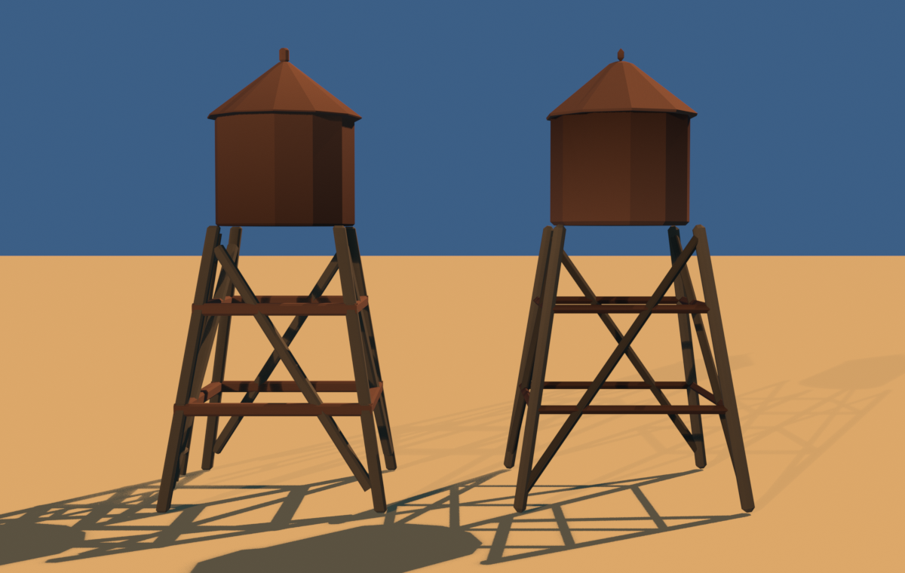
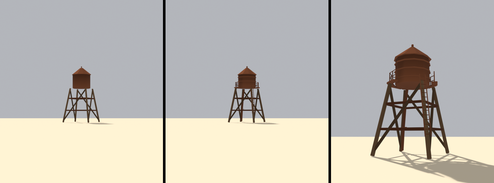

# Brief asset — Turn de apă (`water_tower.glb`)

Brief auto-conținut pentru un agent Blender (ex. Blender MCP). Nu presupune
acces la restul repo-ului — tot contractul e aici. Sursa reproductibilă: [tools/blender/build_water_tower.py](../../tools/blender/build_water_tower.py).
Sursele din care e derivat:
[style_bible.md](../style_bible.md) (estetică) + [blender_export.md](../blender_export.md)
(pipeline) + [scripts/palette.gd](../../scripts/palette.gd) (indici de sloturi).

> **Prompt de dat agentului** — de la linia orizontală de mai jos în jos e
> paste-ready. Restul paginii sunt note pentru noi.

---

Construiește un turn de apă low-poly, stilizat, pentru un joc de curse cu
mașinuțe de jucărie în stil diorámă de deșert (ton *Art of Rally* — machetă de
masă, NU foto-realist). Rezultat: un `.glb` care intră într-o lume cu un singur
material partajat.

**Formă și dimensiuni** (unitate: 1 = 1 m; mașina de referință = 4 m):
- Înălțime totală ≈ **9.5 m**.
- **Picioare / schelă**: de la 0 la 5.7 m. **4 picioare groase, evazate** —
  amprentă la sol ~4.6×4.6 m, sus ~2.8×2.8 m. Grinzi de ~0.25 m grosime. Două
  inele orizontale de legătură (la 2.0 m și 4.0 m) și **o singură diagonală
  groasă per față** — NU fermă fină, NU zăbrele subțiri.
- **Rezervor**: cilindru cu **12–14 laturi**, de la 5.7 la 8.0 m, rază ~1.5 m.
- **Acoperiș conic**: 8.0 → 9.2 m, streașină ușor peste rezervor (rază ~1.7 m).
- **Finial**: cilindru mic pe vârf, 9.2 → 9.5 m, rază ~0.12 m.
- **Scară** (opțională): o singură față, doar dacă rămâne *chunky* — două
  balustre groase + câteva trepte groase. Dacă iese subțire, omite-o.

**Culoare — FĂRĂ texturi proprii. UV → sloturi dintr-un atlas de paletă** (32
sloturi orizontale). Fiecare față își colapsează toate UV-urile pe **un singur
punct**, centrul slotului:
- Metal ruginit (rezervor, acoperiș, finial, inele): **u = 0.328125, v = 0.5**
- Lemn decolorat (picioare, diagonale, scară): **u = 0.296875, v = 0.5**
- Nu e nevoie să încarci vreo imagine în Blender; contează doar coordonata UV.
  Materialul se înlocuiește ulterior.

**Vertex colors = ambient occlusion copt (grayscale), se înmulțește peste
culoare în engine:**
- Gradient vertical: jos mai închis (~0.55), sus spre 1.0.
- Întunecă unde se ocluză: sub rezervor, unde picioarele se întâlnesc, sub
  streașina acoperișului, în interiorul schelei.
- 1.0 = neatins, ~0.5 = adânc/umbrit. Fără el iese plat — e obligatoriu.

**Scară, origine, orientare:**
- Originea (pivotul) la **baza obiectului, centrată în XZ**, ca să stea direct
  pe sol la poziție.
- Bevel **consistent 0.08 m** pe toate muchiile (semnătura stilului — colțuri
  rotunjite, nimic tăios).
- Buget: **≤ 900 triunghiuri**. Fără șuruburi, balustrade subțiri sau detaliu
  de frecvență înaltă — se pierde la viteză. Siluetă mare și lizibilă.

**Export:**
- glTF Binary **(.glb)**, un fișier, nume `water_tower.glb`.
- Include: Mesh, **UVs**, **Vertex Colors**, Normals. Fără camere, lumini sau
  materiale complexe.
- **Apply Modifiers: ON** (bevel-ul să fie în geometrie). Y-up: implicit.

---

## Note pentru noi (nu fac parte din prompt)

- **Referința foto ≠ suprafață.** Poza de kit are rugină și zăbrele fine
  foto-realiste; noi le simplificăm la grinzi groase + AO în vertex colors.
  Poza dă *silueta și inventarul*, nu suprafața.
- **Sloturi folosite:** `rust_metal` = 10 (u = (10+0.5)/32 = 0.328125),
  `wood_weathered` = 9 (u = (9+0.5)/32 = 0.296875). Dacă se schimbă ordinea în
  [palette.gd](../../scripts/palette.gd), se recalculează u.
- **Checklist de verificare la primire** (`res://assets/models/buildings/water_tower.glb`):
  1. triunghiuri ≤ 900
  2. UV-urile nimeresc centrele sloturilor (metal 0.328125 / lemn 0.296875)
  3. origine la bază, centrată XZ; stă pe sol la Y=0
  4. există un strat de vertex color (AO), nu doar geometrie plată
  5. instanțiere cu `Palette.apply_world_material(glb)` → un singur material
- Șablonul a fost extras ca fișier: [_TEMPLATE.md](_TEMPLATE.md). Pagina asta
  rămâne exemplul funcțional din care a ieșit, dar briefurile noi pornesc de
  acolo — are și tabelul de `u` pre-calculat pentru toate cele 14 sloturi legale.

### Nu mai e „produs de un agent extern" (#A3)

Turnul a fost multă vreme **singurul hero fără `build_*.py` și fără `.blend`** —
un agent Blender extern l-a produs direct din brieful de mai sus, iar GLB-ul a
fost comis fără sursă. Ironia era că exact pagina care se autodeclară șablon
pentru toate celelalte era singura care încălca regula din
[assets/blender/README.md](../../assets/blender/README.md): *„sursa reală e
scriptul, nu `.blend`-ul"*. Practic nimeni nu-l putea modifica, iar #D2 era
blocat.

Acum e reproductibil: [build_water_tower.py](../../tools/blender/build_water_tower.py).

**Măsurat după rescriere:** 882 de triunghiuri din 900 (înainte 732), bbox
4.78 × 4.78 × **9.500** m, verdict `verify_glb.py`: **OK**.

Cele două cote se compensează explicit pentru bevel, fiindcă amândouă au
consumatori în Godot:
- `FINIAL_TOP = 9.486` → bbox 9.500. Bevel-ul adaugă 1.4 cm peste vârf, iar
  contractul e pe bbox-ul **măsurat**, nu pe cota din cod.
- `FOOT_HALF = 2.28` → rază 2.391, sub colizorul cilindric de 2.4 din
  `_LANDMARKS` (`track.gd`). Modelul vechi ieșea 3.9 cm în afara colizorului
  și era și decentrat cu 7 cm pe X.

**Scara rămâne omisă** — dar nu din motivul vechi. §Formă o făcea opțională
fiindcă geometria subțire scrisă de mână ieșea urât; `dio_lib.ladder()` (#A1)
rezolvă asta impunând grosimi minime. Scara, pasarela și cercurile de rezervor
sunt scopul lui **#D2**, nu al acestei rescrieri.

## Livrat (#D2)

De la stânga: înainte, după — ambele de la **60 m, de la nivelul drumului** — și
un prim-plan. Ambele randate cu același material comun.

| | înainte | după |
|---|---|---|
| triunghiuri | 882 | **4490** |
| bbox | 4.783 × 4.785 × 9.500 | **identic** |

Buget ignorat la cerere. Issue-ul ținea 880, pornind de la un titlu care spunea
„732 → 880" — dar turnul măsura deja 882, deci incrementul era consumat înainte
să adaug ceva. Am semnalat asta pe issue înainte de a construi.

### Ce s-a adăugat, în ordinea de prioritate din issue

**Cercuri pe rezervor** (cel mai ieftin, cel mai vizibil). Lipseau complet, și nu
din neglijență: până la `torus()` nimic din `dio_lib` nu producea un inel —
`revolve` se învârte în jurul axei dar pornește **de pe** ea, deci dă forme
pline, nu găuri. `major_seg` egal cu al rezervorului nu e cosmetică: la alt număr
de laturi, muchiile inelului nu s-ar mai alinia și ar apărea o dantelare.

**Scara**, cu `ladder()`. Brieful o făcea opțională — *„doar dacă rămâne
chunky... dacă iese subțire, omite-o"* — și a fost omisă. Motivul real nu era
estetic: nu exista ajutorul, iar o scară scrisă de mână din grinzi subțiri arată
prost. `ladder()` impune grosimile minime, deci răspunsul devine „da".

**Pasarelă cu balustradă**, 7 din 10 laturi. Brieful cere explicit să nu fie
completă; capătul deschis e chiar locul pe unde urci de pe scară.

**Conductă de coborâre** cu două coliere.

### Două lucruri prinse de gărzi, nu de ochi

**Scara plutea.** Prima versiune o punea verticală la o poziție fixă. Piciorul e
evazat, deci sus rămânea la 0.66 m de el. Acum urmează piciorul prin `leg_xy`,
cu un decalaj de 0.20 m pe diagonală.

**Gabaritul creștea pe toate trei axele**, inclusiv **+16 mm pe înălțime** — o
cotă care e contract cu `_LANDMARKS` (`height: 9.5`). Cauza nu e geometrie care
iese, ci banda de bevel, care se schimbă chiar acolo unde geometria n-a fost
atinsă. Compensarea printr-o constantă ajustată de mână (cum era
`FINIAL_TOP = 9.486`) ține până la următoarea retușare și apoi se strică tăcut;
măsurarea nu se strică. `snap_bbox()` corectează după bevel, cu ×0.9965 / ×0.9960
/ ×0.9983 — sub trei miimi.
