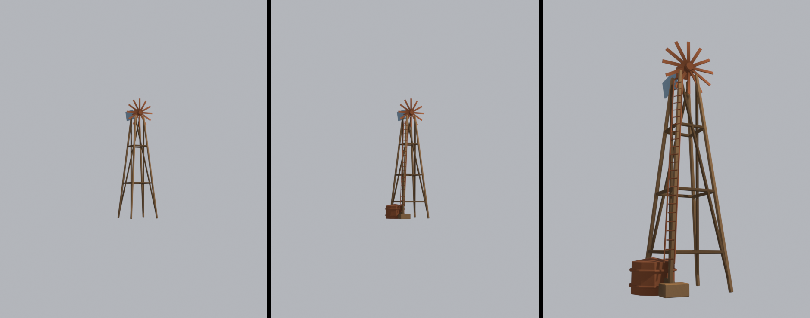

# Brief asset — Moară de vânt animată ("windmill", `windmill.glb`)

Brief auto-conținut pentru un agent Blender (Blender MCP). Nu presupune acces la
restul repo-ului — tot contractul e aici. Surse din care e derivat:
[style_bible.md](../style_bible.md) (estetică) + [blender_export.md](../blender_export.md)
(pipeline) + [scripts/palette.gd](../../scripts/palette.gd) (indici de sloturi).

> **Prompt de dat agentului** — de la linia orizontală în jos e paste-ready.
> Restul paginii sunt note pentru noi. **Punctul critic e roata separată pentru
> animație** (vezi §Animație).

---

Construiește o moară de vânt americană de fermă (farm windmill, tip roată
multi-pală pe turn de schelă), low-poly și stilizată, pentru un joc de curse cu
mașinuțe de jucărie în stil **diorámă de deșert** (ton *Art of Rally* — machetă
de masă, NU foto-realist). Rezultat: un `.glb` cu **un singur material partajat**
și cu **roata palelor ca obiect separat**, ca s-o rotim în engine. Piesă "hero":
siluetă mare, grinzi groase, zero zăbrele fine.

**Formă și dimensiuni** (unitate: 1 = 1 m; mașina de referință = 4 m; înălțime
totală ≈ **11 m**):
- **Turn / schelă** (obiect static): 4 picioare evazate, de la 0 la ~8.5 m.
  Amprentă la sol ~2.6 × 2.6 m, sus ~0.8 × 0.8 m. Grinzi de ~0.15 m grosime.
  **2–3 inele orizontale** de legătură + **o singură diagonală groasă per față**
  — NU fermă fină, NU zăbrele subțiri (exact ca la turnul de apă).
- **Cap / platformă** (static, în vârful turnului, ~8.5–9.0 m): o cutie mică
  ~0.6 × 0.6 × 0.5 m (carcasa angrenajului) pe care se montează roata și coada.
- **Coadă / vană de direcție** (statică, prinsă de cap, în spate spre +Z): o
  aripă plată ~1.6 m lungime × 0.9 m înălțime, grosime ~0.06 m, ușor înclinată.
- **Roata de pale — OBIECT SEPARAT, numit exact `Blades`** (vezi §Animație):
  diametru ~**2.6 m**, montată în față (spre -Z), centrul la ~8.75 m înălțime.
  - **Butuc** central: cilindru scurt cu 8 laturi, rază ~0.18 m.
  - **12 pale plate** (paddle), radiale, ușor înclinate (pitch ~15°), fiecare
    ~0.15 m lățime × 1.1 m lungime × 0.04 m grosime. **Pale groase de tip padelă,
    NU 18 lamele subțiri** — compromis stilizat care ține bugetul și se citește.
  - Opțional un inel exterior subțire care leagă vârfurile palelor (ca la moara
    reală) — DOAR dacă rămâne ≥ 0.05 m grosime; altfel omite-l.
- Bevel **consistent 0.08 m** pe muchiile turnului/capului; **0.04 m** pe pale.

**Culoare — FĂRĂ texturi proprii. UV → sloturi dintr-un atlas de paletă** (32
sloturi orizontale). Fiecare față își colapsează UV-urile pe **un singur punct**,
centrul slotului (v = 0.5 mereu):
- **Lemn decolorat** (picioare turn, diagonale, inele) → u = **0.296875**
- **Metal ruginit** (cap/carcasă, butuc, pale, coadă) → u = **0.328125**
- **Metal vopsit** (accent pe cap sau pe vană, dacă vrei un ton mai rece) → u = **0.359375**
- Nu încărca nicio imagine în Blender; contează doar coordonata UV.

**Vertex colors = ambient occlusion copt (grayscale), se înmulțește peste
culoare:**
- Gradient vertical: jos (picioarele) ~0.55, sus spre 1.0.
- Întunecă în interiorul schelei, sub cap, în spatele palelor lângă butuc.
- **Pe obiectul `Blades`**: AO propriu (butucul mai închis, vârfurile palelor
  mai deschise) — trebuie să arate bine în ORICE rotație, deci fără AO direcțional
  care presupune o poziție fixă.
- 1.0 = neatins, ~0.5 = adânc. Obligatoriu — fără el iese plat.

**§Animație — roata se rotește în engine (nu bake):**
- Roata palelor e **un obiect separat**, numit **`Blades`** (păstrează numele
  exact — engine-ul îl caută după nume).
- **Originea (pivotul) obiectului `Blades` EXACT în centrul butucului.** Roata se
  învârte în jurul **axei locale +Z** a obiectului (geometria palelor stă în
  planul local XY). Verifică: dacă rotești `Blades` pe Z în Blender, roata se
  învârte curat, fără wobble → pivotul e corect.
- Nu e nevoie de animație bake / armature. Godot rotește nodul `Blades` cu viteză
  constantă printr-un script mic (mai ieftin pe mobil, controlabil). Restul morii
  (turn, cap, coadă) rămâne static.

**Scară, origine, orientare (pe TOT modelul):**
- Originea modelului la **baza turnului, centrată în XZ**, ca să stea pe sol la Y=0.
- Fața roții spre **-Z**, coada spre **+Z**.
- Buget total: **≤ 1200 triunghiuri** (din care roata ~300–400). Siluetă mare,
  fără detaliu de frecvență înaltă.

**Export:**
- glTF Binary **(.glb)**, un fișier, nume `windmill.glb`.
- Include: Mesh, **UVs**, **Vertex Colors**, Normals, și **ierarhia de obiecte**
  (obiectul `Blades` separat, ca nod distinct în glTF). Fără camere/lumini.
- **Apply Modifiers: ON** (bevel în geometrie), DAR **nu uni `Blades` cu turnul**
  (join) — trebuie să rămână nod separat ca să-l putem roti. Y-up: implicit.

---

## Note pentru noi (nu fac parte din prompt)

- **De ce roata separată:** vrem "animat" fără cost de animație bake. Godot ia
  nodul `Blades` din GLB și îl rotește pe axa lui locală. Script de atașat pe
  rădăcina moriii instanțiate (extinde pattern-ul din
  [scenes/props/world_prop.gd](../../scenes/props/world_prop.gd)):
  ```gdscript
  @tool
  extends Node3D
  ## Aplica materialul lumii + roteste roata palelor (nod "Blades" din GLB).
  @export var rpm: float = 8.0            # rotatii pe minut, lent, de fundal
  @export var axis: Vector3 = Vector3(0, 0, 1)  # axa locala a roții (+Z din brief)
  var _blades: Node3D

  func _ready() -> void:
      Palette.apply_world_material(self)
      _blades = find_child("Blades", true, false) as Node3D

  func _process(delta: float) -> void:
      if Engine.is_editor_hint():
          return   # nu murdari scena in editor; se roteste doar la runtime
      if _blades:
          _blades.rotate(axis.normalized(), deg_to_rad(rpm * 6.0) * delta)
  ```
  (rpm × 6 = grade/secundă; 8 rpm ≈ 48°/s, calm.) Când vrei, îl adaug ca
  `scenes/props/windmill.gd` și îl leg de scena morii.
- **Sloturi folosite:** wood_weathered=9 (u=0.296875), rust_metal=10 (0.328125),
  painted_metal=11 (0.359375). u = (slot+0.5)/32 dacă se schimbă ordinea.
- **Commit sursa `.blend` + `.glb`** — nu doar exportul.
- **Checklist la primire** (`res://assets/models/buildings/windmill.glb`):
  1. triunghiuri ≤ 1200
  2. nod separat `Blades`, pivot în centrul butucului, se rotește curat pe +Z
  3. UV-uri pe centrele sloturilor; AO pe roată arată bine în orice unghi
  4. origine la baza turnului, XZ centrat; stă pe sol la Y=0
  5. instanțiere cu `Palette.apply_world_material(glb)` + script de rotație → animat

## Livrat (#D3)



De la stânga: înainte, după la 50 m, și un prim-plan. Ambele randate cu același
material comun.

| | înainte | după |
|---|---|---|
| `Windmill` | 836 | **2608** |
| `Blades` | 172 | **172** (neatins) |
| înălțime | 10.95 m | **10.95 m** |
| pivot `Blades` | (0, 0.450, 9.650) | **identic** |

Buget ignorat la cerere.

### Ce s-a adăugat

- **Al treilea rând de inele.** Comentariul din script spunea „două (brief: 2–3),
  trei ar depăși bugetul după bevel" — al treilea e chiar ce cere issue-ul, și e
  cea mai ieftină îmbunătățire: turnul devine mai dens spre bază, ceea ce e și
  corect structural, fiindcă acolo sunt forțele.
- **Rezervor la bază**, cu capac și două cercuri. O moară de apă fără rezervor
  n-are ce pompa — ăsta e detaliul care leagă obiectul de funcția lui.
- **Jgheab** de la rezervor, cu apa sugerată prin `retag` pe fețele de sus
  (`SAND_SHADOW`, zero triunghiuri).
- **Scară** pe un picior, până sub cap, cu `ladder()`.

### Abaterea asumată: amprenta crește cu 1.07 m

Issue-ul cere două lucruri care nu încap împreună: **„rezervor la bază"** și
**„bbox-ul nu crește"**. Un rezervor la bază nu poate sta *înăuntrul* turnului.

Am minimizat creșterea — rezervorul a scăzut de la R=1.05 la 0.85 și s-a
apropiat, jgheabul a fost mutat pe +Y unde coada morii iese oricum cu 2.35 m —
dar rămâne +1.07 m pe X. Raza maximă față de axă urcă de la 1.84 la **2.44 m**.

Contextul care face abaterea acceptabilă: `_LANDMARKS` are deja `radius: 1.6`,
iar turnul singur avea 1.84 la colțuri. Colizorul sub-acoperea și înainte, și
issue-ul spune explicit că instanța de gameplay repară intrarea aia la
integrare. Numărul nou de care are nevoie e **2.44**.

Ce **nu** s-a schimbat, fiindcă alea sunt contractele tari: înălțimea și pivotul
lui `Blades` (`scenes/props/windmill.gd:16` îl caută după nume și îi animează
rotația; redenumit sau mutat înseamnă roată statică cu `push_warning`).
